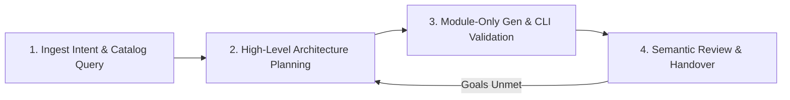

# Simplified GCP Modular Terraform Architect Skill

This skill performs an agentic design cycle around a 4-phase generation
pipeline:



You MUST follow these 4 explicit phases strictly in order. You must not skip
phases. If the semantic review in Phase 4 determines that the configuration does
not fully meet the user's architectural goals or intent, you MUST loop back to
Phase 2 to replan and regenerate.

--------------------------------------------------------------------------------

## ⚠️ Strict Architectural Constraints

All generated configurations must prioritize the modular structure while
adhering to naming and HCL style constraints. Refer to:

-   `generator_instructions.md` for generation constraints and
    project defaults.
-   `terraform_validator_instructions.md` for semantic validation
    rules.

General defaults & policies:

-   **Default Network and Subnetwork:** Target the pre-existing VPC network and
    subnetwork both named `"default"` in `<project_id>` unless otherwise
    specified.
-   **Secret-Safe Policy (MANDATORY):** NEVER write plaintext passwords, API
    keys, or credentials in HCL code or `terraform.tfvars`. All secrets must be
    declared as resources in GCP Secret Manager (using the
    `terraform-google-secret-manager` module) and referenced dynamically by
    target services.
-   **State Isolation Policy (MANDATORY):** Keep the Terraform state local in
    the scratch folder for validation. NEVER generate a remote backend block
    (e.g., `backend "gcs" {}`), as remote state is managed dynamically by the
    parent orchestrator/deployment registry.

--------------------------------------------------------------------------------

## Phase 1: Ingest Intent & Catalog Query

1.  **Load Inputs:** Ingest user goals and instructions.
2.  **Query Catalog Registry (Private and Public):** To supplement the design,
    search both your project's custom private catalog and the public Google
    catalog by calling the native **`manage_catalog`** MCP tool with the
    **`CATALOG_OPERATION_LIST_COMPONENTS`** operation.

    *   **Query Private Catalog (Target Space):**

        *   ServerName: `application_design_center`
        *   ToolName: `manage_catalog`
        *   Arguments:

            ```json
            {
              "project": "<project_id>",
              "location": "<location>",
              "spaceId": "<space_id>",
              "operation": "CATALOG_OPERATION_LIST_COMPONENTS"
            }
            ```

    *   **Query Public Google Catalog:**

        *   ServerName: `application_design_center`
        *   ToolName: `manage_catalog`
        *   Arguments:

            ```json
            {
              "project": "gcpdesigncenter",
              "location": "us-central1",
              "spaceId": "googlespace",
              "catalogId": "googlecatalog",
              "operation": "CATALOG_OPERATION_LIST_COMPONENTS"
            }
            ```

    -   *Priority Rule:* You MUST prioritize using private catalog templates
        (found in your target space) over public Google ones to ensure
        project-specific customizations are respected.

3.  **Get Module Details:** Fetch detailed module metadata containing inputs,
    outputs, and dependencies by calling the native **`manage_catalog`** MCP
    tool with the **`CATALOG_OPERATION_GET_COMPONENT_METADATA`** operation (or
    **`CATALOG_OPERATION_GET_COMPONENT_IAC`** to retrieve the underlying
    Terraform source code directly):

    *   **MCP Tool Call:**

        *   ServerName: `application_design_center`
        *   Tool Name: `manage_catalog`
        *   Arguments:

            ```json
            {
              "project": "<project_id>",
              "location": "<location>",
              "spaceId": "<space_id>",
              "catalogTemplateId": "<short_module_id>",
              "catalogTemplateRevisionId": "<revision_id>",
              "operation": "CATALOG_OPERATION_GET_COMPONENT_METADATA"
            }
            ```

    -   *Constraint:* Pass only the short module ID (e.g., `cloud-run-job`,
        which is the last segment of the fully qualified resource name), NOT the
        full resource name path returned by the list command.

    > [!IMPORTANT] To ensure your local HCL declarations perfectly match the
    > version constraints validated by the Design Center registry, you MUST
    > extract the precise Git repository tag from the registry and use it in
    > your HCL module `source`.
    >
    > The `gitSource` metadata block (including `refTag`, `repo`, and `dir`) is
    > returned directly in the output of the **`manage_catalog`** MCP tool
    > (under the `gitSource` field).
    >
    > If you need to fallback to the CLI to describe the revision details, you
    > can run the `describe` command directly using the revision URI retrieved
    > from the MCP tool:
    >
    > ```bash
    >    gcloud design-center spaces catalogs templates revisions describe <revision_uri>
    > ```
    >
    > 1.  **Extract the fields** from the `gitSource` block:
    >
    >     ```yaml
    >     gitSource:
    >       dir: modules/v2
    >       refTag: v0.33.0
    >       repo: GoogleCloudPlatform/terraform-google-cloud-run
    >     ```
    >
    > 2.  **Construct the HCL `source` URI** using the pattern
    >     `github.com/<repo>//<dir>?ref=<refTag>`:
    >
    >     ```terraform
    >     source = "github.com/GoogleCloudPlatform/terraform-google-cloud-run//modules/v2?ref=v0.33.0"
    >     ```

--------------------------------------------------------------------------------

## Phase 2: High-Level Architecture Planning

1.  **Resource Initialization (MANDATORY):** Before formulating any plan, you
    MUST read instructions from `planner_instructions.md`. Do not
    proceed until these instructions are in your active context.
2.  **Design the High-Level Architecture:** Based on the modules identified in
    Phase 1, plan the design topology connecting the key modular building blocks
    (VPC, Compute, Databases, Security).
3.  **Formulate Integration Pattern Decisions:** Determine core pattern layout
    decisions (such as GKE vs. Cloud Run computing model, storage engines,
    network boundaries, private interconnects, and database hosting structures)
    using available modules.
    -   *Note:* Follow Google best practices while formulating a pattern. For
        example:
        1.  Always use Secret Manager to store and reference database
            credentials instead of using passphrases as input parameters.
        2.  Use Private Service Connect instead of public access for private
            connectivity.
4.  **Gather pre-existing reusable TF modules:** Check if there are any
    preexisting TF modules from the catalog to understand available building
    blocks to create end to end solution matching user intent. Catalog contains
    modules public catalog (published by GCP) and private catalog owned by the
    customer. When there is a duplicate module between public and private
    catalog, always prefer private catalog component/module. Inspect the
    selected modules by calling the native **`manage_catalog`** MCP tool with
    the **`CATALOG_OPERATION_GET_COMPONENT_METADATA`** operation to verify
    inputs, outputs, required inputs, and reference outputs:

    *   **MCP Tool Call:**

        *   ServerName: `application_design_center`
        *   Tool Name: `manage_catalog`
        *   Arguments:

            ```json
            {
              "project": "gcpdesigncenter",
              "location": "us-central1",
              "spaceId": "googlespace",
              "catalogId": "googlecatalog",
              "operation": "CATALOG_OPERATION_GET_COMPONENT_METADATA",
              "catalogTemplateId": "<module_id>"
            }
            ```

    -   *Constraint:* Use the short module ID (the last segment of the resource
        name, e.g., `cloud-run-job`), NOT the full resource path starting with
        `projects/...`. If querying a private catalog, update the `project`,
        `spaceId`, and `catalogId` arguments accordingly.

5.  **Review End to End Solution Templates:** Review well-architected solutions
    published by GCP as well as solutions published by the customer's own
    organization. Use these solutions as reference architectures when
    applicable. To explore available templates, run the local CLI script
    `list_terraform_templates` to see if a pre-existing application template can
    serve as your design baseline. You MUST pass your active target project ID
    and space ID to retrieve both public Google templates and private templates:

    ```bash
    python3 scripts/list_terraform_templates.py --project="<project_id>" --space_id="<space_id>" --catalog_id="<catalog_id>"
    ```

    -   *Priority Rule:* In the returned list, private application templates
        appear first (marked with `"source": "private"`). You MUST prioritize
        using private application templates over public Google ones (marked with
        `"source": "google"`) if a suitable private template is available!

6.  **Fetch Terraform Template:** Fetch the baseline template config to your
    local workspace by running the local CLI script `fetch_terraform_template`.
    You MUST pass your active target project ID and space ID:

    ```bash
    python3 scripts/fetch_terraform_template.py <template_id> --project="<project_id>" --space_id="<space_id>" --out_dir="<target_directory_path>"
    ```

    (the output directory will be created automatically if it does not exist).

7.  **Review Planner Principles:** Crosscheck planning directives in
    `planner_instructions.md`.

--------------------------------------------------------------------------------

## Phase 3: Module-Only Generator & CLI Validation Loop

1.  **Resource Initialization (MANDATORY):** Before writing any HCL, you MUST
    read instructions from `generator_instructions.md`. Do not
    proceed until these instructions are in your active context.
2.  **Generate Raw HCL:** Write standard Terraform code, prioritizing module
    blocks as much as possible, or using direct resources where no suitable
    module is available, based on rules in the loaded instructions.
3.  **Save Configuration File:** Create a dedicated workspace scratch directory
    unique to this execution/session (e.g. `scratch/tf_validate_{session_id}/`,
    using the session, conversation, or a unique run ID to avoid concurrent
    executions overwriting one another) and write the generated HCL code split
    into:
    -   `providers.tf`: Provider and terraform blocks.
    -   `main.tf`: Module and resource declarations.
    -   `variables.tf`: Variable declarations.
    -   `terraform.tfvars`: Variable values.
    -   `outputs.tf`: Output declarations.
4.  **Semantic Architecture Validation (MANDATORY):** Before running any CLI
    validation, you MUST read instructions from
    `terraform_validator_instructions.md`. Perform a comprehensive
    semantic audit to ensure the configuration complies with the validator
    guidelines (preferring modules over resources, no custom variables, correct
    GitHub source formatting, etc.). Do not proceed until these instructions are
    in your active context.
5.  **Execute Local CLI Validation Check (CRITICAL):**

    -   Initialize the directory using the Terraform CLI directly to pull CFT
        sources and download provider plugins:

        ```bash
        terraform -chdir=scratch/tf_validate_{session_id}/ init
        ```

    -   Validate HCL block structures and type connections using the Terraform
        CLI directly:

        ```bash
        terraform -chdir=scratch/tf_validate_{session_id}/ validate
        ```

    -   Dry-run resource changes and verify configuration feasibility with the
        Terraform CLI:

        ```bash
        terraform -chdir=scratch/tf_validate_{session_id}/ plan
        ```

    -   *Remediation Loop:* If errors or warnings are reported by the Terraform
        CLI during initialization, validation, or planning, correct `main.tf`
        and repeat the check commands until clean.

--------------------------------------------------------------------------------

## Phase 4: Semantic Review & Handover

Your final modular code must be clean, robust, and securely wired.

1.  **Semantic Review & Goal Alignment:** Audit the validated configuration
    against the user's intent and architectural constraints. If the architecture
    fails to meet the goal or requires adjustment, loop back to **Phase 2:
    High-Level Architecture Planning** to replan and regenerate.
2.  **Deliver Architectural Rationale:** Output a clear, thorough final report
    that describes:
    -   The **High-Level Architecture Layout**: Clear overview detailing each
        module or resource block and its structural role in the GCP
        infrastructure.
    -   The **Architectural Rationale**: Explicit decisions for why specific
        compute systems, boundaries, and database models were picked. Explain
        the necessity of using direct resources if any were created instead of
        modules. If multiple products were considered, include rationale for
        product choice.
    -   The **Inter-Module Topology & Dataflow**: A descriptive text-based
        walk-through of how data flows between the VPC network boundaries,
        computing blocks, and dependent database components.
3.  **Output Intact Terraform Code:** Read each generated file (including `.tf`
    and `.tfvars` files) in the target validation directory (using your standard
    file viewing/reading tools) and output its exact, intact HCL configuration
    in your final response. Each file MUST be formatted as:

    ````markdown
    File: `<path>`
    ```hcl
    [content]
    ```
    ````

    Ensure you output the complete and exact file contents for all final
    validated files.
