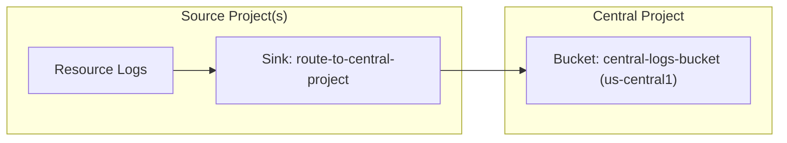
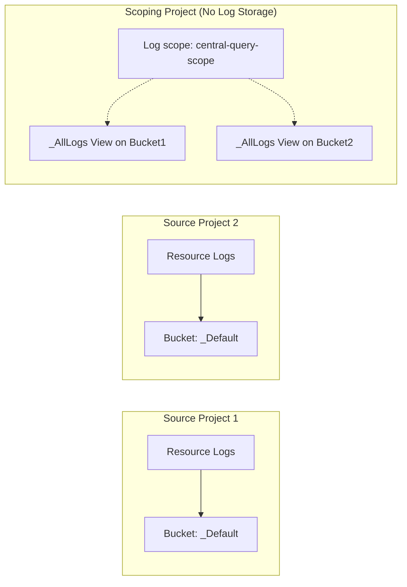

# Configuring Cross-Project Logging

This skill describes how to use `gcloud` commands to configure Cloud Logging so
that you store log data in a central location, regardless of the point of
origin. The skill also describes how to query log data when that data is stored
in multiple projects.

> [!IMPORTANT] **Sandbox Network Limitation (CRITICAL for Agent Testing):**
> During evaluation or in restricted sandboxed environments, network traffic to
> GCP APIs is blocked. Do **NOT** run network discovery commands to find
> resource names, project IDs, or organization IDs. Always use the exact project
> IDs or placeholders provided in the user prompt or instructions, for example,
> `{project_id}`, `{source_project_id}`, `{central_project_id}`. Assume these
> resources exist and proceed directly with configuration commands. Running
> these discovery commands will cause the execution to hang and timeout.

## Safety and Confirmation Tiers (CRITICAL)

Before executing any commands on behalf of the user, you MUST adhere to the
following safety tiers based on the action requested:

1.  **Tier R: Read-Only**
    *   **Description:** Commands that only read state or query logs.
    *   **Example commands:**
        *   `gcloud logging read`
        *   `gcloud logging buckets list`
    *   **Rule:** No confirmation needed. You may execute these commands
        immediately to gather information.
2.  **Tier M: Mutation (Non-Billing)**
    *   **Description:** Configuration modifications or free metadata creations
        that do not incur direct storage or billing costs and do not affect
        resource security/access policies.
    *   **Example commands:**
        *   `gcloud logging views create`
        *   `gcloud logging views update`
        *   `gcloud logging scopes create`
        *   `gcloud logging buckets create`
    *   **Rule:** No confirmation needed. You may execute these commands
        immediately to apply configurations.
3.  **Tier B: Billing and Security-Sensitive Mutations (High-Risk)**
    *   **Description:** Operations that create billing-inducing resources or
        integrations, or modify security and IAM access control policies
        (presenting a risk of privilege escalation).
    *   **Example commands:**
        *   `gcloud logging metrics create`
        *   `gcloud logging links create`
        *   `gcloud projects add-iam-policy-binding`
    *   **Rule:** **Interactive confirmation required.** These commands create
        resources that incur billing costs or alter security access. You MUST
        present the exact, literal command and receive user confirmation before
        executing. NEVER execute in the same turn as asking.
4.  **Tier D: Causes irreversible data loss**
    *   **Description:** Actions that permanently discard or delete logs, for
        example sink exclusions.
    *   **Example commands:**
        *   `gcloud logging buckets delete`
        *   `gcloud logging sinks update --add-exclusion`
    *   **Rule:** **Explicit typed confirmation required.** These commands
        discard or delete logs immediately and irreversibly, or they may result
        in log data not being stored. You MUST ask for explicit typed
        confirmation, for example, "Yes, discard logs", and halt execution until
        the user replies.

## Decision Matrix: Centralized Storage vs. Distributed Storage with Read-Time Aggregation

Use this decision matrix to evaluate and choose between **Centralized Storage**
and **Read-Time Aggregation**. With centralized storage, log data is routed to
one log bucket, regardless of where the data originates. You write queries
against the centralized log bucket. With read-time aggregation, log data is
stored by the resource where it originates. However, a single query aggregates
the data by querying all resources.

After you have determined the optimal architecture for handling cross-project
logs, follow the corresponding configuration steps detailed below.

| Criterion             | Centralized Storage      | Read-Time Aggregation    |
| :-------------------- | :----------------------- | :----------------------- |
| **GCP Project Scale** | Scales to thousands of   | Best for < 375 projects. |
:                       : projects.                :                          :
| **Log Storage**       | Consolidated in a single | Resides in originating   |
:                       : log bucket.              : resources.               :
| **SQL Analytics**     | Easy; unified querying   | Hard; requires querying  |
:                       : via Observability        : multiple log buckets.    :
:                       : Analytics.               :                          :
| **Access Control**    | Scoped access via log    | Requires IAM access to   |
:                       : views on the centralized : all views on resources   :
:                       : log bucket.              : that store log data.     :
| **Configuration**     | Options vary based on    | Will not interfere with  |
: **Complexity**        : Project, Folder,         : bucket-based log-based   :
:                       : Organization structure.  : metrics.                 :
| **Cost**              | Potential for duplicate  | Cost-effective; no data  |
:                       : storage of log buckets   : replication.             :
:                       : if exclusions aren't     :                          :
:                       : set.                     :                          :

## Architecture

### Centralized Storage (Log Routing)



### Read-Time Aggregation (Log Scopes)



## Setup Steps: Centralized Storage (Log Routing)

Use these steps to route logs from one or more source projects to a central log
bucket in a project. Create or select the Google Cloud project that you will use
for storing your log data. This is the central project.

### 1. Create log bucket in central project (Tier M)

Create a custom log bucket with Log Analytics enabled.

> [Tip] Use regional log buckets, for example, set the location to
> `us-central1`. Don't use the `global` location. This approach ensures
> compatibility with Observability Analytics and SQL querying.

```bash
gcloud logging buckets create {bucket_id} \
    --project={central_project_id} \
    --location={region} \
    --retention-days={retention_days} \
    --enable-analytics
```

### 2. Create log sink in central project (Tier M)

Create a project-level sink in the central project pointing to the central log
bucket. This sink will route logs that land in the central project's log router
into the central log bucket.

```bash
gcloud logging sinks create {sink_name} \
    logging.googleapis.com/projects/{central_project_id}/locations/{region}/buckets/{bucket_id} \
    --project={central_project_id}
```

### 3. Create log sink in source resource (Tier M)

To route logs to the central project, you must create a log sink in each source
organization, folder, or project. While you can configure a sink to route only a
subset of logs using the `--log-filter` argument, recommended practice is to
route all non-audit logs, and then restrict access or partition logs at the
destination using custom Log Views on the centralized log bucket.

*   **For an organization-level log sink**

    ```bash
    gcloud logging sinks create {sink_name} \
        logging.googleapis.com/projects/{central_project_id} \
        --organization={source_organization_id} \
        --include-children \
        --exclusion=filter='LOG_ID("cloudaudit.googleapis.com/activity")' \
        --exclusion=filter='LOG_ID("externalaudit.googleapis.com/activity")' \
        --exclusion=filter='LOG_ID("cloudaudit.googleapis.com/system_event")' \
        --exclusion=filter='LOG_ID("externalaudit.googleapis.com/system_event")' \
        --exclusion=filter='LOG_ID("cloudaudit.googleapis.com/access_transparency")' \
        --exclusion=filter='LOG_ID("externalaudit.googleapis.com/access_transparency")'
    ```

*   **For project-level log sinks**

    ```bash
    gcloud logging sinks create {sink_name} \
        logging.googleapis.com/projects/{central_project_id} \
        --project={source_project_id} \
        --exclusion=filter='LOG_ID("cloudaudit.googleapis.com/activity")' \
        --exclusion=filter='LOG_ID("externalaudit.googleapis.com/activity")' \
        --exclusion=filter='LOG_ID("cloudaudit.googleapis.com/system_event")' \
        --exclusion=filter='LOG_ID("externalaudit.googleapis.com/system_event")' \
        --exclusion=filter='LOG_ID("cloudaudit.googleapis.com/access_transparency")' \
        --exclusion=filter='LOG_ID("externalaudit.googleapis.com/access_transparency")'
    ```

### 4. Grant IAM permissions to sink writers (Tier B)

> [!IMPORTANT] **Security Action (Tier B):** Granting IAM permissions changes
> access control policy and must be explicitly confirmed by the user before
> execution.

To allow the source sinks to route logs to the central project's router, and to
allow the central sink to write logs to the central bucket:

1.  **Grant Logs Writer permission to the source sink:** Retrieve the
    `writerIdentity` of the source log sink and grant it
    `roles/logging.logWriter` on the central project.

    ```bash
    # Get the writer identity of the source sink
    gcloud logging sinks describe {sink_name} \
        --project={source_project_id} \
        --format="value(writerIdentity)"
    ```

    The output is the `{source_writer_identity}` value (for example
    `serviceAccount:...`) for the following command:

    ```bash
    # Grant Logs Writer permissions on the central project
    gcloud projects add-iam-policy-binding {central_project_id} \
        --member={source_writer_identity} \
        --role=roles/logging.logWriter
    ```

2.  **Grant Bucket Writer permission to the central sink:** Retrieve the
    `writerIdentity` of the central log sink and grant it
    `roles/logging.bucketWriter` on the central project.

    ```bash
    # Get the writer identity of the central sink
    gcloud logging sinks describe {central_sink_name} \
        --project={central_project_id} \
        --format="value(writerIdentity)"
    ```

    The output is the `{central_writer_identity}` value for the following
    command:

    ```bash
    # Grant Bucket Writer permissions on the central project
    gcloud projects add-iam-policy-binding {central_project_id} \
        --member={central_writer_identity} \
        --role=roles/logging.bucketWriter
    ```

### 5. Create custom Log Views on the central bucket (Tier M)

To partition logs or restrict access by log ID or project (since all logs were
routed to the same central bucket), create custom Log Views on the central
bucket.

*   **Filter by log ID:**

    ```bash
    gcloud logging views create {view_id} \
        --bucket={bucket_id} \
        --location={region} \
        --project={central_project_id} \
        --log-filter='LOG_ID("{log_id}")'
    ```

*   **Filter by source project:**

    ```bash
    gcloud logging views create {view_id} \
        --bucket={bucket_id} \
        --location={region} \
        --project={central_project_id} \
        --log-filter='project_id="{source_project_id}"'
    ```

### Verify Centralized Log Routing (Tier R)

To verify that logs are being routed from the source projects to the central
regional log bucket:

1.  **Write a test log in the source project:**

    ```bash
    gcloud logging write {test_log_id} "Test log entry for verification" \
        --severity=WARNING \
        --project={source_project_id}
    ```

2.  **Read the test log from the central log bucket:** For regional log buckets,
    you **must** specify the `--view` flag. Because the default view `_Default`
    only contains logs matching the default filter, you should query the
    **`_AllLogs`** view or your custom log view on the central bucket:

    ```bash
    gcloud logging read 'logName:"projects/{source_project_id}/logs/{test_log_id}"' \
        --bucket={bucket_id} \
        --location={region} \
        --view=_AllLogs \
        --project={central_project_id}
    ```

--------------------------------------------------------------------------------

## Setup Steps: Read-Time Aggregation (Log Scopes)

Create or select a Google Cloud project that you will use for querying your log
data. This is the scoping project. Use these steps to configure a log scope. Log
scopes let you issue a query for log data that is stored in multiple projects.

### 1. Create a custom Log View (Optional but recommended) (Tier M)

Create a Log View in the source project to restrict which logs are accessible.

> [!IMPORTANT] **Gotcha:** Log View filters can only contain specific
> restrictions. Refer to
> https://docs.cloud.google.com/logging/docs/logs-views.md.txt#view-filter

```bash
gcloud logging views create {view_id} \
    --bucket={bucket_id} \
    --location={region} \
    --project={source_project_id} \
    --log-filter='LOG_ID("{log_id}")'
```

*   `{bucket_id}`: for example, `_Default`
*   `{region}`: for example, `global`
*   `{view_id}`: for example, `app-logs-view`
*   If you want to allow access to all logs in the log bucket, omit the
    `--log-filter` flag.

### 2. Create a log scope in the scoping project (Tier M)

Create a log scope in the scoping project listing the source resources, which
may be projects or specific log views.

```bash
gcloud logging scopes create {log_scope_id} \
    --project={scoping_project_id} \
    --resource-names={resource_names}
```

*   `{log_scope_id}`: for example, `central-query-scope`
*   `{resource_names}`: Comma-separated list of log views. For example,
    `projects/source-project-1/locations/global/buckets/_Default/views/app-logs-view,projects/source-project-2/locations/global/buckets/_Default/views/app-logs-view`.
    You can include up to 100 views in the scope.

### 3. Update Default Observability Scope (Optional) (Tier M)

Link the log scope to the project's default observability scope so it is used by
default in Logs Explorer.

```bash
gcloud observability scopes update _Default \
    --project={scoping_project_id} \
    --location=global \
    --log-scope=//logging.googleapis.com/projects/{scoping_project_id}/locations/global/logScopes/{log_scope_id}
```

### 4. Grant IAM permissions to users (Tier B)

Unlike centralized routing, permissions are checked at query time on all source
projects. Users running queries must have:

*   `roles/logging.viewAccessor` granted on the specific Log View (with IAM
    conditions) or `roles/logging.viewer` on the source projects.
*   Access to the scoping project.

## Troubleshooting Cross-Project Log Routing and Sink Permission Failures

If logs are not appearing in a central project's bucket after configuring
centralized logging:

### 1. Verify Log Router Sink Filters in Source Resource

*   Ensure that the log sink's filter matches the logs you expect to route.

    > [!IMPORTANT] **Gotcha:** Standard filter expressions like `logName:abc` or
    > `logName="projects/{project_id}/logs/abc"` can fail to match in log sinks.
    > **Always** use `LOG_ID("abc")` for precise matching in log sink filters.

*   Verify that you have not configured an exclusion filter that accidentally
    discards these logs.

### 2. Verify and Grant Writer Identity Permissions (Most Common Cause)

The log sink's writer identity service account in the source project must be
explicitly granted the necessary permissions on the central resource.

*   **Step A: Get the Writer Identity**

    ```bash
    gcloud logging sinks describe {sink_name} \
        --project={source_project_id} \
        --format="value(writerIdentity)"
    ```

*   **Step B: Grant the Permission in the Central Project (Tier B)**

    > [!IMPORTANT] **Security Action (Tier B):** Granting IAM permissions
    > changes access control policy and must be explicitly confirmed by the user
    > before execution.

    *   **For Cloud Logging Buckets (standard):** Grant
        `roles/logging.bucketWriter`:

        ```bash
        gcloud projects add-iam-policy-binding {central_project_id} \
            --member={writer_identity} \
            --role=roles/logging.bucketWriter
        ```

    *   **For GCS Buckets:** Grant `roles/storage.objectCreator` on the GCS
        bucket.

    *   **For Pub/Sub Topics:** Grant `roles/pubsub.publisher` on the Pub/Sub
        topic.

    *   **For BigQuery Datasets:** Grant `roles/bigquery.dataEditor` on the
        BigQuery dataset.

--------------------------------------------------------------------------------

## References and Supporting Links

*   [GCP Cloud Logging - Routing and Storage Overview](https://docs.cloud.google.com/logging/docs/routing/overview.md.txt)
*   [GCP Cloud Logging - Log Scopes](https://docs.cloud.google.com/logging/docs/log-scope/create-and-manage.md.txt)
*   [GCP Cloud Logging - Custom Log Views](https://docs.cloud.google.com/logging/docs/logs-views.md.txt)
