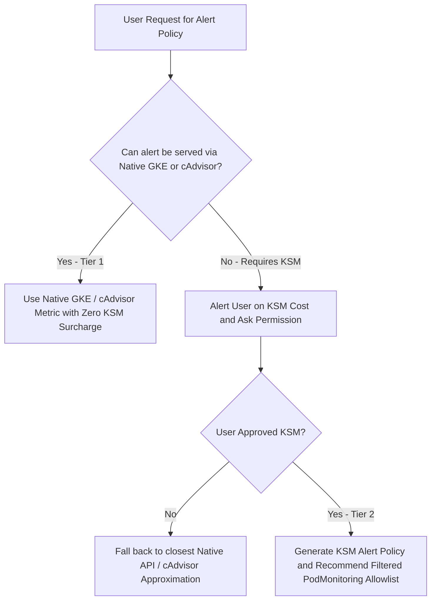

# Comprehensive GKE Metrics & Kubernetes Alerting Catalog

This catalog compiles public Google Kubernetes Engine (GKE) telemetry metrics
from the
[Google Cloud Managed Service for Prometheus Documentation](https://docs.cloud.google.com/monitoring/managed-prometheus.md.txt),
the
[GKE Observability Documentation](https://docs.cloud.google.com/kubernetes-engine/docs/concepts/monitoring.md.txt),
and the
[Google Cloud Monitoring Pricing Documentation](https://docs.cloud.google.com/monitoring/pricing.md.txt),
along with critical alerting rules from the open-source
[Awesome Prometheus Alerts for Kubernetes](https://samber.github.io/awesome-prometheus-alerts/rules/orchestrators/kubernetes/)
catalog.

It serves as the reference catalog for the `gke-alert-configuration` skill when
generating evaluation suites and production alerting policies in Google Cloud
Managed Service for Prometheus and Cloud Monitoring.

--------------------------------------------------------------------------------

## Table of Contents

*   [Telemetry Decision Hierarchy and KSM Cost Guardrails](#telemetry-decision-hierarchy-and-ksm-cost-guardrails)
    (~line 61)
    *   [Classification Tiers and Cost Optimization](#classification-tiers-and-cost-optimization)
        (~line 84)
    *   [Tier 2 Allowlist Template (PodMonitoring)](#tier-2-allowlist-template-podmonitoring-with-metricrelabeling)
        (~line 92)
*   [GKE Public Metrics Catalog (kubernetes.io/)](#gke-public-metrics-catalog-kubernetesio)
    (~line 119)
    *   [Container and Pod Core Metrics](#container-and-pod-core-metrics)
        (~line 123)
    *   [Node and Infrastructure Core Metrics](#node-and-infrastructure-core-metrics)
        (~line 143)
    *   [Autoscaling and Hardware Accelerator Metrics](#autoscaling-and-hardware-accelerator-metrics)
        (~line 157)
*   [Open Source Kubernetes Alerts Catalog (awesome-prometheus-alerts)](#open-source-kubernetes-alerts-catalog-awesome-prometheus-alerts)
    (~line 169)
    *   [Node Health and Capacity Alerts](#node-health-and-capacity-alerts)
        (~line 173)
    *   [Workload and Container Reliability Alerts](#workload-and-container-reliability-alerts)
        (~line 184)
    *   [Jobs, CronJobs, and Storage Alerts](#jobs-cronjobs-and-storage-alerts)
        (~line 199)
    *   [API Server and Control Plane Alerts](#api-server-and-control-plane-alerts)
        (~line 210)
*   [Non-KSM Native Alternative Implementations](#non-ksm-native-alternative-implementations)
    (~line 221)
    *   [Container Memory Saturation and OOM Risk](#container-memory-saturation-and-oom-risk-primary-saturation-alert)
        (~line 227)
    *   [Pod CrashLoopBackOff and Restarts](#pod-crashloopbackoff-and-restarts-non-ksm-alternative)
        (~line 257)
    *   [Node Readiness and Health](#node-readiness-and-health-non-ksm-alternative)
        (~line 277)
    *   [Multi-Window Multi-Burn-Rate SLO Error Rate Alerts](#multi-window-multi-burn-rate-mwmbr-slo-error-rate-alerts)
        (~line 287)
    *   [Traffic Outage Detection (absent() / default 0)](#traffic-outage-detection-absent--default-0)
        (~line 310)

--------------------------------------------------------------------------------

## Telemetry Decision Hierarchy and KSM Cost Guardrails

> [!IMPORTANT] **Cost Warning on `kube-state-metrics` (KSM)**: In Google Cloud
> Managed Service for Prometheus, billing is based on **metric samples
> ingested**. Deploying open-source `kube-state-metrics` unmodified scrapes
> state for every object across the cluster, generating high time-series volume
> and significant ingestion cost.
>
> **Mandatory Agent Guardrail**: When a user requests an alert that requires
> `kube-state-metrics`, you **must alert the user** that the policy requires
> KSM, ask for explicit permission before assuming or enabling KSM ingestion,
> and prefer **Non-KSM Native Alternatives** where possible.



### Classification Tiers and Cost Optimization

*   **Tier 1: Native GKE Built-ins / cAdvisor (Zero KSM Cost)**: Metrics
    collected natively by GKE or cAdvisor without `kube-state-metrics`.
*   **Tier 2: Filtered KSM (Requires Consent & Allowlist)**: Rules requiring
    Kubernetes control-plane state (such as Deployment spec versus ready
    replicas) that require `kube-state-metrics`.

#### Tier 2 Allowlist Template (`PodMonitoring` with `metricRelabeling`)

When KSM is required and authorized, always recommend configuring a filtered
`PodMonitoring` resource to scrape only the required metrics and drop all
others:

```yaml
apiVersion: monitoring.googleapis.com/v1
kind: PodMonitoring
metadata:
  name: kube-state-metrics-filtered
  namespace: kube-system
spec:
  selector:
    matchLabels:
      app.kubernetes.io/name: kube-state-metrics
  endpoints:
  - port: http-metrics
    interval: 30s
    metricRelabeling:
    - action: keep
      sourceLabels: [__name__]
      regex: "^(kube_deployment_.*|kube_statefulset_.*|kube_daemonset_.*|kube_cronjob_.*|kube_job_.*|kube_pod_status_phase|kube_pod_info|kube_pod_container_status_.*|kube_persistentvolume_status_phase)$"
```

--------------------------------------------------------------------------------

## GKE Public Metrics Catalog (`kubernetes.io/`)

Below are the public native GKE telemetry metrics available in Cloud Monitoring.

### Container and Pod Core Metrics

Metric Path                                             | Unit | Description                                         | Cost Tier
:------------------------------------------------------ | :--- | :-------------------------------------------------- | :--------
`kubernetes.io/container/cpu/core_usage_time`           | `s`  | Cumulative CPU time consumed by the container.      | Tier 1 (Native)
`kubernetes.io/container/cpu/limit_cores`               | `1`  | CPU core limit configured for the container.        | Tier 1 (Native)
`kubernetes.io/container/cpu/request_cores`             | `1`  | CPU core request configured for the container.      | Tier 1 (Native)
`kubernetes.io/container/memory/used_bytes`             | `By` | Total memory currently used by the container.       | Tier 1 (Native)
`kubernetes.io/container/memory/limit_bytes`            | `By` | Memory limit configured for the container.          | Tier 1 (Native)
`kubernetes.io/container/memory/request_bytes`          | `By` | Memory request configured for the container.        | Tier 1 (Native)
`kubernetes.io/container/memory/page_fault_count`       | `1`  | Cumulative count of memory page faults.             | Tier 1 (Native)
`kubernetes.io/container/restart_count`                 | `1`  | Number of times the container has restarted.        | Tier 1 (Native)
`kubernetes.io/container/uptime`                        | `s`  | Duration the container has been running.            | Tier 1 (Native)
`kubernetes.io/container/ephemeral_storage/used_bytes`  | `By` | Local ephemeral storage used by container.          | Tier 1 (Native)
`kubernetes.io/container/ephemeral_storage/limit_bytes` | `By` | Ephemeral storage limit for container.              | Tier 1 (Native)
`kubernetes.io/pod/network/received_bytes_count`        | `By` | Cumulative bytes received by pod network interface. | Tier 1 (Native)
`kubernetes.io/pod/network/sent_bytes_count`            | `By` | Cumulative bytes sent by pod network interface.     | Tier 1 (Native)
`kubernetes.io/pod/volume/used_bytes`                   | `By` | Persistent volume storage used by pod.              | Tier 1 (Native)
`kubernetes.io/pod/volume/total_bytes`                  | `By` | Total persistent volume storage capacity.           | Tier 1 (Native)

### Node and Infrastructure Core Metrics

Metric Path                                       | Unit | Description                                             | Cost Tier
:------------------------------------------------ | :--- | :------------------------------------------------------ | :--------
`kubernetes.io/node/cpu/allocatable_cores`        | `1`  | Total allocatable CPU cores on the node.                | Tier 1 (Native)
`kubernetes.io/node/cpu/total_cores`              | `1`  | Total physical CPU cores on the node.                   | Tier 1 (Native)
`kubernetes.io/node/cpu/core_usage_time`          | `s`  | Cumulative CPU core seconds used across node.           | Tier 1 (Native)
`kubernetes.io/node/memory/allocatable_bytes`     | `By` | Total allocatable memory on the node.                   | Tier 1 (Native)
`kubernetes.io/node/memory/used_bytes`            | `By` | Total memory currently used on the node.                | Tier 1 (Native)
`kubernetes.io/node/status`                       | `1`  | Current operational status of the node.                 | Tier 1 (Native)
`kubernetes.io/node/status_condition`             | `1`  | Condition status (Ready, MemoryPressure, DiskPressure). | Tier 1 (Native)
`kubernetes.io/node/ephemeral_storage/used_bytes` | `By` | Ephemeral storage bytes used on node filesystem.        | Tier 1 (Native)
`kubernetes.io/node/pid_used` / `pid_limit`       | `1`  | PIDs used vs. maximum PID limit on node.                | Tier 1 (Native)

### Autoscaling and Hardware Accelerator Metrics

Metric Path                                                                       | Unit | Description                                 | Cost Tier
:-------------------------------------------------------------------------------- | :--- | :------------------------------------------ | :--------
`kubernetes.io/autoscaler/container/cpu/per_replica_recommended_request_cores`    | `1`  | VPA recommended CPU request per replica.    | Tier 1 (Native)
`kubernetes.io/autoscaler/container/memory/per_replica_recommended_request_bytes` | `By` | VPA recommended memory request per replica. | Tier 1 (Native)
`kubernetes.io/autoscaler/recommenders/horizontal/target_value`                   | `1`  | HPA target metric value for autoscaling.    | Tier 1 (Native)
`kubernetes.io/container/accelerator/duty_cycle`                                  | `%`  | GPU/TPU accelerator execution duty cycle.   | Tier 1 (Native)
`kubernetes.io/container/accelerator/memory_used`                                 | `By` | GPU/TPU accelerator memory allocated.       | Tier 1 (Native)

--------------------------------------------------------------------------------

## Open Source Kubernetes Alerts Catalog (`awesome-prometheus-alerts`)

Compiled from the open-source community catalog.

### Node Health and Capacity Alerts

Alert Name                              | Open Source PromQL Rule                                                                                                                                                                                                   | Severity | KSM Required? | Non-KSM Native Alternative Available?
:-------------------------------------- | :------------------------------------------------------------------------------------------------------------------------------------------------------------------------------------------------------------------------ | :------- | :------------ | :------------------------------------
**Kubernetes Node not ready**           | `kube_node_status_condition{condition="Ready",status="true"} == 0`                                                                                                                                                        | Critical | No (Standard) | Yes (Tier 1 PromQL / native node status)
**Kubernetes Node scheduling disabled** | `kube_node_spec_taint{key="node.kubernetes.io/unschedulable"} == 1`                                                                                                                                                       | Warning  | No (Standard) | Yes
**Kubernetes Node memory pressure**     | `kube_node_status_condition{condition="MemoryPressure",status="true"} == 1`                                                                                                                                               | Critical | No (Standard) | Yes
**Kubernetes Node disk pressure**       | `kube_node_status_condition{condition="DiskPressure",status="true"} == 1`                                                                                                                                                 | Critical | No (Standard) | Yes
**Kubernetes Node network unavailable** | `kube_node_status_condition{condition="NetworkUnavailable",status="true"} == 1`                                                                                                                                           | Critical | No (Standard) | Yes
**Kubernetes Node out of pod capacity** | `sum by (node) ((kube_pod_status_phase{phase="Running"} == 1) + on(uid, instance) group_left(node) (0 * kube_pod_info{pod_template_hash=""})) / sum by (node) (kube_node_status_allocatable{resource="pods"}) * 100 > 90` | Warning  | **Yes (KSM)** | Yes (Approximate via cAdvisor pod count)

### Workload and Container Reliability Alerts

Alert Name                                       | Open Source PromQL Rule                                                                                                                                                                                                     | Severity | KSM Required? | Non-KSM Native Alternative Available?
:----------------------------------------------- | :-------------------------------------------------------------------------------------------------------------------------------------------------------------------------------------------------------------------------- | :------- | :------------ | :------------------------------------
**Kubernetes Pod crash looping**                 | `increase(kube_pod_container_status_restarts_total[15m]) > 3`                                                                                                                                                               | Warning  | No (cAdvisor) | Yes (`kubernetes.io/container/restart_count`)
**Kubernetes Pod not healthy**                   | `sum by (namespace, pod) (kube_pod_status_phase{phase=~"Pending\|Unknown\|Failed"}) > 0`                                                                                                                                    | Critical | **Yes (KSM)** | Partial (Native pod availability checks)
**Kubernetes Container OOMKiller**               | `(kube_pod_container_status_restarts_total - kube_pod_container_status_restarts_total offset 10m >= 1) and ignoring (reason) min_over_time(kube_pod_container_status_last_terminated_reason{reason="OOMKilled"}[10m]) == 1` | Warning  | **Yes (KSM)** | Yes (Memory usage > 95% of container limit)
**Kubernetes Deployment replicas mismatch**      | `kube_deployment_spec_replicas != kube_deployment_status_replicas_available`                                                                                                                                                | Warning  | **Yes (KSM)** | No exact match without KSM (Control Plane state)
**Kubernetes StatefulSet replicas mismatch**     | `kube_statefulset_status_replicas_ready != kube_statefulset_status_replicas`                                                                                                                                                | Warning  | **Yes (KSM)** | No exact match without KSM
**Kubernetes StatefulSet down**                  | `kube_statefulset_replicas != kube_statefulset_status_replicas_ready > 0`                                                                                                                                                   | Critical | **Yes (KSM)** | No exact match without KSM
**Kubernetes Deployment generation mismatch**    | `kube_deployment_status_observed_generation != kube_deployment_metadata_generation`                                                                                                                                         | Critical | **Yes (KSM)** | Requires KSM
**Kubernetes StatefulSet update not rolled out** | `max without (revision) (kube_statefulset_status_current_revision unless kube_statefulset_status_update_revision) * (kube_statefulset_replicas != kube_statefulset_status_replicas_updated)`                                | Warning  | **Yes (KSM)** | Requires KSM
**Kubernetes DaemonSet rollout stuck**           | `(kube_daemonset_status_number_ready / kube_daemonset_status_desired_number_scheduled * 100 < 100) or (kube_daemonset_status_desired_number_scheduled - kube_daemonset_status_current_number_scheduled > 0)`                | Warning  | **Yes (KSM)** | Requires KSM
**Kubernetes DaemonSet misscheduled**            | `kube_daemonset_status_number_misscheduled > 0`                                                                                                                                                                             | Critical | **Yes (KSM)** | Requires KSM

### Jobs, CronJobs, and Storage Alerts

Alert Name                              | Open Source PromQL Rule                                                                                                                                          | Severity | KSM Required? | Non-KSM Native Alternative Available?
:-------------------------------------- | :--------------------------------------------------------------------------------------------------------------------------------------------------------------- | :------- | :------------ | :------------------------------------
**Kubernetes Job failed**               | `kube_job_status_failed > 0`                                                                                                                                     | Warning  | **Yes (KSM)** | Requires KSM
**Kubernetes Job not starting**         | `kube_job_status_active == 0 and kube_job_status_failed == 0 and kube_job_status_succeeded == 0 and (time() - kube_job_status_start_time) > 600`                 | Warning  | **Yes (KSM)** | Requires KSM
**Kubernetes CronJob failing**          | `(kube_cronjob_status_last_schedule_time > kube_cronjob_status_last_successful_time) AND (kube_cronjob_status_active == 0) AND (kube_cronjob_spec_suspend == 0)` | Critical | **Yes (KSM)** | Requires KSM
**Kubernetes Volume out of disk space** | `kubelet_volume_stats_available_bytes / kubelet_volume_stats_capacity_bytes * 100 < 10 and kubelet_volume_stats_capacity_bytes > 0`                              | Warning  | No (Kubelet)  | Yes (`kubernetes.io/pod/volume/...`)
**Kubernetes Volume full in four days** | `predict_linear(kubelet_volume_stats_available_bytes[6h:5m], 4 * 24 * 3600) < 0`                                                                                 | Critical | No (Kubelet)  | Yes
**Kubernetes PersistentVolume error**   | `kube_persistentvolume_status_phase{phase=~"Failed\|Pending"} > 0`                                                                                               | Critical | **Yes (KSM)** | Requires KSM

### API Server and Control Plane Alerts

Alert Name                                     | Open Source PromQL Rule                                                                                                                                                                                                                                                | Severity | KSM Required? | Non-KSM Native Alternative Available?
:--------------------------------------------- | :--------------------------------------------------------------------------------------------------------------------------------------------------------------------------------------------------------------------------------------------------------------------- | :------- | :------------ | :------------------------------------
**Kubernetes API server errors**               | `sum(rate(apiserver_request_total{job="apiserver",code=~"(?:5..)"}[1m])) by (instance, job) / sum(rate(apiserver_request_total{job="apiserver"}[1m])) by (instance, job) * 100 > 3 and sum(rate(apiserver_request_total{job="apiserver"}[1m])) by (instance, job) > 0` | Critical | No            | Yes (Native Control Plane PromQL)
**Kubernetes API client errors**               | `(sum(rate(rest_client_requests_total{code=~"(4\|5).."}[1m])) by (instance, job) / sum(rate(rest_client_requests_total[1m])) by (instance, job)) * 100 > 1 and sum(rate(rest_client_requests_total[1m])) by (instance, job) > 0`                                       | Critical | No            | Yes (Native Control Plane PromQL)
**Kubernetes client certificate expires soon** | `apiserver_client_certificate_expiration_seconds_count{job="apiserver"} > 0 and on(job) histogram_quantile(0.01, sum by (job, le) (rate(apiserver_client_certificate_expiration_seconds_bucket{job="apiserver"}[5m]))) < 24*60*60`                                     | Critical | No            | Yes (Native Control Plane PromQL)
**Kubernetes API server latency**              | `histogram_quantile(0.99, sum(rate(apiserver_request_duration_seconds_bucket{verb!~"(?:CONNECT\|WATCHLIST\|WATCH\|PROXY)"}[10m])) WITHOUT (subresource)) > 1`                                                                                                          | Warning  | No            | Yes (Native Control Plane PromQL)

--------------------------------------------------------------------------------

## Non-KSM Native Alternative Implementations

When a user requests open-source catalog alerts that normally rely on
`kube-state-metrics`, the skill must first offer these **Tier 1 (Non-KSM)**
equivalents to avoid customer ingestion costs:

### Container Memory Saturation and OOM Risk (Primary Saturation Alert)

Instead of `container_memory_working_set_bytes /
kube_pod_container_resource_limits`, use native cAdvisor limits:

```promql
sum(
  container_memory_working_set_bytes{
    cluster="${var.cluster_name}",
    namespace="${var.namespace}",
    container!=""
  }
) by (pod, container)
/
sum(
  container_spec_memory_limit_bytes{
    cluster="${var.cluster_name}",
    namespace="${var.namespace}",
    container!=""
  }
) by (pod, container) > 0.90
```

> [!NOTE] **Memory versus CPU Saturation**: In Kubernetes, CPU is compressible
> and throttled by the CFS scheduler without killing containers. Memory is
> uncompressible and triggers fatal OOMKilled events. Therefore, cluster
> saturation alerting focuses on **Memory Saturation**, and CPU saturation
> alerts (and `container_cpu_usage_seconds_total`) are excluded from the
> recommended cluster alert suite.

### Pod CrashLoopBackOff and Restarts (Non-KSM Alternative)

Use native GKE Cloud Monitoring metric `kubernetes.io/container/restart_count`
or cAdvisor restart counter:

```promql
sum(
  increase(
    kube_pod_container_status_restarts_total{
      cluster="${var.cluster_name}",
      namespace="${var.namespace}"
    }[15m]
  )
) by (pod, container) > 3
```

*   **Duration Rule**: Set Terraform `duration = "0s"` (or `"60s"`). The `[15m]`
    lookback window already smooths transient spikes; adding `duration = "300s"`
    delays critical crashloop alerts by 20 minutes total.

### Node Readiness and Health (Non-KSM Alternative)

```promql
kube_node_status_condition{
  cluster="${var.cluster_name}",
  condition="Ready",
  status="true"
} == 0
```

### Multi-Window Multi-Burn-Rate (MWMBR) SLO Error Rate Alerts

For service error rate monitoring, use multi-window burn rate alerts instead of
simple static ratios:

```promql
(
  (
    sum(rate(http_requests_total{cluster="${var.cluster_name}", namespace="${var.namespace}", status=~"5.."}[5m])) by (service)
    /
    sum(rate(http_requests_total{cluster="${var.cluster_name}", namespace="${var.namespace}"}[5m])) by (service)
  ) > (1 - 0.99) * 14.4
)
and
(
  (
    sum(rate(http_requests_total{cluster="${var.cluster_name}", namespace="${var.namespace}", status=~"5.."}[1h])) by (service)
    /
    sum(rate(http_requests_total{cluster="${var.cluster_name}", namespace="${var.namespace}"}[1h])) by (service)
  ) > (1 - 0.99) * 14.4
)
```

### Traffic Outage Detection (`absent()` / `default 0`)

Avoid brittle `== 0` checks. Use `default 0` or `absent()` to detect total
traffic loss:

```promql
(sum(rate(http_requests_total{cluster="${var.cluster_name}", namespace="${var.namespace}"}[5m])) by (service) default 0) == 0
and
(sum(rate(http_requests_total{cluster="${var.cluster_name}", namespace="${var.namespace}"}[5m] offset 1w)) by (service)) > 1
```
