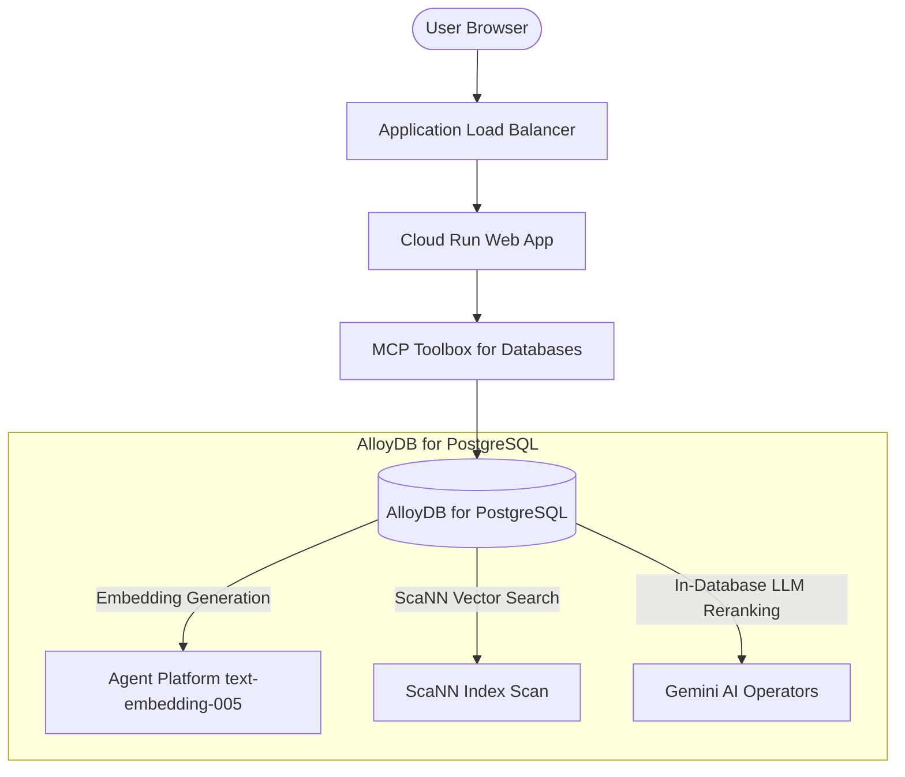

<!-- Use this template to compile the content that you generate based on the
instructions in `SKILL.md`. -->

# Google Cloud solution architecture: Hybrid Search

## 1. Executive summary and workload overview

[A brief description of the workload, its business goals, and the high-level
solution architecture proposed.]

## 2. Requirements and current state

### 2.1. Functional requirements

- **Business processes**: [Details of the business processes supported]
- **Activities and use cases**: [Details of the key activities and use cases]

### 2.2. Non-functional requirements

- **Security**: [Details of the security requirements including compliance,
  encryption, access control requirements]
- **Reliability**: [Details of the reliability requirements including SLA,
  RTO/RPO, backup, redundancy requirements]
- **Cost**: [Details of the cost constraints and pricing models]
- **Operations**: [Details of the operational requirements including
  monitoring, logging, deployment, maintenance requirements]
- **Performance**: [Details of the performance requirements including latency,
  throughput, scaling requirements]
- **Sustainability**: [Details of the sustainability requirements including
  carbon footprint, resource optimization requirements]

### 2.3. Current state

[If applicable, describe the current on-premises or other-cloud architecture.]

- **Current infrastructure**: [Details of existing setup]
- **Pain points and drivers for migration/redesign**: [Details of the drivers
  for migration/redesign]

### 2.4. Dependencies

- **Internal dependencies**: [Details of internal dependencies including other
  workloads and internal services]
- **External dependencies**: [Details of external dependencies including
  third-party products and on-premises tools]

## 3. Technical decomposition of the workload

[Technical decomposition of the workload components, breaking down the
application into logical layers: data ingestion & embedding pipeline, relational
& vector data store, hybrid query engine & reranker, database abstraction &
agentic tooling, and web application UI.]

## 4. Proposed solution architecture

### 4.1. Google Cloud products and features mapping

[Identify Google Cloud products and features mapped to the technical
components. For each component, justify the selection, note alternatives
considered, and describe the pros and cons of the recommended product/feature
and alternatives.]

| Component            | Recommended Google Cloud product/feature | Justification and citations                        | Alternatives considered | Pros and cons of alternatives    |
| :------------------- | :--------------------------------------- | :------------------------------------------------- | :---------------------- | :------------------------------- |
| **[Component Name]** | **[Product Name]**                       | [Why this product is chosen, citing official docs] | [Alternative product]   | **Pros**: ...   **Cons**: ... |

### 4.2. Architecture diagram

[Architecture diagram in Mermaid format showing the relationships and flows
between the components of the architecture.]

### 4.3. Architecture description

[Detailed description of the architecture. Describe the task flow and data
flow between the components of the architecture.]

- **Data flow**: [Describe the flow of data.]
- **Tasks/control flow**: [Describe the flow of tasks/control.]

## 5. Design and configuration recommendations

[Best practices and configuration recommendations for each pillar of the
Google Cloud Architecture Framework.]

### 5.1. Security, privacy, and compliance

*   **Access control**: [E.g., IAM least privilege roles (roles/alloydb.client, roles/aiplatform.user), PostgreSQL database-native CREATE ROLE permissions, search_path isolation]
*   **Data protection**: [E.g., CMEK encryption at rest, mTLS Auth Proxy transit encryption, DLP de-identification templates]
*   **Network Security**: [E.g., Direct VPC Egress, Private Services Access/PSC, Cloud Armor WAF rules, disabled default run.app URLs]

### 5.2. Reliability

*   **Redundant deployment**: [E.g., AlloyDB multi-zone HA instance, regional Cloud Run deployment]
*   **Backup and DR**: [E.g., AlloyDB continuous microsecond PITR backups, cross-region replication]

### 5.3. Operational excellence

*   **Monitoring and logging**: [E.g., Cloud Logging structured JSON logs, Cloud Trace, AlloyDB Query Insights and System Insights dashboards]
*   **Infrastructure as Code (IaC)**: [E.g., Terraform manifests, gcloud CLI commands]

### 5.4. Cost optimization

*   **Sizing and scaling**: [E.g., Cloud Run scale-to-zero, Cloud Storage Object Lifecycle Management]
*   **Pricing models**: [E.g., Committed Use Discounts (CUDs) for AlloyDB compute]

### 5.5. Performance efficiency

*   **Caching and database indexing**: [E.g., ScaNN multi-level tree tuning (num_leaves, num_leaves_to_search), B-tree facet indexes, leaf search streaming (scann.satisfy_limit = 'relaxed_order')]
*   **Data updates**: [E.g., Automated embedding generation, automatic ScaNN index self-maintenance (`MODE='AUTO'`)]

### 5.6. Sustainability

*   [E.g., Serverless compute scaling, in-database query execution and AI function evaluation]

## 6. Deployment guidance

[Instructions and code for deploying the architecture.]

### 6.1. Deployment prerequisites

*   [Prerequisite 1: E.g., Enabling APIs (alloydb.googleapis.com, aiplatform.googleapis.com, run.googleapis.com)]
*   [Prerequisite 2: E.g., Installing SDKs/tools (gcloud, terraform, psql)]
*   ...and so on

### 6.2. Step-by-step deployment instructions

1.  [Step 1: E.g., Authenticate with Google Cloud and set project environment]
2.  [Step 2: E.g., Initialize and apply Terraform infrastructure manifests]
3.  [Step 3: E.g., Deploy containerized application and MCP tools to Cloud Run]

## 7. Validation plan

[Details of the pre-deployment static dry-run checks and post-deployment runtime
verification steps (e.g., ScaNN vector query recall measurement using
evaluate_query_recall, endpoint health checks).]

## 8. References

- [E.g., Secure agent interactions with MCP Toolbox for Databases](https://docs.cloud.google.com/alloydb/docs/ai/secure-agent-interactions-mcp)
- [E.g., RAG infrastructure for generative AI using Agent Platform and AlloyDB for PostgreSQL](https://docs.cloud.google.com/architecture/rag-capable-gen-ai-app-using-vertex-ai)
- [E.g., Best practices for tuning ScaNN index in AlloyDB](https://docs.cloud.google.com/alloydb/docs/ai/best-practices-tuning-scann)
- [E.g., Choose a connectivity option for AlloyDB](https://docs.cloud.google.com/alloydb/docs/choose-alloydb-connectivity)
- [E.g., AlloyDB security best practices](https://docs.cloud.google.com/alloydb/docs/security-best-practices)
