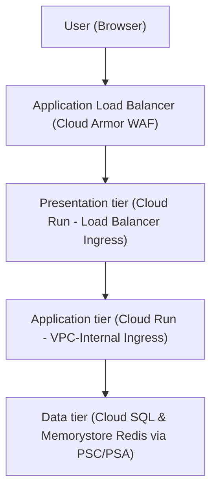

<!-- Use this template to compile the solution architecture and code generated
based on the instructions in SKILL.md. -->
<!-- disableFinding(all) -->
<!-- mdlint off -->

# Google Cloud solution architecture: [Workload Name]

Note: Standalone text or instructions enclosed between [ and ] (e.g., [Workload Name] or [Paste code here]) represent placeholder instructions or sample text that are replaced by the agent when populating this template.

## 1. Executive summary and workload overview

[A brief description of the workload, its business goals, and the high-level
N-Tier (multi-tier) serverless solution architecture proposed across your
compute and data tiers.]

## 2. Requirements and current state

### 2.1. Functional requirements

*   **Business processes**: [Details of the business processes supported]
*   **Activities and use cases**: [Details of the key activities and use cases]

### 2.2. Non-functional requirements

*   **Security & Zero-Trust**: [Details of security requirements including
    single-domain reverse proxy, WAF mitigation, VPC-internal ingress
    isolation (`INGRESS_TRAFFIC_INTERNAL_ONLY`), and optional VPC Service
    Controls]
*   **Reliability & Availability**: [Details of reliability constraints, SLA
    targets, auto-scaling concurrency, and multi-zone regional high
    availability]
*   **Cost**: [Details of cost constraints, serverless $0 idle cost preferences
    (`ALL_TRAFFIC` + PGA), and pricing models]
*   **Operations & Observability**: [Details of monitoring, structured logging,
    database Query Insights, and continuous deployment requirements]
*   **Performance**: [Details of latency, connection pooling, Cloud CDN caching,
    and Memorystore Redis caching requirements]
*   **Sustainability**: [Details of serverless resource optimization and carbon
    footprint reduction strategies]

### 2.3. Current state

[If applicable, describe the current on-premises, legacy v1 Cloud Run, or
other-cloud architecture.]

*   **Current infrastructure**: [Details of existing setup]
*   **Pain points and drivers for migration/redesign**: [Details of drivers for
    migration/redesign]

### 2.4. Dependencies

*   **Internal dependencies**: [Details of internal dependencies including
    existing VPCs, domain names, and downstream APIs]
*   **External dependencies**: [Details of third-party SaaS products and
    on-premises tools]

## 3. Technical decomposition of the workload

[Decompose the workload into distinct logical tiers across the request
lifecycle, ensuring strict security boundary segregation:]

*   **Tier 1 presentation tier (frontend / reverse proxy)**: Public-facing UI
    rendering and gateway proxy service
    (`google_cloud_run_v2_service.frontend`). Ingress restricted strictly to
    Application Load Balancer (`INGRESS_TRAFFIC_INTERNAL_LOAD_BALANCER`).
*   **Tier 2..N application tier (internal microservices / business logic)**:
    1 to N internal business logic services
    (`google_cloud_run_v2_service.backend_application`, `orders_service`, etc.). Ingress
    restricted strictly to VPC-internal (`INGRESS_TRAFFIC_INTERNAL_ONLY`).
*   **Data tier (persistent database and in-memory cache)**: Private relational
    database (`Cloud SQL PostgreSQL 18 Enterprise Edition` with `database_version = "POSTGRES_18"`, Regional HA `availability_type = "REGIONAL"`, and `Private Service Connect` configuration `psc_enabled = true, ipv4_enabled = false`) and cache
    (`Memorystore Redis` via `Private Services Access`).
*   **Shared security and lifecycle tiers**: Container image management
    (`Artifact Registry`), secret credentials (`Secret Manager`), private internal DNS resolution (`Cloud DNS Managed Private Zone` for `run.app.`), and zero-trust
    Cloud NGFW network firewall policies (`google_compute_network_firewall_policy`, `google_compute_network_firewall_policy_association`, and `google_compute_network_firewall_policy_rule`).

## 4. Proposed solution architecture

### 4.1. Google Cloud products and features mapping

[Map your confirmed decomposition directly to Google Cloud products based on the
mandatory product mapping specifications in `SKILL.md`. Justify every selection and note
trade-offs:]

[Populate the following table with the appropriate content at runtime.]

| Component | Recommended Google Cloud product/feature | Justification and citations | Alternatives considered | Pros and cons of alternatives |
| :--- | :--- | :--- | :--- | :--- |

### 4.2. Architecture diagram

[Mermaid architecture flowchart illustrating the request and data flow across public and private tiers:]
[The following diagram is a sample and must be updated to reflect actual recommendation if necessary.]



### 4.3. Architecture description

*   **Data flow**: [Describe the secure request and data payload lifecycle from
    edge entry point `https://domain.com` through tier 1 reverse proxying,
    internal microservice processing, and persistent database/cache storage.]
*   **Tasks/control flow**: [Describe container startup authentication,
    least-privilege IAM service account execution (`roles/run.invoker`,
    `roles/cloudsql.client`), and Cloud SQL sidecar socket connections.]

## 5. Design and configuration recommendations

[Populate the following subsections with clear, parameter-dense recommendations adhering to Google Cloud Architecture Framework pillars. The included text is a sample and must be updated to reflect actual recommendation if necessary.]

### 5.1. Security, privacy, and compliance

*   **Edge WAF & Ingress Filtering**: Attach Cloud Armor security policy (`google_compute_security_policy` with `sqli-v33-stable` preconfigured rule) to Application Load Balancer backend service. Tier 1 Frontend ingress is restricted to `INGRESS_TRAFFIC_INTERNAL_LOAD_BALANCER` to prevent direct `*.run.app` URL bypass.
*   **VPC-Internal Compute Ingress & Cloud DNS**: Intermediate/backend microservices (T2..TN) are restricted strictly to `INGRESS_TRAFFIC_INTERNAL_ONLY`. Deploy a Cloud DNS Managed Private Zone (`google_dns_managed_zone`) for `run.app.` bound to `vpc_network` with `google_dns_record_set` mapping `*.run.app` to Private Google Access VIPs (`199.36.153.4/30 / 199.36.153.8/30`) so `egress = "ALL_TRAFFIC"` requests resolve internally without hitting default-deny firewalls or public IP routing.
*   **Cloud NGFW Egress Firewalls & Sidecar Cert Exchange (`443`)**: Enforce zero-trust Cloud NGFW network firewall policies (`google_compute_network_firewall_policy_rule`) with default-deny outbound (`0.0.0.0/0`, priority 65534). Allow frontend egress to backend / PGA VIPs (`80, 443`), and backend egress (`allow_backend_db_egress`) to Cloud SQL PSC IP (TCP 5432) and PGA VIPs (TCP 443 on `199.36.153.4/30, 199.36.153.8/30`) so the Cloud SQL Auth Proxy sidecar can query `sqladmin.googleapis.com` on startup for IAM certificate exchange.
*   **Cloud SQL Auth Proxy & IAM Database Auth (`DB_SOCKET_PATH`)**: Mount Cloud SQL Auth Proxy sidecar via `cloud_sql_instance` volume (`/cloudsql/project:region:instance` Unix socket). Configure IAM DB authentication (`cloudsql.iam_authentication = on`, `roles/cloudsql.client` via `google_sql_user`). Recommend `DB_SOCKET_PATH` (`/cloudsql/...` Unix socket) as the primary/default path over direct TCP (`DB_PSC_ENDPOINT`).
*   **VPC Service Controls Perimeter**: Document/support wrapping `run.googleapis.com`, `sqladmin.googleapis.com`, and `secretmanager.googleapis.com` in an Org-level VPC-SC perimeter when `enable_vpc_sc = true`.
*   **Regional Sovereignty (if applicable)**: For EU/regional data residency compliance, deploy Regional External ALB (`google_compute_region_backend_service`), omit Cloud CDN, provision a regional proxy-only subnet (`purpose = "REGIONAL_MANAGED_PROXY"`), and specify `network` on the regional forwarding rule (`google_compute_forwarding_rule`).

### 5.2. Reliability

*   **Cloud SQL PostgreSQL Regional HA & PSC**: Provision Cloud SQL for PostgreSQL (`POSTGRES_18`) Enterprise Edition with Regional High Availability (`availability_type = "REGIONAL"`, point-in-time recovery enabled), and connect via Private Service Connect (`psc_enabled = true, ipv4_enabled = false`, `google_compute_forwarding_rule`).
*   **Redundant Serverless Deployment**: Cloud Run v2 automatically distributes instances across physical zones in `var.region`. Configure `scaling.min_instance_count` and `max_instance_count` to eliminate cold-start latency and protect downstream tiers.

### 5.3. Operational excellence

*   **Structured Logging & Error Reporting**: Emit structured JSON logs (`severity`, `message`, `trace`) for automated ingestion in Logs Explorer and unhandled exception grouping in Cloud Error Reporting.
*   **VPC Flow Logs & Firewall Policy Logging**: Enable VPC Flow Logs (`flow_sampling = 0.1`, `aggregation_interval = "INTERVAL_1_MIN"`) on Cloud Run subnet and firewall logging (`enable_logging = var.enable_monitoring`) for network access auditing.
*   **Database Insights & Synthetic Probes**: Enable Cloud SQL Query Insights (`query_insights_enabled = true`) for query execution and contention auditing. Configure Cloud Monitoring Uptime Checks (`/healthz`) and threshold alerts for Frontend HTTP 5xx error rates.
*   **Infrastructure as Code (IaC)**: Manage all infrastructure using modular Terraform (`assets/main.tf`) with stateful deletion protection (`deletion_protection = true`).

### 5.4. Cost optimization

*   **Serverless Idle Efficiency ($0 Baseline)**: Internal routing via Direct VPC Egress (`ALL_TRAFFIC`) + Private Google Access + Cloud DNS private zone operates at $0 idle cost without intermediate internal load balancers.
*   **Edge Caching**: Enable Cloud CDN (`enable_cdn = true`) on Global ALB to cache static assets and reduce Cloud Run container activations and egress fees.

### 5.5. Performance efficiency

*   **In-Memory Caching**: Deploy Memorystore for Redis via Private Services Access (`connect_mode = "PRIVATE_SERVICE_ACCESS"`) to cache session state and frequent database read queries.
*   **Connection Pooling**: Implement database connection pooling inside application containers to prevent PostgreSQL connection saturation during traffic spikes.

### 5.6. Sustainability

*   **Scale-to-Zero Compute**: Fully serverless Cloud Run architecture scales compute instances to zero during idle periods, optimizing datacenter utilization and carbon efficiency.

## 6. Deployment guidance

[The following steps are samples only. Provide complete, actionable deployment instructions, your generated modular
Terraform code, and your generated cross-platform verification scripts below.]

### 6.1. Step-by-step deployment instructions

*   **Zero-Install Environment Recommendation**: For immediate deployment
    without local SDK installations, run all steps below inside **Google Cloud
    Shell** (`https://shell.cloud.google.com`), where `terraform`, `python3`,
    `gcloud`, and `git` are 100% pre-installed and authenticated out of the box.

1.  **Select Google Cloud Project and Enable APIs**:
    ```bash
    gcloud config set project [YOUR_PROJECT_ID]
    gcloud services enable run.googleapis.com sqladmin.googleapis.com redis.googleapis.com \
        servicenetworking.googleapis.com secretmanager.googleapis.com monitoring.googleapis.com \
        dns.googleapis.com
    ```

2.  **Initialize and Apply Modular Terraform Configuration**:
    ```bash
    terraform init
    # For production with a custom domain:
    terraform apply -var="domain_name=app.mycompany.com"
    # For sandbox/dev testing over IP with a self-signed certificate:
    terraform apply -var="use_self_signed_cert=true"
    ```
3.  **DNS Cutover & SSL Validation**: If using a Google-managed certificate (`use_self_signed_cert = false`), create a DNS `A` record at your registrar pointing `var.domain_name` to the outputted `load_balancer_ip`. If using self-signed mode (`use_self_signed_cert = true`), you can test immediately over HTTPS via `curl -k https://[LOAD_BALANCER_IP]/`.
4.  **Optional VPC Service Controls (`enable_vpc_sc`) Configuration**: If
    deploying with `enable_vpc_sc = true`, ensure your active identity is an
    Organization Access Context Manager Admin and update your service perimeter
    to include the newly deployed project and required APIs before starting
    containers.

### 6.2. Modular infrastructure as code (`main.tf`)

[Embed your complete, deploy-ready Terraform (`main.tf`) code generated from
`assets/main.tf` below, containing Section 5.1 ("Tier 1 presentation tier: frontend reverse proxy") and
replicated Section 5.2 ("Tier 2 application tier: private backend API") building blocks inside `assets/main.tf`
tailored to the user's workload, ensuring `database_version = "POSTGRES_18"` is strictly preserved:]

```hcl
# [Paste complete deploy-ready generated main.tf HCL code here]
```

### 6.3. Step-by-step `gcloud` CLI deployment commands

[Replace the following sample code with the complete sequence of `gcloud` CLI commands required to deploy this exact three-tier architecture manually from the terminal. Ensure the sequence executes in strict **bottom-up deployment order** (`internal data tier -> internal microservices -> public presentation gateway -> external Application Load Balancer`), enforces `--database-version=POSTGRES_18` for Cloud SQL, and captures dynamic downstream URLs into shell variables to automatically pass them inside `--update-env-vars`:]

```bash
# 1. Create VPC network and private subnet with Private Google Access enabled
[gcloud command to create a VPC network]
[gcloud command to create a subnet]

# 2. Provision data tier (Private Cloud SQL instance with Public IP disabled & Private Redis)
[gcloud command to create a Cloud SQL instance with --database-version=POSTGRES_18 --no-assign-ip --enable-private-service-connect ...]
[gcloud command to create a Redis instance]

# 3. Deploy internal application tier service (strictly VPC-internal ingress & Direct VPC Egress)
[gcloud command to create an application tier service]

# 4. Extract generated internal application tier URL into shell variable for service wiring
[shell command to extract an application tier URL]

# 5. Deploy presentation tier frontend service with load balancer-only ingress, injecting BACKEND_URL right into environment variables
[gcloud command to deploy the presentation tier service]

# 6. Create Serverless NEG and attach to external Application Load Balancer with Cloud Armor WAF
[gcloud command to create a serverless NEG]
# [Paste remaining gcloud compute backend-services / url-maps / target-https-proxies commands here]
```

### 6.4. Solution verification guide and custom automated validation script

[Embed your custom automated validation script (e.g., self-contained
cross-platform Python script using standard `urllib` / `subprocess` or
cross-platform shell script) generated per Phase 4 validation steps across SSL
provisioning, Tier 1 ingress blocking, Tier 2..N internal VPC ingress blocking,
Application Load Balancer reachability, and Cloud Armor WAF SQLi interception:]

```python
# [Paste custom generated verification script code here]
```

*   **Execution Commands**:
  ```bash
  python3 validate.py <custom_domain> <ssl_cert_name> <frontend_run_url> [internal_run_url_1 ...]
  ```

## 7. References

*   [Google Cloud Architecture Framework](https://docs.cloud.google.com/architecture/framework.md.txt)
*   [Cloud Run Direct VPC Egress](https://docs.cloud.google.com/run/docs/configuring/vpc-direct-vpc.md.txt)
*   [Private Service Connect for Cloud SQL](https://docs.cloud.google.com/sql/docs/postgres/configure-private-service-connect.md.txt)
*   [Google Cloud Terraform Best Practices](https://docs.cloud.google.com/docs/terraform/best-practices/general-style-structure.md.txt)