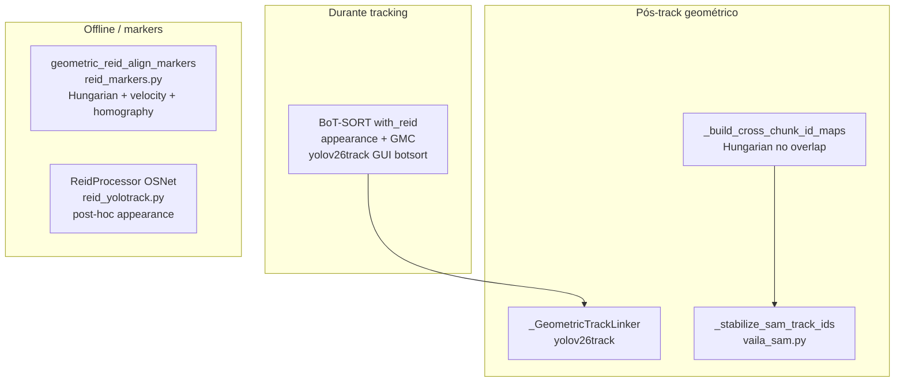
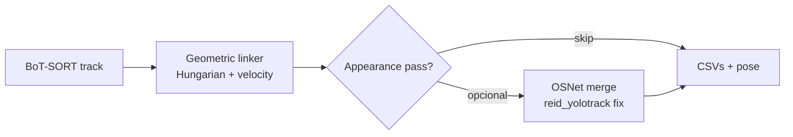

# Análise e melhorias Re-ID em vailá

## Estado atual (o que já funciona bem)

vailá usa **quatro camadas** de identidade, com papéis distintos:



| Camada | Ficheiro | Algoritmo | Força principal |
|--------|----------|-----------|-----------------|
| BoT-SORT ReID | [`vaila/yolov26track.py`](vaila/yolov26track.py) L5158+ | Embeddings Ultralytics + GMC | Oclusões curtas, pan de câmara |
| Linker YOLO | [`_GeometricTrackLinker`](vaila/yolov26track.py) L2403 | Greedy IoU + centróide | Corrige flicker de ID pós-tracker |
| SAM chunk | [`_build_cross_chunk_id_maps`](vaila/vaila_sam.py) L1734 | Hungarian + IoU médio no overlap | IDs globais em vídeos longos |
| SAM stabilize | [`_stabilize_sam_track_ids`](vaila/vaila_sam.py) L2802 | Greedy IoU + centróide | Meta CSV estável p/ getpixelvideo |
| Markers | [`geometric_reid_align_markers`](vaila/reid_markers.py) L697 | **Hungarian** + direção velocidade + homografia | Melhor matching multi-alvo em cruzamentos |
| OSNet offline | [`reid_yolotrack.py`](vaila/reid_yolotrack.py) | Cosine clustering em crops | Re-merge após tracking errado |

**Conclusão:** a stack cobre bem broadcast esportivo em três níveis (tracker → stabilize → markers). O gap não é “falta de ReID”, mas **inconsistência entre módulos** e **subutilização de appearance**.

---

## Gaps encontrados (prioridade alta)

### 1. Matching greedy onde já existe Hungarian

[`_GeometricTrackLinker.assign_frame`](vaila/yolov26track.py) e [`_stabilize_sam_track_ids`](vaila/vaila_sam.py) usam **greedy por ordem de detecção**. Em cruzamentos com N jogadores, a ordem da lista pode trocar IDs.

Já existe `_assignment_min_cost` (Hungarian) em **três ficheiros duplicados**:
- [`yolov26track.py`](vaila/yolov26track.py) L2300 — **definido mas nunca chamado**
- [`reid_markers.py`](vaila/reid_markers.py) L668 — usado em `geometric_reid_align_markers`
- [`vaila_sam.py`](vaila/vaila_sam.py) L1699 — usado em `_build_cross_chunk_id_maps`

**Melhoria:** substituir greedy por Hungarian frame-a-frame (mesmo padrão de `reid_markers`).

### 2. Velocity/direction só em markers, não em YOLO/SAM

[`geometric_reid_align_markers`](vaila/reid_markers.py) usa:

```775:775:vaila/reid_markers.py
                cost[i, j] = d * (1.0 + float(direction_weight) * alignment_penalty)
```

YOLO/SAM usam só `(dist/180) + (1-IoU)` — **sem penalidade de direção**. Em cruzamentos perpendiculares, dois jogadores com IoU baixo mas distância similar podem trocar.

**Melhoria:** portar `direction_weight` + estado `vel` para `_GeometricTrackLinker` (bbox centróide como proxy de marker).

### 3. Paridade CLI / GUI incompleta

| Feature | GUI | CLI `--pose` | CLI `--no-pose` |
|---------|-----|--------------|-----------------|
| BoT-SORT `with_reid` + GMC | Sim (botsort custom YAML) | Depende de `botsort.yaml` default | Idem |
| `_GeometricTrackLinker` | Sim (sempre no loop) | Sim via `_emit_track_pose_from_buffer` | **Não** — usa raw IDs em `_write_per_id_csvs_from_buffer` |
| `yolo_reid_links.csv` | Só se `do_pose` (L5820) | Sim | **Não** |

**Melhoria:** extrair stabilize para passo comum pós-buffer (CLI) e escrever links sempre que `stabilize_ids=True`.

### 4. Appearance ReID fragmentado / dead code

- [`ReidModelSelectorDialog`](vaila/yolov26track.py) + `REID_MODELS` — **nunca instanciados**
- [`reid_yolotrack.py`](vaila/reid_yolotrack.py) — OSNet funcional mas:
  - **Não ligado** ao botão principal nem ao pipeline YOLO
  - Parser incompatível: espera `person_id3.csv`, yolov26track escreve `person_id_01.csv` (L242–243)
  - `StrongSORT` importado mas **nunca usado**
- BoT-SORT usa ReID Ultralytics default (`yolo26n-cls.pt`), não OSNet de `REID_MODELS`

**Melhoria:** ou integrar OSNet no fluxo pós-track, ou remover dead code e documentar uma única estratégia appearance.

### 5. Duplicação de código (3× `_assignment_min_cost`, 2× linker geométrico)

`_GeometricTrackLinker` ≈ `_stabilize_sam_track_ids` (só muda xyxy vs xywh e output CSV).

**Melhoria:** módulo partilhado [`vaila/geometric_reid.py`](vaila/geometric_reid.py) (novo) com:
- `_assignment_min_cost`
- `_bbox_iou_xyxy` / `_bbox_iou_xywh`
- `GeometricFrameLinker` (Hungarian + optional velocity + tunables)
- adapters SAM / YOLO / markers

### 6. Parâmetros hard-coded (não expostos GUI/CLI)

| Parâmetro | YOLO linker | SAM stabilize | reid_markers GUI |
|-----------|-------------|---------------|------------------|
| `max_gap` | 12 | 12 | 15 (prompt) |
| `max_dist` | 180 px | 180 px | 150 px |
| `min_iou` | 0.05 | 0.05 (hardcoded gate) | — |
| `direction_weight` | — | — | 0.5 |

**Melhoria:** flags unificados `--reid-max-gap`, `--reid-max-dist`, `--reid-min-iou`, `--reid-direction-weight` + campos GUI espelhados.

---

## Roadmap de melhorias (priorizado)

### Fase 1 — Quick wins (baixo risco, alto impacto)

1. **Hungarian em `_GeometricTrackLinker`** — usar `_assignment_min_cost` já presente; teste: cruzamento simétrico de 2 IDs (estender [`tests/test_yolov26track_pose_reid.py`](tests/test_yolov26track_pose_reid.py)).
2. **CLI `--no-pose` + stabilize** — chamar linker antes de `_write_per_id_csvs_from_buffer`; escrever `yolo_reid_links.csv` sempre com `stabilize_ids`.
3. **GUI: `yolo_reid_links.csv` fora do bloco `do_pose`** — audit trail mesmo em `track`-only com stabilize on.
4. **Mover checkbox “Geometric ID stabilize”** para secção Run Mode / Tracking (hoje está sob Pose — confunde).
5. **BoT-SORT custom YAML no CLI** — mesma config `with_reid` + GMC que GUI quando `--tracker botsort`.

### Fase 2 — Unificação algorítmica

1. **Novo [`vaila/geometric_reid.py`](vaila/geometric_reid.py)** — extrair linker + Hungarian + cost builder; refatorar YOLO, SAM, tests.
2. **Velocity direction no linker bbox** — portar lógica de [`reid_markers.py`](vaila/reid_markers.py) L767–775 (EMA opcional na velocidade para reduzir ruído).
3. **Hungarian em `_stabilize_sam_track_ids`** — alinhar com chunk linker.
4. **Parâmetros expostos** — GUI + CLI + help sync.

### Fase 3 — Camada híbrida appearance + geometry

Ordem recomendada no pipeline YOLO:



1. **Corrigir [`reid_yolotrack.py`](vaila/reid_yolotrack.py)** — parser `person_id_{NN:02d}.csv`, filtrar `all_id_*` / `*_pose.csv`, metadata v0.3.x, remover `pip install`.
2. **Hook pós-track opcional** — flag GUI/CLI `--appearance-reid` / `--reid-threshold 0.6` após geometric stabilize (só quando geometric falhou — long gaps ou swap suspeito).
3. **Wire `ReidModelSelectorDialog`** OU documentar que BoT-SORT usa cls.pt e OSNet é passo offline separado (evitar duas UIs conflitantes).

### Fase 4 — Melhorias domain-specific (futebol / broadcast)

1. **Homography gate no linker YOLO** — reutilizar matriz de [`soccerfield_calib.py`](vaila/soccerfield_calib.py) / FIFA DLT para distância em metros no campo (como `reid_markers` já faz offline).
2. **SAM mask IoU** — termo extra em `_build_cross_chunk_id_maps` / stabilize usando PNGs em `masks/` (forma do jogador > bbox em oclusão parcial).
3. **Bidirectional pass** em `geometric_reid_align_markers` — forward + backward para segmentos ambíguos no meio do clip.
4. **Overlap tunável** em SAM chunking — `--overlap-frames 4` para câmaras rápidas (hoje hard-coded 2).

---

## Matriz decisão: quando usar cada camada

| Cenário | Recomendação atual | Melhoria proposta |
|---------|-------------------|-------------------|
| Tracking live 11v11 | BoT-SORT + geometric linker + `--max-ids 26` | + Hungarian + direction (Fase 1–2) |
| ID swap após cruzamento | `reid_markers` GUI com homography | Exportar markers auto de `all_id_pose` / bbox anchor |
| Vídeo longo SAM3 | chunk Hungarian + `--stabilize-ids` | mask IoU + overlap tunável (Fase 4) |
| Uniformes iguais / re-entry longo | **Não coberto** só com geometry | OSNet pass pós-track (Fase 3) |
| REC2D/REC3D | `*_markers.csv` + geometric markers | Garantir stable_id consistente CLI `--no-pose` (Fase 1) |

---

## Testes a adicionar (cobertura Re-ID)

| Teste | Ficheiro sugerido | O quê |
|-------|-------------------|-------|
| Hungarian evita swap em cruzamento | `tests/test_geometric_reid.py` | 2 detecções × 2 tracks, ordem invertida |
| Velocity penalty | idem | det perpendicular → match correto vs greedy |
| CLI `--no-pose` + stabilize | `tests/test_yolov26track_idcap.py` | mock buffer → stable IDs + links CSV |
| `reid_yolotrack` filename | `tests/test_reid_yolotrack.py` | `person_id_01.csv` parse |
| SAM stabilize Hungarian | `tests/test_vaila_sam.py` | estender `test_merge_chunk_outputs_links_ids` |

---

## Recomendação imediata

Se quiser **melhorar Re-ID sem refator grande**, implementar **Fase 1** primeiro:

1. Hungarian no `_GeometricTrackLinker` (código já existe, só falta ligar).
2. Paridade CLI `--no-pose` + links CSV.
3. BoT-SORT ReID no CLI igual à GUI.

Isso ataca os cenários mais comuns (cruzamentos, CLI headless, audit trail) sem nova dependência nem modelo extra.

**Fase 3 (OSNet)** só vale se o problema principal for **mesmo equipamento / re-entry após muitos segundos** — geometry sozinha não resolve isso.
