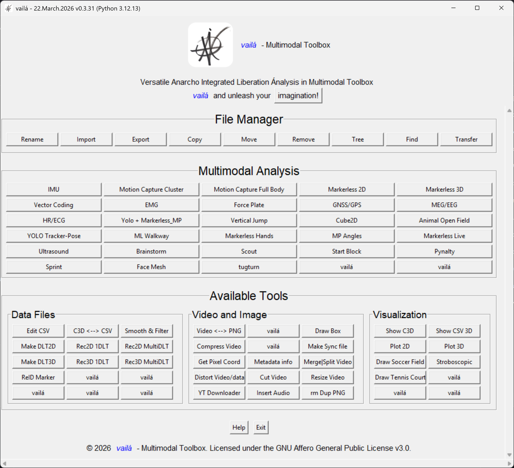

# *vailá* - Multimodal Toolbox

<p align="center">
  
</p>

<div align="center">
  <table>
    <tr>
      <th>Operating System</th>
      <th>Conda Environment Status</th>
    </tr>
    <tr>
      <td><strong>Linux</strong></td>
      <td>✅ OK</td>
    </tr>
    <tr>
      <td><strong>macOS</strong></td>
      <td>✅ OK</td>
    </tr>
    <tr>
      <td><strong>Windows</strong></td>
      <td>✅ OK</td>
    </tr>
  </table>
</div>

## Development of *vailá*: Versatile Anarcho Integrated Liberation Ánalysis in Multimodal Toolbox

## Introduction

The analysis of human movement is fundamental in both health and sports biomechanics, providing valuable insights into various aspects of physical performance, rehabilitation, and injury prevention. However, existing software often restricts user control and customization, acting as a "black box." With *vailá*, users have the freedom to explore, customize, and create their own tools in a truly open-source and collaborative environment.

## Table of Contents
- [Introduction](#introduction)
- [Description](#description)
- [Installation and Setup](#installation-and-setup)
- [Running the Application](#running-the-application)
- [Uninstallation Instructions](#unistallation-instructions)
- [Project Structure](#project-structure)
- [Citing *vailá*](#citing-vailá)
- [Authors](#authors)
- [Contribution](#contribution)
- [License](#license)

---
*vailá* (Versatile Anarcho Integrated Liberation Ánalysis) is an open-source multimodal toolbox that leverages data from multiple biomechanical systems to enhance human movement analysis. It integrates data from:

### Supported Systems and Data Sources:
- **Motion Capture Systems** (Vicon, OptiTrack)
- **IMU Sensors** (Delsys, Noraxon)
- **Markerless Tracking** (OpenPose, MediaPipe)
- **Force Plates** (AMTI, Bertec)
- **Electromyography (EMG)**
- **GNSS/GPS Systems**
- **Heart Rate/ECG**
- **MEG/EEG**
- **Video Analysis**
- **Ultrasound**

## Description

This multimodal toolbox integrates data from various motion capture systems to facilitate advanced biomechanical analysis by combining multiple data sources. The primary objective is to improve understanding and evaluation of movement patterns across different contexts.

## *vailá* Manifest

### English Version

Join us in the liberation from paid software with the "vailá - Versatile Anarcho Integrated Liberation Ánalysis in Multimodal Toolbox."

In front of you stands a versatile tool designed to challenge the boundaries of commercial systems. This software is a symbol of innovation and freedom, determined to eliminate barriers that protect the monopoly of expensive software, ensuring the dissemination of knowledge and accessibility.

With *vailá*, you are invited to explore, experiment, and create without constraints. "vailá" means "go there and do it!" — encouraging you to harness its power to perform analysis with data from multiple systems.

### Versão em Português

Junte-se a nós na libertação do software pago com o "vailá: Análise Versátil da Libertação Anarquista Integrada na Caixa de Ferramentas Multimodal".

Diante de você está uma ferramenta versátil, projetada para desafiar as fronteiras dos sistemas comerciais. Este software é um símbolo de inovação e liberdade, determinado a eliminar as barreiras que protegem o monopólio do software caro, garantindo a disseminação do conhecimento e a acessibilidade.

Com *vailá*, você é convidado a explorar, experimentar e criar sem restrições. "vailá" significa "vai lá e faça!" — encorajando você a aproveitar seu poder para realizar análises com dados de múltiplos sistemas.

---

## Installation and Setup

### Prerequisites

- **Conda**: Ensure that either [Anaconda](https://www.anaconda.com/download/success) or [Miniconda](https://docs.conda.io/en/latest/miniconda.html) is installed and accessible from the command line.

- **FFmpeg**: Required for video processing functionalities.

### Clone the Repository

```bash
git clone https://github.com/vaila-multimodaltoolbox/vaila
cd vaila
```

## Installation Instructions


---

## 🔵 For Windows:

## YouTube How to install *vailá* Windows 11
[How to Install Vailá on Windows 11 | Step-by-Step Guide](https://youtu.be/w2iZfeD_j30)

### **Important Notice Before Installation**

> *vailá* values freedom and the goodwill to learn. If you are not the owner of your computer and do not have permission to perform the installation, we recommend doing it on your own computer. If you are prevented from installing software, it means you are not prepared to liberate yourself, make your modifications, and create, which is the philosophy of *vailá!*

If you need any further adjustments or have additional requests, feel free to let me know!

### 1. **Install Anaconda or Miniconda**
   - Download and install either:
     - **[Anaconda](https://www.anaconda.com/download/success)** (full distribution with many pre-installed packages)
     - **[Miniconda](https://docs.conda.io/en/latest/miniconda.html)** (minimal installer with just conda, Python, and essential packages)
   - For Anaconda: REMEMBER to install "Admin for all users" [Anaconda install](https://www.anaconda.com/docs/getting-started/anaconda/advanced-install/multi-user)
   - Ensure that **Conda** is accessible from the terminal after installation.

### 2. **Download *vailá***
   - Use **Git** to clone the repository:
     ```bash
     git clone https://github.com/vaila-multimodaltoolbox/vaila
     cd vaila
     ```
   - **Or download the zip file**:
     - Go to [*vailá* GitHub Repository](https://github.com/vaila-multimodaltoolbox/vaila), download the `.zip` file, and extract the contents.
     - **Included the Reminder**: Added a note in both the **Download *vailá*** section and the **Important Notes** section to remind users to rename the directory from `vaila-main` to `vaila` if they downloaded the zip file.

### 3. **Run the Installation Script**
   - Open **PowerShell** (with Anaconda/Miniconda initialized) or **Anaconda/Miniconda PowerShell Prompt**.
   - Navigate to the directory where *vailá* was downloaded or extracted.
    - - Normally use this command if you have downloaded *vailá* from Downloads
     ```powershell
     cd "C:\Users\$env:USERNAME\Downloads\vaila"
     ```
   - Execute the installation script:
     ```powershell
     .\install_vaila_win.ps1
     ```

### 4. **Automatic Configuration**
   - The script will:
     - Set up the Conda environment using `yaml_for_conda_env/vaila_win.yaml`.
     - Copy *vailá* program files to `C:\Users\<YourUser>\AppData\Local\vaila`.
     - Initialize Conda for PowerShell.
     - Install **PowerShell 7** using **winget**.
     - Install **Chocolatey** package manager.
     - Install **rsync** via Chocolatey for file synchronization.
     - Install and configure **OpenSSH** for secure communication.
     - Install **FFmpeg** and **Windows Terminal** using **winget**.
     - Add a profile for *vailá* in **Windows Terminal** for quick access.
     - Set appropriate permissions for the installation directories.
     - Create shortcuts for launching *vailá*:
       - **Desktop shortcut**: A shortcut will be created on your desktop.
       - **Start Menu shortcut**: A shortcut will be added to the Windows Start Menu.

### ⚠️ **Important Notes**
   - Ensure **Conda** (from either Anaconda or Miniconda installation) is accessible from the command line before running the script.
   - The installation script requires administrative privileges to install system components.
   - The installation script dynamically configures paths, so no manual adjustments are necessary for user-specific directories.
   - **Miniconda users**: The script will work perfectly with Miniconda - it automatically detects your conda installation path.

### 5. **Launching *vailá***
   - After installation, you can launch *vailá*:
     - Using the Desktop shortcut.
     - From the **Windows Start Menu** under *vailá*.
     - From **Windows Terminal** via the pre-configured *vailá* profile.
     - Manually, by running the following commands:
       ```powershell
       conda activate vaila
       python vaila.py
       ```
---

## 🟠 For Linux:

**Note**: These scripts work with both Anaconda and Miniconda installations.

1. **Make the installation script executable**:

```bash
sudo chmod +x install_vaila_linux.sh
```

2. **Run instalation script**:

```bash
./install_vaila_linux.sh
```

- The script will:

  - Set up the Conda environment using `./yaml_for_conda_env/vaila_linux.yaml`.
  - Copy program files to your home directory (~/vaila).
  - Install ffmpeg from system repositories.
  - Create a desktop entry for easy access.

3. **Notes**:

- Run the script as your regular user, not with sudo.
- Ensure that Conda (Anaconda or Miniconda) is added to your PATH and accessible from the command line.
- The script automatically detects your conda installation directory.

---

## ⚪ For macOS:

**Note**: These scripts work with both Anaconda and Miniconda installations.

1. **Make the installation script executable**:

```bash
sudo chmod +x install_vaila_mac.sh
```

2. **Run the installation script**:

```bash
./install_vaila_mac.sh
```

- The script will:
  - Set up the Conda environment using `./yaml_for_conda_env/vaila_mac.yaml`.
  - Copy program files to your home directory (`~/vaila`).
  - Install ffmpeg using Homebrew.
  - Convert the .iconset folder to an .icns file for the app icon.
  - Create an application bundle (`vaila.app`) in your Applications folder.
  - Create a symbolic link in `/Applications` to the app in your home directory.

3. **Notes**:
  
- You may be prompted for your password when the script uses sudo to create the symbolic link.
- Ensure that Conda (Anaconda or Miniconda) is added to your PATH and accessible from the command line.
- **Important for Miniconda users**: The macOS script currently has a hardcoded path that assumes Anaconda installation. This will be fixed in the next update to automatically detect conda installation paths.


---

## Running the Application

### Running the Application After installation, you can launch *vailá* from your applications menu or directly from the terminal, depending on your operating system.

- 🟠 Linux and ⚪ macOS: **From the Terminal bash or zsh**

1. Navigate to the `vaila` directory:
   
  ```bash
  cd ~/vaila
  ``` 

and run command:

  ```bash
  conda activate vaila
  python3 vaila.py
  ```

- 🔵 Windows

- Click on the `vailá` icon in the Applications menu or use the shortcut in desktop or Windows Terminal.

- Windows: **From the Windows Terminal (Anaconda/Miniconda in path) or use Anaconda/Miniconda PowerShell**

1. Open Anaconda Prompt, Miniconda Prompt, or Anaconda/Miniconda Powershell Prompt (PowerShell is recommended) and run command:

```Anaconda/Miniconda Powershell
conda activate vaila
python vaila.py
```

---

## If preferred, you can also run *vailá* from the launch scripts.

### For 🟠 Linux and ⚪ macOS 

- From the Applications Menu:
  
  - Look for `vailá` in your applications menu and launch it by clicking on the icon. 

--- 

#### From the Terminal If you prefer to run *vailá* from the terminal or if you encounter issues with the applications menu, you can use the provided launch scripts.

##### 🟠Linux and ⚪ macOS

- **Make the script executable** (if you haven't already):

- 🟠 **Linux**
  
```bash
sudo chmod +x ~/vaila/linux_launch_vaila.sh
```

- **Run the script**:
  
```bash
~/vaila/linux_launch_vaila.sh 
```

- ⚪ **macOS**
  
```bash
sudo chmod +x ~/vaila/mac_launch_vaila.sh
```

- **Run the script**:
  
```bash
~/vaila/mac_launch_vaila.sh 
```

#### Notes for 🟠 Linux and ⚪ macOS 

- **Ensure Conda is in the Correct Location**:
  - The launch scripts assume that Conda is installed in `~/anaconda3` or `~/miniconda3`. 
  - If Conda is installed elsewhere, update the `source` command in the scripts to point to the correct location.

- **Verify Paths**:
  - Make sure that the path to `vaila.py` in the launch scripts matches where you have installed the program.
  - By default, the scripts assume that `vaila.py` is located in `~/vaila`.

- **Permissions**:
  - Ensure you have execute permissions for the launch scripts and read permissions for the program files. 

--- 

## Unistallation Instructions

## For Uninstallation on Linux

1. **Run the uninstall script**:

```bash
sudo chmod +x uninstall_vaila_linux.sh
./uninstall_vaila_linux.sh
```

- The script will:
  - Remove the `vaila` Conda environment.
  - Delete the `~/vaila` directory.
  - Remove the desktop entry.

2. **Notes**:

- Run the script `./uninstall_vaila_linux.sh` as your regular user, not with sudo.
- Ensure that Conda is added to your PATH and accessible from the command line.

## For Uninstallation on macOs

1. **Run the uninstall script**:

```bash
sudo chmod +x uninstall_vaila_mac.sh
./uninstall_vaila_mac.sh
```

- The script will:
  - Remove the `vaila` Conda environment.
  - Delete the `~/vaila` directory.
  - Remove `vaila.app` from /Applications.
  - Refresh the Launchpad to remove cached icons.

2. **Notes**:

- Run the script as your regular user, not with sudo.
- You will prompted for your password when the script uses `sudo` to remove the app from `/Applications`.

## For Uninstallation on Windows

1. **Run the uninstallation script as Administrator in Anaconda/Miniconda PowerShell Prompt**:

- PowerShell Script:
  ```powershell
  ExecutionPolicy Bypass -File .\uninstall_vaila_win.ps1
  .\uninstall_vaila_win.ps1
  ```

1. **Follow the Instructions Displayed by the Script**:

- The script will:
  - Remove the `vaila` Conda environment.
  - Delete the `C:\Users\your_user_name_here\AppData\Local\vaila` directory.
  - Remove the Windows Terminal profile (settings.json file).
  - Delete the desktop shortcut if it exists.

1. **Manual Removal of Windows Terminal Profile (if necessary)**:

- If the Windows Terminal profile is not removed automatically (e.g., when using the `uninstall_vaila_win.ps1` script), you may need to remove it manually:

```Anaconda/Miniconda PowerShell Prompt
conda remove -n vaila --all
```

Remove directory `vaila` inside `C:\Users\your_user_name_here\AppData\Local\vaila`.

---

## Project Structure

<p align="center">
  
</p>

```bash	
                                             o
                                _,  o |\  _,/
                          |  |_/ |  | |/ / |
                           \/  \/|_/|/|_/\/|_/                    
##########################################################################
Mocap fullbody_c3d           Markerless_3D       Markerless_2D_MP
                  \                |                /
                   v               v               v        
   CUBE2D  --> +---------------------------------------+ <-- Vector Coding
   IMU_csv --> |       vailá - multimodal toolbox      | <-- Cluster_csv
Open Field --> +---------------------------------------+ <-- Force Plate
              ^                   |                    ^ <-- YOLOv11 and MediaPipe
        EMG__/                    v                     \__Tracker YOLOv11
                    +--------------------------+
                    | Results: Data and Figure | 
                    +--------------------------+

============================ File Manager (Frame A) ========================
A_r1_c1 - Rename          A_r1_c2 - Import           A_r1_c3 - Export
A_r1_c4 - Copy            A_r1_c5 - Move             A_r1_c6 - Remove
A_r1_c7 - Tree            A_r1_c8 - Find             A_r1_c9 - Transfer

========================== Multimodal Analysis (Frame B) ===================
B1_r1_c1 - IMU            B1_r1_c2 - MoCapCluster    B1_r1_c3 - MoCapFullBody
B1_r1_c4 - Markerless2D   B1_r1_c5 - Markerless3D

B2_r2_c1 - Vector Coding  B2_r2_c2 - EMG             B2_r2_c3 - Force Plate
B2_r2_c4 - GNSS/GPS       B2_r2_c5 - MEG/EEG

B3_r3_c1 - HR/ECG         B3_r3_c2 - Markerless_MP_Yolo  B3_r3_c3 - vailá_and_jump
B3_r3_c4 - Cube2D         B3_r3_c5 - Animal Open Field 
B3_r4_c1 - Tracker        B3_r4_c2 - ML Walkway       B3_r4_c3 - Markerless Hands
B3_r4_c4 - vailá          B3_r4_c5 - vailá
============================== Tools Available (Frame C) ===================
C_A: Data Files

C_A_r1_c1 - Edit CSV      C_A_r1_c2 - C3D <--> CSV   C_A_r1_c3 - Gapfill | split
C_A_r2_c1 - Make DLT2D    C_A_r2_c2 - Rec2D 1DLT     C_A_r2_c3 - Rec2D MultiDLT
C_A_r3_c1 - Make DLT3D    C_A_r3_c2 - Rec3D 1DLT     C_A_r3_c3 - Rec3D MultiDLT
C_A_r4_c1 - vailá         C_A_r4_c2 - vailá          C_A_r4_c3 - vailá

C_B: Video and Image
C_B_r1_c1 - Video<-->PNG  C_B_r1_c2 - vaiá          C_B_r1_c3 - Draw Box
C_B_r2_c1 - CompressH264  C_B_r2_c2 - CompressH265  C_B_r2_c3 - Make Sync file
C_B_r3_c1 - GetPixelCoord C_B_r3_c2 - Metadata info C_B_r3_c3 - Merge Videos
C_B_r4_c1 - Distort video C_B_r4_c2 - Cut Video     C_B_r4_c3 - vailá

C_C: Visualization
C_C_r1_c1 - Show C3D      C_C_r1_c2 - Show CSV       C_C_r2_c1 - Plot 2D
C_C_r2_c2 - Plot 3D       C_C_r3_c1 - vailá          C_C_r3_c2 - vailá
C_C_r4_c1 - vailá         C_C_r4_c2 - vailá          C_C_r4_c3 - vailá

Type 'h' for help or 'exit' to quit.

Use the button 'imagination!' to access command-line (xonsh) tools for advanced multimodal analysis!
```

An overview of the project structure:

```bash
vaila
├── __init__.py                     # Package initializer
├── __pycache__                     # Compiled Python files cache
│   └── all .pyc files
├── animal_open_field.py            # Animal Open Field analysis
├── batchcut.py                     # Batch video cutting tools
├── cluster_analysis.py             # Cluster analysis for motion capture
├── common_utils.py                 # Common utility functions
├── compress_videos_h264.py         # H.264 video compression
├── compress_videos_h265.py         # H.265 (HEVC) video compression
├── compressvideo.py                # Video compression utilities (legacy or alternative)
├── cop_analysis.py                 # Center of Pressure (CoP) analysis
├── cop_calculate.py                # CoP calculations
├── cube2d_kinematics.py            # 2D kinematics analysis tools
├── cutvideo.py                     # Video cutting tools
├── data_processing.py              # General data processing tools
├── dialogsuser.py                  # User interaction dialogs
├── dialogsuser_cluster.py          # Dialog tools for cluster analysis
├── dlc2vaila.py                   # Convert DeepLabCut to vailá format
├── dlt2d.py                        # 2D Direct Linear Transformation (DLT)
├── dlt3d.py                        # 3D Direct Linear Transformation (DLT)
├── drawboxe.py                     # Draw box in video frames
├── ellipse.py                      # Ellipse fitting tools
├── emg_labiocom.py                 # EMG signal analysis tools
├── extractpng.py                   # Extract PNG frames from videos
├── filemanager.py                  # File management utilities
├── filter_utils.py                 # Additional filter utility tools
├── filtering.py                    # Data filtering methods
├── fixnoise.py                     # Noise reduction tools
├── fonts                           # Custom fonts
│   └── mrrobot.ttf                 # Font example
├── force_cmj.py                    # Countermovement jump analysis
├── force_cube_fig.py               # 3D force data visualization
├── forceplate_analysis.py          # Force plate analysis tools
├── getpixelvideo.py                # Extract pixel coordinates from video
├── gnss_analysis.py                # GNSS/GPS data analysis tools
├── grf_gait.py                     # Ground Reaction Force (GRF) gait analysis
├── images                          # GUI assets and images
│   ├── cluster_config.png
│   ├── eeferp.png
│   ├── gui.png
│   ├── preto.png
│   ├── unf.png
│   ├── usp.png
│   ├── vaila.ico
│   ├── vaila_edge_w.png
│   ├── vaila_ico.png
│   ├── vaila_ico_mac.png
│   ├── vaila_ico_mac_original.png
│   ├── vaila_ico_trans.ico
│   ├── vaila_icon_win_original.ico
│   ├── vaila_logo.png
│   ├── vaila_trans_square.png
│   ├── vaila_transp.ico
│   └── vaila_white_square.png
├── imu_analysis.py                 # IMU sensor data analysis
├── interpolation_split.py          # Interpolation and split data tool
├── join2dataset.py                 # Join multiple datasets
├── linear_interpolation_split.py   # Linear interpolation split tool
├── listjointsnames.py              # List joint names from datasets
├── load_vicon_csv_split_batch.py   # Load Vicon data in batch
├── maintools.py                    # Core tools for analysis
├── markerless2d_mpyolo.py          # Markerless 2D tracking using MP-YOLO
├── markerless_2D_analysis.py       # Markerless 2D tracking analysis
├── markerless_3D_analysis.py       # Markerless 3D tracking analysis
├── mergestack.py                   # Merge datasets into stacks
├── ml_models_training.py           # Machine learning models training
├── ml_valid_models.py              # Validate machine learning models
├── mocap_analysis.py               # Motion capture full body analysis
├── models                          # Trained models and associated parameters
│   ├── README.txt
│   ├── step_length.pkl
│   ├── step_length_scaler_params.json
│   ├── step_time.pkl
│   ├── step_time_scaler_params.json
│   ├── step_width.pkl
│   ├── step_width_scaler_params.json
│   ├── stride_length.pkl
│   ├── stride_length_scaler_params.json
│   ├── stride_time.pkl
│   ├── stride_time_scaler_params.json
│   ├── stride_velocity.pkl
│   ├── stride_velocity_scaler_params.json
│   ├── stride_width.pkl
│   ├── stride_width_scaler_params.json
│   ├── support_base.pkl
│   ├── support_base_scaler_params.json
│   ├── support_time_doubled.pkl
│   ├── support_time_doubled_scaler_params.json
│   ├── support_time_single.pkl
│   ├── support_time_single_scaler_params.json
│   ├── yolo11l-pose.pt
│   ├── yolo11l.pt
│   ├── yolo11m-pose.pt
│   ├── yolo11m.pt
│   ├── yolo11n-pose.pt
│   ├── yolo11n.pt
│   ├── yolo11s-pose.pt
│   ├── yolo11s.pt
│   ├── yolo11x-pose.pt
│   ├── yolo11x-seg.pt
│   └── yolo11x.pt
├── modifylabref.py                # Modify laboratory references
├── modifylabref_cli.py            # CLI for modifying lab references
├── numberframes.py                # Frame numbering tools
├── plotting.py                    # Data plotting tools
├── process_gait_features.py       # Gait feature extraction and processing
├── readc3d_export.py              # Read and export C3D files
├── readcsv.py                     # Read CSV data
├── readcsv_export.py              # Export CSV data
├── rearrange_data.py              # Rearrange and clean datasets
├── rec2d.py                       # 2D Reconstruction
├── rec2d_one_dlt2d.py             # 2D reconstruction with single DLT
├── rec3d_one_dlt3d.py             # 3D reconstruction with single DLT
├── rotation.py                    # Rotation analysis tools
├── run_vector_coding.py           # Run vector coding analysis
├── run_vector_coding_GUI.py       # GUI for vector coding analysis
├── showc3d.py                    # Visualize C3D data
├── spectral_features.py           # Spectral feature extraction
├── stabilogram_analysis.py        # Stabilogram analysis tools
├── standardize_header.py          # Standardize data headers
├── sync_flash.py                  # Synchronize flash-based data
├── syncvid.py                     # Synchronize video files
├── utils.py                       # General utility scripts
├── vaila_and_jump.py             # Vertical jump analysis tool
├── vaila_datdistort.py            # Data distortion utilities
├── vaila_distortvideo_gui.py      # GUI for video distortion
├── vaila_lensdistortvideo.py      # Video lens distortion correction
├── vaila_manifest.py             # Manifest file for vailá
├── vaila_mlwalkway.py            # Machine learning analysis for walkways
├── vaila_upscaler.py              # Data upscaling tools
├── vailaplot2d.py                # Plot 2D biomechanical data
├── vailaplot3d.py                # Plot 3D biomechanical data
├── vector_coding.py              # Joint vector coding analysis
├── videoprocessor.py             # Video processing tools
├── viewc3d.py                    # Visualize C3D files
├── vpython_c3d.py                # 3D visualization using VPython
├── walkway_ml_prediction.py      # Machine learning prediction for walkway analysis
└── yolov11track.py               # YOLOv11 based tracking
```

## Citing *vailá*

If you use *vailá* in your research or project, please consider citing our work:

```bibtex
@misc{vaila2024,
  title={vailá - Versatile Anarcho Integrated Liberation Ánalysis in Multimodal Toolbox},
  author={Paulo Roberto Pereira Santiago and Guilherme Manna Cesar and Ligia Yumi Mochida and Juan Aceros and others},
  year={2024},
  eprint={2410.07238},
  archivePrefix={arXiv},
  primaryClass={cs.HC},
  url={https://arxiv.org/abs/2410.07238}
}

@article{tahara2025predicting,
  title={Predicting walkway spatiotemporal parameters using a markerless, pixel-based machine learning approach},
  author={Tahara, Ariany K and Chinaglia, Abel G and Monteiro, Rafael LM and Bedo, Bruno LS and Cesar, Guilherme M and Santiago, Paulo RP},
  journal={Brazilian Journal of Motor Behavior},
  volume={19},
  number={1},
  pages={e462--e462},
  year={2025}
}
```

## You can also refer to the tool's GitHub repository for more details and updates:

- [*vailá* on arXiv](https://arxiv.org/abs/2410.07238)
- [*vailá* GitHub Repository](https://github.com/vaila-multimodaltoolbox/vaila)

## Authors

- **Paulo Roberto Pereira Santiago** [ORCID: 0000-0002-9460-8847](https://orcid.org/0000-0002-9460-8847)  
  Biomechanics and Motor Control Lab, School of Physical Education and Sport of Ribeirão Preto, University of São Paulo, Brazil  
  Graduate Program in Rehabilitation and Functional Performance, Ribeirão Preto Medical School, University of São Paulo, Brazil  

- **Abel Gonçalves Chinaglia** [ORCID: 0000-0002-6955-7187](https://orcid.org/0000-0002-6955-7187)  
  Graduate Program in Rehabilitation and Functional Performance, Ribeirão Preto Medical School, University of São Paulo, Brazil  

- **Kira Flanagan** [ORCID: 0000-0003-0317-6346](https://orcid.org/0000-0003-0317-6346)  
  College of Computing, Engineering and Construction, University of North Florida, USA  

- **Bruno Luiz de Souza Bedo** [ORCID: 0000-0003-3821-2327](https://orcid.org/0000-0003-3821-2327)  
  Laboratory of Technology and Sports Performance Analysis, School of Physical Education and Sport, University of São Paulo, Brazil  

- **Ligia Yumi Mochida** [ORCID: 0009-0005-7266-3799](https://orcid.org/0009-0005-7266-3799)  
  Laboratory of Applied Biomechanics and Engineering, Brooks College of Health, University of North Florida, USA  
  Department of Physical Therapy, Brooks College of Health, University of North Florida, USA  

- **Juan Aceros** [ORCID: 0000-0001-6381-7032](https://orcid.org/0000-0001-6381-7032)  
  Laboratory of Applied Biomechanics and Engineering, Brooks College of Health, University of North Florida, USA  
  College of Computing, Engineering and Construction, University of North Florida, USA

- **Aline Bononi** [ORCID: 0000-0001-8169-0864](https://orcid.org/0000-0001-8169-0864)
  Municipal Pharmacy of Ribeirão Preto - Brazil

- **Guilherme Manna Cesar** [ORCID: 0000-0002-5596-9439](https://orcid.org/0000-0002-5596-9439)  
  Laboratory of Applied Biomechanics and Engineering, Brooks College of Health, University of North Florida, USA  
  Department of Physical Therapy, Broo~/vaila/linux_launch_vaila.sh ks College of Health, University of North Florida, USA  

## Contribution

We encourage creativity and innovation to enhance and expand the functionality of this toolbox. You can make a difference by contributing to the project! To get involved, feel free to fork the repository, experiment with new ideas, and create a branch for your changes. When you're ready, submit a pull request so we can review and potentially integrate your contributions.

Don't hesitate to learn, explore, and experiment. Be bold, and don't be afraid to make mistakes—every attempt is a step towards improvement!

## License

This project is licensed under the GNU Affero General Public License v3.0 (AGPLv3). 
This license ensures that any use of vailá, including network/server usage, 
maintains the freedom of the software and requires source code availability.

For more details, see the [LICENSE](LICENSE) file or visit: 
https://www.gnu.org/licenses/agpl-3.0.html


