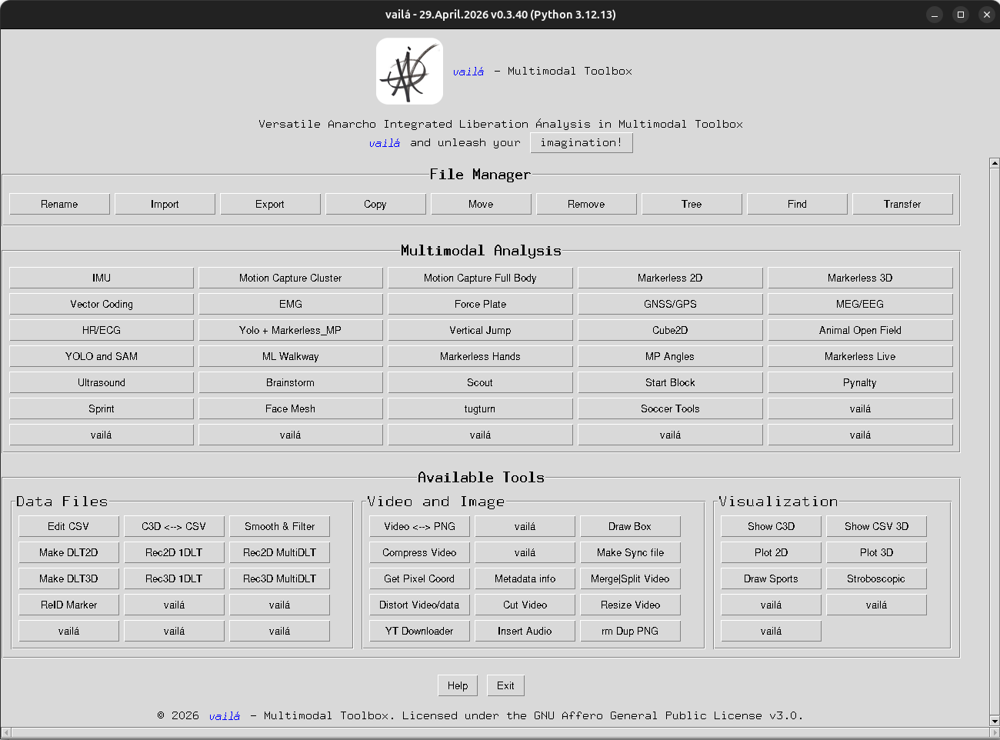

# _vailá_ - Multimodal Toolbox

<p align="center">
  
</p>

<div align="center">
  <table>
    <tr>
      <th>Operating System</th>
      <th>Installation Method</th>
      <th>Status</th>
    </tr>
    <tr>
      <td><strong>🪟 Windows</strong></td>
      <td>uv (Recommended)</td>
      <td>✅ Ready</td>
    </tr>
    <tr>
      <td><strong>🐧 Linux</strong></td>
      <td>uv (Recommended)</td>
      <td>✅ Ready</td>
    </tr>
    <tr>
      <td><strong>🍎 macOS</strong></td>
      <td>uv (Recommended)</td>
      <td>✅ Ready</td>
    </tr>
  </table>
</div>

## ⚡ Install Now (One-Line)

Install _vaila_ with a single command!

**🐧 Linux:**

```bash
wget -qO- https://raw.githubusercontent.com/vaila-multimodaltoolbox/vaila/main/install_vaila_linux.sh | bash
```

**🍎 macOS:**

```bash
/bin/bash -c "$(curl -fsSL https://raw.githubusercontent.com/vaila-multimodaltoolbox/vaila/main/install_vaila_mac.sh)"
```

**🪟 Windows:**

```powershell
irm https://raw.githubusercontent.com/vaila-multimodaltoolbox/vaila/main/install_vaila_win.ps1 | iex
```

or

```powershell
[Net.ServicePointManager]::SecurityProtocol = [Net.ServicePointManager]::SecurityProtocol -bor 3072; irm https://raw.githubusercontent.com/vaila-multimodaltoolbox/vaila/main/install_vaila_win.ps1 | iex
```

If you use a one-liner that points to `https://vaila.io/install.ps1`, use the same TLS fix first:

```powershell
[Net.ServicePointManager]::SecurityProtocol = [Net.ServicePointManager]::SecurityProtocol -bor 3072; iwr -useb https://vaila.io/install.ps1 | iex
```

**Windows SSL/TLS error?** If you see "could not establish trust relationship for the SSL/TLS secure channel", the line above enables TLS 1.2 before the download. This is unrelated to Conda being activated.

## Introduction

The analysis of human movement is fundamental in both health and sports biomechanics, providing valuable insights into various aspects of physical performance, rehabilitation, and injury prevention. However, existing software often restricts user control and customization, acting as a "black box." With _vailá_, users have the freedom to explore, customize, and create their own tools in a truly open-source and collaborative environment.

## Table of Contents

- [Introduction](#introduction)
- [Description](#description)
- [_vailá_ Structure and Interface](#vailá-structure-and-interface)
- [Installation and Setup](#installation-and-setup)
- [Running the Application](#running-the-application)
- [Uninstallation Instructions](#uninstallation-instructions)
- [Documentation](#documentation)
- [Citing _vailá_](#citing-vailá)
- [Contribution](#contribution)
- [License](#license)

---

_vailá_ (Versatile Anarcho Integrated Liberation Ánalysis) is an open-source multimodal toolbox that leverages data from multiple biomechanical systems to enhance human movement analysis.

The toolbox is designed to integrate and analyze data from diverse measurement systems commonly used in biomechanics research, including motion capture systems (such as Vicon and OptiTrack), inertial measurement units (IMU), markerless tracking solutions (OpenPose and MediaPipe), force plates (AMTI and Bertec), electromyography (EMG), GNSS/GPS systems, physiological sensors (heart rate, ECG, MEG, EEG), video analysis tools, and ultrasound systems. This comprehensive integration enables researchers to perform advanced multimodal analysis by combining data from different sources, providing a more complete understanding of human movement patterns and biomechanical parameters.

## Description

This multimodal toolbox integrates data from various motion capture systems to facilitate advanced biomechanical analysis by combining multiple data sources. The primary objective is to improve understanding and evaluation of movement patterns across different contexts.

## _vailá_ Manifest

### English Version

Join us in the liberation from paid software with the "vailá - Versatile Anarcho Integrated Liberation Ánalysis in Multimodal Toolbox."

In front of you stands a versatile tool designed to challenge the boundaries of commercial systems. This software is a symbol of innovation and freedom, determined to eliminate barriers that protect the monopoly of expensive software, ensuring the dissemination of knowledge and accessibility.

With _vailá_, you are invited to explore, experiment, and create without constraints. "vailá" means "go there and do it!" — encouraging you to harness its power to perform analysis with data from multiple systems.

### Versão em Português

Junte-se a nós na libertação do software pago com o "vailá: Análise Versátil da Libertação Anarquista Integrada na Caixa de Ferramentas Multimodal".

Diante de você está uma ferramenta versátil, projetada para desafiar as fronteiras dos sistemas comerciais. Este software é um símbolo de inovação e liberdade, determinado a eliminar as barreiras que protegem o monopólio do software caro, garantindo a disseminação do conhecimento e a acessibilidade.

Com _vailá_, você é convidado a explorar, experimentar e criar sem restrições. "vailá" significa "vai lá e faça!" — encorajando você a aproveitar seu poder para realizar análises com dados de múltiplos sistemas.

---

## _vailá_ Structure and Interface

_vailá_ provides a comprehensive multimodal analysis framework organized into three main sections (Frames A, B, and C) that handle different aspects of biomechanical data processing:

```bash
                                             o
                                _,  o |\  _,/
                          |  |_/ |  | |/ / |
                           \/  \/|_/|/|_/\/|_/
##########################################################################
Mocap fullbody_c3d           Markerless_3D       Markerless_2D_MP
                  \                |                /
                   v               v               v
   CUBE2D  --> +---------------------------------------+ <-- Vector Coding
   IMU_csv --> |       vailá - multimodal toolbox      | <-- Cluster_csv
Open Field --> +---------------------------------------+ <-- Force Plate
              ^                   |                    ^ <-- YOLOv11 and MediaPipe
        EMG__/                    v                     \__Tracker YOLOv11
                    +--------------------------+
                    | Results: Data and Figure |
                    +--------------------------+

============================ File Manager (Frame A) ========================
A_r1_c1 - Rename          A_r1_c2 - Import           A_r1_c3 - Export
A_r1_c4 - Copy            A_r1_c5 - Move             A_r1_c6 - Remove
A_r1_c7 - Tree            A_r1_c8 - Find             A_r1_c9 - Transfer

========================== Multimodal Analysis (Frame B) ===================
B1_r1_c1 - IMU            B1_r1_c2 - MoCapCluster    B1_r1_c3 - MoCapFullBody
B1_r1_c4 - Markerless2D   B1_r1_c5 - Markerless3D

B2_r2_c1 - Vector Coding  B2_r2_c2 - EMG             B2_r2_c3 - Force Plate
B2_r2_c4 - GNSS/GPS       B2_r2_c5 - MEG/EEG

B3_r3_c1 - HR/ECG         B3_r3_c2 - MP_Yolo         B3_r3_c3 - vailá_and_jump
B3_r3_c4 - Cube2D         B3_r3_c5 - Animal Open Field

B4_r4_c1 - Tracker        B4_r4_c2 - ML Walkway      B4_r4_c3 - Markerless Hands
B4_r4_c4 - MP Angles      B4_r4_c5 - Markerless Live

B4_r5_c1 - Ultrasound     B4_r5_c2 - Brainstorm      B4_r5_c3 - Scout
B4_r5_c4 - StartBlock     B4_r5_c5 - Pynalty

B5_r6_c1 - Sprint         B5_r6_c2 - vailá           B5_r6_c3 - vailá
B5_r6_c4 - vailá          B5_r6_c5 - vailá

============================== Tools Available (Frame C) ===================
-> C_A: Data Files
C_A_r1_c1 - Edit CSV      C_A_r1_c2 - C3D <--> CSV   C_A_r1_c3 - Smooth_Fill_Split
C_A_r2_c1 - Make DLT2D    C_A_r2_c2 - Rec2D 1DLT     C_A_r2_c3 - Rec2D MultiDLT
C_A_r3_c1 - Make DLT3D    C_A_r3_c2 - Rec3D 1DLT     C_A_r3_c3 - Rec3D MultiDLT
C_A_r4_c1 - ReID Marker   C_A_r4_c2 - vailá          C_A_r4_c3 - vailá

-> C_B: Video and Image
C_B_r1_c1 - Video<-->PNG  C_B_r1_c2 - vailá          C_B_r1_c3 - Draw Box
C_B_r2_c1 - Compress      C_B_r2_c2 - vailá          C_B_r2_c3 - Make Sync file
C_B_r3_c1 - GetPixelCoord C_B_r3_c2 - Metadata info  C_B_r3_c3 - Merge Videos
C_B_r4_c1 - Distort video C_B_r4_c2 - Cut Video      C_B_r4_c3 - Resize Video
C_B_r5_c1 - YT Downloader C_B_r5_c2 - Insert Audio   C_B_r5_c3 - rm Dup PNG

-> C_C: Visualization
C_C_r1_c1 - Show C3D      C_C_r1_c2 - Show CSV       C_C_r2_c1 - Plot 2D
C_C_r2_c2 - Plot 3D       C_C_r3_c1 - Soccer Field   C_C_r3_c2 - vailá
C_C_r4_c1 - vailá         C_C_r4_c2 - vailá          C_C_r4_c3 - vailá
C_C_r5_c1 - vailá         C_C_r5_c2 - vailá          C_C_r5_c3 - vailá

Type 'h' for help or 'exit' to quit.

Use the button 'imagination!' to access command-line (xonsh) tools for advanced multimodal analysis!
```

<p align="center">
  
</p>

An overview of the project file structure:

```bash
vaila
├── vaila.py                        # Main Entry Point
├── install_vaila_linux.sh           # Linux Installer (uv or Conda)
├── install_vaila_mac_uv.sh         # macOS Installer (unified: uv)
├── install_vaila_win.ps1            # Windows Installer (uv or Conda)
├── pyproject.toml                  # Project Dependencies (uv/poetry)
├── uv.lock                         # Dependency Lock File
├── vaila                           # Package Source Directory
│   ├── __init__.py
│   ├── animal_open_field.py        # Animal Open Field analysis
│   ├── backup_markerless.py        # Backup tools for markerless data
│   ├── batchcut.py                 # Batch video cutting tools
│   ├── brainstorm.py               # Brainstorming/Notes tool
│   ├── cluster_analysis.py         # Cluster analysis for motion capture
│   ├── common_utils.py             # Common utility functions
│   ├── compress_videos_h264.py     # H.264 video compression
│   ├── compress_videos_h265.py     # H.265 (HEVC) video compression
│   ├── compress_videos_h266.py     # H.266 (VVC) video compression
│   ├── cop_analysis.py             # Center of Pressure (CoP) analysis
│   ├── cube2d_kinematics.py        # 2D kinematics analysis tools
│   ├── cutvideo.py                 # Video cutting tools
│   ├── dlc2vaila.py                # DeepLabCut to vailá converter
│   ├── dlt2d.py                    # 2D Direct Linear Transformation
│   ├── dlt3d.py                    # 3D Direct Linear Transformation
│   ├── drawboxe.py                 # Draw box in video frames
│   ├── emg_labiocom.py             # EMG signal analysis tools
│   ├── extractpng.py               # Extract PNG frames from videos
│   ├── filemanager.py              # File management utilities
│   ├── force_cube_fig.py           # 3D force data visualization
│   ├── forceplate_analysis.py      # Force plate analysis tools
│   ├── getpixelvideo.py            # Extract pixel coordinates from video
│   ├── gnss_analysis.py            # GNSS/GPS data analysis tools
│   ├── grf_gait.py                 # Ground Reaction Force (GRF) gait analysis
│   ├── images/                     # GUI assets and images
│   ├── imu_analysis.py             # IMU sensor data analysis
│   ├── interp_smooth_split.py      # Interpolation and smoothing tools
│   ├── markerless2d_mpyolo.py      # Markerless 2D tracking (MP-YOLO)
│   ├── markerless2d_analysis_v2.py # Advanced Markerless 2D analysis
│   ├── markerless3d_analysis_v2.py # Advanced Markerless 3D analysis
│   ├── markerless_live.py          # Live markerless tracking
│   ├── merge_multivideos.py        # Merge multiple videos
│   ├── ml_models_training.py       # ML models training
│   ├── mocap_analysis.py           # Motion capture full body analysis
│   ├── models/                     # Trained models (YOLO, etc.)
│   ├── modifylabref.py             # Modify laboratory references
│   ├── mpangles.py                 # MediaPipe angles calculation
│   ├── mphands.py                  # MediaPipe hands analysis
│   ├── numberframes.py             # Frame counting utility
│   ├── numstepsmp.py               # Step counting with MediaPipe
│   ├── plotting.py                 # Data plotting tools
│   ├── process_gait_features.py    # Gait feature extraction
│   ├── pynalty.py                  # Penalty kick analysis tool
│   ├── readc3d_export.py           # Read and export C3D files
│   ├── readcsv.py                  # Read CSV data
│   ├── rec2d.py                    # 2D Reconstruction (MultiDLT)
│   ├── rec2d_one_dlt2d.py          # 2D Reconstruction (Single DLT)
│   ├── rec3d.py                    # 3D Reconstruction (MultiDLT)
│   ├── rec3d_one_dlt3d.py          # 3D Reconstruction (Single DLT)
│   ├── reid_markers.py             # Re-identification of markers
│   ├── reid_yolotrack.py           # Re-ID with YOLO tracking
│   ├── resize_video.py             # Video resizing tool
│   ├── rm_duplicateframes.py       # Remove duplicate frames
│   ├── rotation.py                 # Rotation analysis tools
│   ├── run_vector_coding.py        # Vector coding analysis
│   ├── scout_vaila.py              # Scout analysis tool
│   ├── showc3d.py                  # Visualize C3D data
│   ├── sit2stand.py                # Sit-to-Stand analysis
│   ├── soccerfield.py              # Soccer field analysis
│   ├── spectral_features.py        # Spectral feature extraction
│   ├── stabilogram_analysis.py     # Stabilogram analysis tools
│   ├── startblock.py               # Sprint start block analysis
│   ├── syncvid.py                  # Synchronize video files
│   ├── usound_biomec1.py           # Ultrasound biomechanics tool
│   ├── utils.py                    # General utility scripts
│   ├── vaila_and_jump.py           # Vertical jump analysis tool
│   ├── vaila_distortvideo_gui.py   # Lens distortion correction GUI
│   ├── vaila_iaudiovid.py          # Audio insertion tool
│   ├── vaila_manifest.py           # Manifest file for vailá
│   ├── vaila_ytdown.py             # YouTube downloader
│   ├── vailaplot2d.py              # Plot 2D biomechanical data
│   ├── vailaplot3d.py              # Plot 3D biomechanical data
│   ├── vailasprint.py              # Sprint analysis
│   ├── vector_coding.py            # Joint vector coding analysis
│   ├── videoprocessor.py           # Video processing tools
│   ├── viewc3d.py                  # Visualize C3D files
│   ├── walkway_ml_prediction.py    # ML prediction for walkway
│   ├── yolotrain.py                # YOLO training utility
│   ├── yolov11track.py             # YOLOv11 based tracking
│   └── yolov12track.py             # YOLOv12 based tracking
```

---

## Installation and Setup

### ⚡ New Engine: Powered by _uv_

_vailá_ has migrated to **[uv](https://github.com/astral-sh/uv)**, an extremely fast Python package installer and resolver, written in Rust. **uv is now the recommended installation method for all platforms** (Windows, Linux, macOS).

**Why uv is recommended:**

- **Speed:** Installation is **10-100x faster** than traditional Conda setups.
- **Performance:** **Faster execution times** compared to Conda environments.
- **Simplicity:** You no longer _need_ to pre-install Anaconda or Miniconda manually.
- **Reliability:** Uses a strictly locked dependency file (`uv.lock`) ensuring that what runs on our machine runs on yours.
- **Modern:** Built with Rust, following Python packaging standards (`pyproject.toml`).
- **Dynamic Hardware Optimization**: Automatically detects hardware (NVIDIA GPU, Apple Silicon) and selects the optimized configuration template for your system.
- **Cross-Platform**: Full support for **Windows** (CUDA 12.1), **Linux** (CUDA 12.8), and **macOS** (Metal/MPS).

**Note:** Conda installation methods are still available but are now considered legacy due to slower installation and execution times.

#### 🎯 Smart Configuration System

_vailá_ uses a **template-based configuration system** that automatically selects the optimal dependencies for your hardware:

- **`pyproject.toml`** (in repository): Universal CPU-only configuration (default in repository, compatible with all systems)
- **`pyproject_win_cuda12.toml`**: Windows with NVIDIA CUDA 12.1 support (TensorRT, GPU acceleration)
- **`pyproject_linux_cuda12.toml`**: Linux with NVIDIA CUDA 12.8 support (TensorRT, GPU acceleration)
- **`pyproject_macos.toml`**: macOS with Metal/MPS acceleration (Apple Silicon optimized)
- **`pyproject_universal_cpu.toml`**: Universal CPU-only fallback (backup template)

**How it works (step-by-step):**

1. **Hardware Detection**: The installation script detects your hardware:
   - **Windows/Linux**: Checks for NVIDIA GPU via `nvidia-smi` command
   - **macOS**: Detects architecture via `uname -m` (Apple Silicon `arm64` vs Intel `x86_64`)
2. **User Prompt**: If GPU/accelerator is detected, it asks if you want GPU support:
   - Windows: "NVIDIA GPU detected. Install with GPU support (CUDA 12.1)? [Y/n]"
   - Linux: "NVIDIA GPU detected. Install with GPU support (CUDA 12.8)? [Y/n]"
   - macOS: "Apple Silicon detected. Use Metal/MPS acceleration? [Y/n]"
3. **Template Selection**: Based on your choice, it selects the appropriate template:
   - **Windows + GPU** → `pyproject_win_cuda12.toml` (CUDA 12.1 + TensorRT)
   - **Linux + GPU** → `pyproject_linux_cuda12.toml` (CUDA 12.8 + TensorRT)
   - **macOS (Apple Silicon) + Metal** → `pyproject_macos.toml` (Metal/MPS optimized)
   - **Otherwise** → `pyproject_universal_cpu.toml` (CPU-only)
4. **Backup**: Backs up current `pyproject.toml` to `pyproject_universal_cpu.toml`
5. **Template Application**: **Copies the selected template to `pyproject.toml` BEFORE creating the virtual environment**
   - ⚠️ **Critical**: This happens **before** `uv python pin` and `uv venv` are executed
   - This ensures the virtual environment is created with the correct dependencies from the start
6. **Environment Creation**: `uv` creates the `.venv` with the correct dependencies from the beginning
7. **Dependency Installation**: Runs `uv sync` (or `uv sync --extra gpu` if GPU support was selected)
8. **Automatic Fallback**: If installation fails, it automatically restores the universal CPU configuration and retries

**Important:** The template selection happens **before** `uv python pin` and `uv venv` are executed. This ensures the virtual environment is created with the correct dependencies from the beginning, avoiding dependency resolution conflicts.

This ensures that:

- ✅ The virtual environment is created with the correct dependencies from the beginning
- ✅ No dependency resolution conflicts occur during installation
- ✅ Each OS/GPU combination gets its optimized dependency set
- ✅ Automatic fallback to CPU-only if GPU installation fails

For more information about uv, visit: [https://github.com/astral-sh/uv](https://github.com/astral-sh/uv)

---

## 🪟 For Windows

Installation is now streamlined using **uv** with automatic GPU detection.

### **Important Notice Before Installation**

> _vailá_ values freedom and the goodwill to learn. If you are not the owner of your computer and do not have permission to perform the installation, we recommend doing it on your own computer. If you are prevented from installing software, it means you are not prepared to liberate yourself, make your modifications, and create, which is the philosophy of _vailá!_

### 1. **Download _vailá_**

- **Option A (Git):**

  ```powershell
  git clone https://github.com/vaila-multimodaltoolbox/vaila
  cd vaila
  ```

- **Option B (Zip):**
  - Download the `.zip` file from the [_vailá_ GitHub Repository](https://github.com/vaila-multimodaltoolbox/vaila)
  - Extract it
  - **Important:** Rename the folder from `vaila-main` to `vaila`

### 2. **Run the Installation Script**

Open **PowerShell** inside the `vaila` folder and run:

```powershell
.\install_vaila_win.ps1
```

The script will:

1.  Detect if you have an **NVIDIA GPU**.
2.  Ask if you want to install with GPU support (optimizes for CUDA 12.1).
3.  Automatically select and apply the correct configuration template:
    - **GPU detected + user chooses GPU**: Uses `pyproject_win_cuda12.toml` (CUDA 12.1, TensorRT)
    - **No GPU or user chooses CPU**: Uses `pyproject_universal_cpu.toml` (CPU-only)
4.  Install **uv** and all dependencies with the selected configuration.

**Note:** If you run as **Administrator**, _vailá_ installs to `C:\Program Files\vaila`. If you run as a **Standard User**, it installs to your user profile (`~\vaila`).

### 3. **What the Script Does**

The installation script automatically:

- Checks for **uv**; if missing, installs it automatically
- **Detects your hardware** (NVIDIA GPU) and prompts for GPU support preference
- **Selects the optimal configuration template** (`pyproject_win_cuda12.toml` or `pyproject_universal_cpu.toml`)
- **Applies the template** to `pyproject.toml` **before** creating the virtual environment
- Installs **Python 3.12.12** (via uv) securely isolated for _vailá_
- Creates a virtual environment (`.venv`) with the correct dependencies from the start
- Syncs all dependencies using `uv sync` (with `--extra gpu` if GPU support was selected)
- Installs **FFmpeg** and **Windows Terminal** (if running as Administrator)
- Configures shortcuts:
  - **Desktop shortcut** with proper icon
  - **Start Menu shortcut**
  - **Windows Terminal profile** for quick access
- Sets appropriate permissions for the installation directories
- **Automatically falls back** to CPU-only configuration if GPU installation fails

### ⚠️ **Important Notes**

- The installation script requires **administrative privileges** to install system components (FFmpeg, Windows Terminal)
- If you run without admin privileges, some features may be skipped, but _vailá_ will still be installed
- The script dynamically configures paths, so no manual adjustments are necessary
- **No Conda required:** The new installation method does not require Anaconda or Miniconda

**Erro de SSL/TLS ao baixar o script?** Se aparecer "could not establish trust relationship for the SSL/TLS secure channel", use o one-liner da seção [Install Now](#-install-now-one-line) (com a linha que ativa TLS 1.2). Isso não tem relação com o Conda estar ativado.

### 4. **Launching _vailá_**

After installation, you can launch _vailá_:

- Using the **Desktop shortcut** (with proper icon)
- From the **Windows Start Menu** under _vailá_
- From **Windows Terminal** via the pre-configured _vailá_ profile
- Manually, by running:

  ```powershell
  cd path\to\vaila
  uv run vaila.py
  ```

---

## 🐧 For Linux

Installation using **uv** is recommended for faster installation and execution times.

### Using uv (Recommended)

We provide an automated installation script that handles everything for you (dependencies, uv installation, virtual environment, etc.).

1. **Make the script executable**:

   ```bash
   chmod +x install_vaila_linux.sh
   ```

2. **Run the installation script**:

   ```bash
   ./install_vaila_linux.sh
   ```

   The script will:
   1. Detect if you have an **NVIDIA GPU**.
   2. Ask if you want to install with GPU support (optimizes for CUDA 12.8).
   3. Automatically select and apply the correct configuration template:
      - **GPU detected + user chooses GPU**: Uses `pyproject_linux_cuda12.toml` (CUDA 12.8, TensorRT)
      - **No GPU or user chooses CPU**: Uses `pyproject_universal_cpu.toml` (CPU-only)
   4. Install **uv** and all dependencies with the selected configuration.

3. **Manual Installation (Alternative)**

If you prefer to install manually using uv:

```bash
# Install uv
curl -LsSf https://astral.sh/uv/install.sh | sh

# Clone and install vailá
git clone https://github.com/vaila-multimodaltoolbox/vaila
cd vaila

# ⚠️ IMPORTANT: Select GPU configuration BEFORE creating virtual environment
# The template must be copied to pyproject.toml BEFORE running uv python pin and uv venv
# For NVIDIA GPU with CUDA 12.8:
# cp pyproject_linux_cuda12.toml pyproject.toml
# For CPU-only (default):
# The default pyproject.toml is already CPU-only, so no copy needed for CPU
# (or explicitly: cp pyproject_universal_cpu.toml pyproject.toml)

# Initialize Python version (uses the pyproject.toml you just configured)
uv python pin 3.12.12

# Create virtual environment (uses the pyproject.toml you just configured)
uv venv --python 3.12.12

# Generate lock file
uv lock --upgrade

# Install dependencies
uv sync
# Or with GPU support (if you selected GPU template):
# uv sync --extra gpu

# Run vailá
uv run vaila.py
```

**⚠️ Critical Note:** When installing manually, you **MUST** copy the appropriate template to `pyproject.toml` **BEFORE** running `uv python pin` and `uv venv`. The installation scripts do this automatically, but for manual installation you need to do it yourself. The order matters because `uv` reads `pyproject.toml` when creating the virtual environment.

### Legacy Conda Installation

If you prefer the legacy Conda method (slower installation and execution):

1. **Make the installation script executable**:

```bash
sudo chmod +x install_vaila_linux.sh
```

1. **Run installation script**:

```bash
./install_vaila_linux.sh
```

- The script will:
  - Set up the Conda environment using `./yaml_for_conda_env/vaila_linux.yaml`.
  - Copy program files to your home directory (`~/vaila`).
  - Install ffmpeg from system repositories.
  - Create a desktop entry for easy access.

1. **Notes**:

- Run the script as your regular user, not with sudo.
- Ensure that Conda (Anaconda or Miniconda) is added to your PATH and accessible from the command line.
- The script automatically detects your conda installation directory.

---

## 🍎 For macOS

We provide a unified installation script that supports both **uv** (recommended) and **Conda** (legacy) installation methods.

### Unified Installation Script

The installer will prompt you to choose your preferred installation method:

1. **Make the script executable**:

   ```bash
   chmod +x install_vaila_mac.sh
   ```

2. **Run the installation script**:

   ```bash
   ./install_vaila_mac.sh
   ```

   The script will:
   1. Detect your architecture (**Apple Silicon** vs **Intel**).
   2. If Apple Silicon, ask if you want to use **Metal/MPS** acceleration (recommended).
   3. Automatically select and apply the correct configuration template:
      - **Apple Silicon + user chooses Metal**: Uses `pyproject_macos.toml` (Metal/MPS optimized)
      - **Intel or user chooses CPU-only**: Uses `pyproject_universal_cpu.toml` (CPU-only)
   4. Install **uv** and all dependencies with the selected configuration.

3. **Choose your installation method when prompted**:
   - **Option 1: uv** (recommended - modern, fast, requires Homebrew)
   - **Option 2: Conda** (legacy - for compatibility with existing Conda installations)

### Installation Methods Details

#### Method 1: uv (Recommended)

- **Fast installation and execution times**
- **Automatic dependency management**
- **Modern Python package management**
- **Requires Homebrew** for system dependencies

The uv installer will automatically:

- Install/update uv if needed
- Install Python 3.12.12 via uv
- Create a virtual environment
- Install all dependencies
- Set up the macOS application bundle with icon
- Create a launcher in Applications folder

#### Method 2: Conda (Legacy)

- **Compatibility with existing Conda environments**
- **Slower installation and execution times**
- **Useful if you already have Conda set up**
- **Requires Conda** to be installed

The Conda installer will automatically:

- Create/update the Conda environment
- Install all dependencies from `yaml_for_conda_env/vaila_mac.yaml`
- Set up the macOS application bundle
- Install system dependencies via Homebrew (if needed)

### Manual Installation (Alternative)

If you prefer to install manually using uv:

1. **Make the installation script executable**:

```bash
sudo chmod +x install_vaila_mac.sh
```

1. **Run the installation script**:

```bash
./install_vaila_mac.sh
```

- The script will:
  - Set up the Conda environment using `./yaml_for_conda_env/vaila_mac.yaml`.
  - Copy program files to your home directory (`~/vaila`).
  - Install ffmpeg using Homebrew.
  - Convert the .iconset folder to an .icns file for the app icon.
  - Create an application bundle (`vaila.app`) in your Applications folder.
  - Create a symbolic link in `/Applications` to the app in your home directory.

1. **Notes**:

- You may be prompted for your password when the script uses sudo to create the symbolic link.
- Ensure that Conda (Anaconda or Miniconda) is added to your PATH and accessible from the command line.
- **Important for Miniconda users**: The macOS script currently has a hardcoded path that assumes Anaconda installation. This will be fixed in the next update to automatically detect conda installation paths.

---

## Running the Application

After installation, you can launch _vailá_ from your applications menu or directly from the terminal, depending on your operating system.

### 🚀 Using uv (Recommended)

**uv** provides faster execution times and is the recommended method for all platforms.

- Using the **Desktop shortcut** (with proper icon)
- From the **Windows Start Menu** under _vailá_
- From **Windows Terminal** via the pre-configured _vailá_ profile
- Manually, by running:

  ```powershell
  cd path\to\vaila
  uv run vaila.py
  ```

---

## 🧪 Automated Testing

_vailá_ includes an automated test suite to ensure the reliability of biomechanical calculations and data processing pipelines.

### Running Tests

To run the full test suite, use **uv**:

```bash
uv run pytest
```

You can also run specific test files for more detailed output:

```bash
# Unit tests for biomechanical formulas
uv run pytest tests/test_vaila_and_jump.py -v

# Integration tests for full data pipelines
uv run pytest tests/test_vaila_and_jump_integration.py -v
```

The test suite covers:

- **Unit Tests:** Physics formulas (Force, Power, Energy), TOML configuration loading, and baseline calculations.
- **Integration Tests:** End-to-end processing of Time-of-flight, Jump-height, and MediaPipe data using real sample files.

---

---

## If preferred, you can also run _vailá_ from the launch scripts

### For 🐧 Linux and 🍎 macOS

- From the Applications Menu:
  - Look for `vailá` in your applications menu and launch it by clicking on the icon.

---

#### From the Terminal

If you prefer to run _vailá_ from the terminal or if you encounter issues with the applications menu, you can use the launch script created during installation.

##### 🐧 Linux and 🍎 macOS

The installation scripts automatically create a `run_vaila.sh` script in the installation directory (`~/vaila`).

- **Run the script**:

```bash
~/vaila/run_vaila.sh
```

The script will automatically use the correct Python environment (uv or conda) based on your installation method.

##### 🪟 Windows

The installation script automatically creates `run_vaila.ps1` and `run_vaila.bat` scripts in the installation directory.

- **Run using PowerShell**:

```powershell
.\run_vaila.ps1
```

- **Or double-click**:

```batch
run_vaila.bat
```

#### Notes

- The launch scripts (`run_vaila.sh`, `run_vaila.ps1`, `run_vaila.bat`) are automatically created during installation.
- These scripts work with both installation methods (uv and conda).
- The scripts are located in the installation directory (`~/vaila` on Linux/macOS, or the Program Files/user directory on Windows).

---

## ⚡ GPU Support & Optimization

_vailá_ provides comprehensive GPU support across all platforms with automatic hardware detection and optimized dependency installation.

### Installation-Time GPU Support

During installation, the scripts automatically:

- **Detect NVIDIA GPUs** (Windows/Linux) or **Apple Silicon** (macOS)
- **Prompt you** to choose GPU or CPU-only installation
- **Select the optimal configuration template**:
  - Windows: `pyproject_win_cuda12.toml` (CUDA 12.1 + TensorRT)
  - Linux: `pyproject_linux_cuda12.toml` (CUDA 12.8 + TensorRT)
  - macOS: `pyproject_macos.toml` (Metal/MPS acceleration)
  - Fallback: `pyproject_universal_cpu.toml` (CPU-only, always available)

### Runtime GPU Optimization

_vailá_ includes a **HardwareManager** that automatically optimizes performance for your specific computer:

- **Auto-Export**: The first time you run a model, _vailá_ builds a custom `.engine` file for your GPU.
  - _Note_: This process takes 2-5 minutes on the first run.
- **Cross-Platform**:
  - On **Windows**, it uses `trtexec.exe` to build Windows-compatible engines.
  - On **Linux**, it builds Linux-compatible engines.
  - Both can coexist in the same folder if you dual-boot.
- **Profiles**:
  - **The toolbox automatically selects valid settings (Workspace size, Precision) based on your VRAM.**

---

## Uninstallation Instructions

### For Uninstallation on Linux 🐧

1. **Run the uninstall script**:

```bash
sudo chmod +x uninstall_vaila_linux.sh
./uninstall_vaila_linux.sh
```

- The script will:
  - Remove the `vaila` Conda environment.
  - Delete the `~/vaila` directory.
  - Remove the desktop entry.

1. **Notes**:

- Run the script `./uninstall_vaila_linux.sh` as your regular user, not with sudo.
- Ensure that Conda is added to your PATH and accessible from the command line.

### For Uninstallation on macOS 🍎

1. **Run the uninstall script**:

```bash
sudo chmod +x uninstall_vaila_mac.sh
./uninstall_vaila_mac.sh
```

- The script will:
  - Remove the `vaila` Conda environment.
  - Delete the `~/vaila` directory.
  - Remove `vaila.app` from /Applications.
  - Refresh the Launchpad to remove cached icons.

1. **Notes**:

- Run the script as your regular user, not with sudo.
- You will be prompted for your password when the script uses `sudo` to remove the app from `/Applications`.

### For Uninstallation on Windows 🪟

### If you installed using uv (New Method)

1. **Manual Removal**:
   - Delete the installation directory:
     - If installed as Administrator: `C:\Program Files\vaila`
     - If installed as Standard User: `C:\Users\<YourUser>\vaila`
   - Remove the Desktop shortcut
   - Remove the Start Menu shortcut
   - Remove the Windows Terminal profile manually (if needed)

2. **Windows Terminal Profile Removal**:
   - Open Windows Terminal settings (JSON)
   - Remove the `vaila` profile entry from `profiles.list`

### If you installed using Conda (Legacy Method)

1. **Run the uninstallation script as Administrator in Anaconda/Miniconda PowerShell Prompt**:

- PowerShell Script:

  ```powershell
  .\uninstall_vaila_win.ps1
  ```

  **Note:** If you encounter execution policy restrictions, run:

  ```powershell
  powershell -ExecutionPolicy Bypass -File .\uninstall_vaila_win.ps1
  ```

1. **Follow the Instructions Displayed by the Script**:

- The script will:
  - Remove the `vaila` Conda environment.
  - Delete the `C:\Users\your_user_name_here\AppData\Local\vaila` directory.
  - Remove the Windows Terminal profile (settings.json file).
  - Delete the desktop shortcut if it exists.

1. **Manual Removal of Windows Terminal Profile (if necessary)**:

- If the Windows Terminal profile is not removed automatically (e.g., when using the `uninstall_vaila_win.ps1` script), you may need to remove it manually:

```Anaconda/Miniconda PowerShell Prompt
conda remove -n vaila --all
```

Remove directory `vaila` inside `C:\Users\your_user_name_here\AppData\Local\vaila`.

---

## Documentation

### 📚 Script Help Documentation

Comprehensive documentation for all Python scripts and modules in vailá:

- **[Script Help Index (HTML)](vaila/help/index.html)** - Complete documentation for all Python modules and scripts (HTML version)
- **[Script Help Index (Markdown)](vaila/help/index.md)** - Complete documentation for all Python modules and scripts (Markdown version)

The help documentation includes detailed information about:

- Module descriptions and functionality
- Configuration parameters
- Usage instructions
- Input/output formats
- Requirements and dependencies

### 📖 Additional Documentation

- **[Project Documentation](docs/index.md)** - Overview and module documentation
- **[Help Guide](docs/help.md)** - User guide and installation instructions
- **[GUI Button Documentation](docs/vaila_buttons/README.md)** - Complete documentation for all GUI buttons

---

## Citing _vailá_

If you use _vailá_ in your research or project, please consider citing our work:

```bibtex
@misc{vaila2024,
  title={vailá - Versatile Anarcho Integrated Liberation Ánalysis in Multimodal Toolbox},
  author={Paulo Roberto Pereira Santiago and Guilherme Manna Cesar and Ligia Yumi Mochida and Juan Aceros and others},
  year={2024},
  eprint={2410.07238},
  archivePrefix={arXiv},
  primaryClass={cs.HC},
  url={https://arxiv.org/abs/2410.07238}
}

@article{tahara2025predicting,
  title={Predicting walkway spatiotemporal parameters using a markerless, pixel-based machine learning approach},
  author={Tahara, Ariany K and Chinaglia, Abel G and Monteiro, Rafael LM and Bedo, Bruno LS and Cesar, Guilherme M and Santiago, Paulo RP},
  journal={Brazilian Journal of Motor Behavior},
  volume={19},
  number={1},
  pages={e462--e462},
  year={2025}
}

@article{Mochida2025,
  author = {Mochida, Ligia Yumi and Santiago, Paulo R. P. and Lamb, Miranda and Cesar, Guilherme M.},
  title = {Multimodal Motion Capture Toolbox for Enhanced Analysis of Intersegmental Coordination in Children with Cerebral Palsy and Typically Developing},
  journal = {Journal of Visualized Experiments},
  year = {2025},
  number = {206},
  pages = {e69604},
  doi = {10.3791/69604},
  url = {https://www.jove.com/t/69604/multimodal-motion-capture-toolbox-for-enhanced-analysis}
}

@article{chinaglia2026automating,
  title={Automating Timed Up and Go Phase Segmentation and Gait Analysis via the tugturn Markerless 3D Pipeline},
  author={Chinaglia, Abel Gon{\c{c}}alves and Cesar, Guilherme Manna and Santiago, Paulo Roberto Pereira},
  journal={arXiv preprint arXiv:2602.21425},
  year={2026},
  doi = {10.48550/arXiv.2602.21425},
  url = {https://arxiv.org/abs/2602.21425}
}
```

## You can also refer to the tool's GitHub repository for more details and updates

- [_vailá_ on arXiv](https://arxiv.org/abs/2410.07238)
- [_vailá_ GitHub Repository](https://github.com/vaila-multimodaltoolbox/vaila)

## Contribution

We encourage creativity and innovation to enhance and expand the functionality of this toolbox. You can make a difference by contributing to the project! To get involved, feel free to fork the repository, experiment with new ideas, and create a branch for your changes. When you're ready, submit a pull request so we can review and potentially integrate your contributions.

See **[CONTRIBUTING.md](CONTRIBUTING.md)** for workflow, style, and tests. For **security** (secrets, reporting vulnerabilities), see **[SECURITY.md](SECURITY.md)**.

Don't hesitate to learn, explore, and experiment. Be bold, and don't be afraid to make mistakes—every attempt is a step towards improvement!

## License

This project is licensed under the GNU Affero General Public License v3.0 (AGPLv3).
This license ensures that any use of vailá, including network/server usage,
maintains the freedom of the software and requires source code availability.

For more details, see the [LICENSE](LICENSE) file or visit:
<https://www.gnu.org/licenses/agpl-3.0.html>
