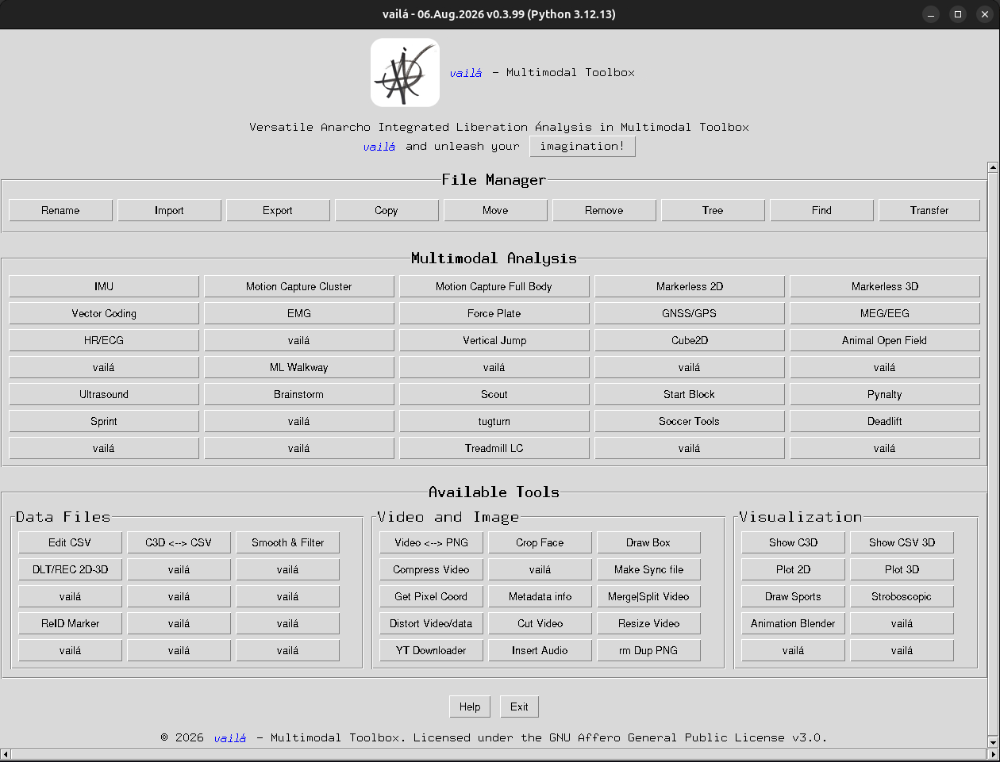

# _vailá_ - Multimodal Toolbox

**App version (GUI/CLI banner):** 0.4.3 (see `vaila.py`). **Package version:** 0.4.3 (`[project].version` in `pyproject.toml`). **Python:** 3.12.x (pinned in-repo for `uv`).

**Last updated:** 2026-09-17

Vertical Jump now adds a CMJ **PODS** profile: explicit onset-to-takeoff timing, mRSI,
momentum sources, braking/propulsive force estimates, phase QC and Team Batch comparisons.
These markerless estimates are not force-platform measurements. See the
[complete metric/event dictionary and validation notes](docs/cmj_pods.md).

File Manager now shares previewed operations between GUI and CLI; YouTube Downloader uses one reviewed URL list with MP4/MP3 selection, progress and cooperative cancellation. See [File Manager help](vaila/help/filemanager.md), [Downloader help](vaila/help/vaila_ytdown.md) and the project [/debug skill](.agents/skills/debug/SKILL.md).

<p align="center">
  
</p>

<div align="center">
  <table>
    <tr>
      <th>Operating System</th>
      <th>Installation Method</th>
      <th>Status</th>
    </tr>
    <tr>
      <td><strong>🪟 Windows</strong></td>
      <td>uv (Recommended)</td>
      <td>✅ Ready</td>
    </tr>
    <tr>
      <td><strong>🐧 Linux</strong></td>
      <td>uv (Recommended)</td>
      <td>✅ Ready</td>
    </tr>
    <tr>
      <td><strong>🍎 macOS</strong></td>
      <td>uv (Recommended)</td>
      <td>✅ Ready</td>
    </tr>
  </table>
</div>

## ⚡ Install Now (One-Line)

Install _vaila_ with a single command!

**🐧 Linux:**

One-line installer:

```bash
wget -qO- https://raw.githubusercontent.com/vaila-multimodaltoolbox/vaila/main/install_vaila_linux.sh | bash
```

If you **already cloned** the repo, prefer running the local script (keeps `uv.lock` / `git pull` clean):

```bash
cd path/to/vaila
chmod +x install_vaila_linux.sh
./install_vaila_linux.sh

# Or install the Complete AI Workstation (CUDA + SAM 3 + Sapiens2 + SAM 3D Body + HF) in one step:
./install_vaila_linux.sh --full
```

**🍎 macOS:**

One-line installer:

```bash
/bin/bash -c "$(curl -fsSL https://raw.githubusercontent.com/vaila-multimodaltoolbox/vaila/main/install_vaila_mac.sh)"
```

If you **already cloned** the repo, prefer running the local script (keeps `uv.lock` / `git pull` clean):

```bash
cd path/to/vaila
chmod +x install_vaila_mac.sh
./install_vaila_mac.sh
```

**🪟 Windows:**

> **Bare/"naked" Windows (no PowerShell 7, git, or Node.js yet)?** No problem — the
> commands below only need the built-in `powershell.exe` (Windows PowerShell 5.1,
> present on every Windows 10/11 install). `install_vaila_win.ps1` auto-installs
> PowerShell 7 (pwsh), git, and Node.js LTS via `winget` as its first step before
> doing anything else.

Preferred (downloads to a temp file, then runs with `-File` so paths work):

```powershell
[Net.ServicePointManager]::SecurityProtocol = [Net.ServicePointManager]::SecurityProtocol -bor 3072
$i = Join-Path $env:TEMP 'install_vaila_win.ps1'
Invoke-WebRequest -Uri 'https://raw.githubusercontent.com/vaila-multimodaltoolbox/vaila/main/install_vaila_win.ps1' -OutFile $i -UseBasicParsing
Unblock-File -Path $i -ErrorAction SilentlyContinue
& powershell.exe -NoProfile -ExecutionPolicy Bypass -File "$i"
```

Or short form (`irm | iex` also works; portable installs to `.\vaila` under your current folder if you are not already inside a clone):

```powershell
[Net.ServicePointManager]::SecurityProtocol = [Net.ServicePointManager]::SecurityProtocol -bor 3072; irm https://raw.githubusercontent.com/vaila-multimodaltoolbox/vaila/main/install_vaila_win.ps1 | iex
```

If you **already cloned** the repo, prefer running the local script (keeps `uv.lock` / `git pull` clean):

```powershell
cd path\to\vaila
.\install_vaila_win.ps1

# Or install the Complete AI Workstation (CUDA + SAM 3 + Sapiens2 + SAM 3D Body + HF) in one step:
.\install_vaila_win.ps1 -Full
```

> **Staying up to date:** in a **git clone**, the GUI runs `git fetch origin main`
> and compares your local `HEAD` with `origin/main` (any new commit counts —
> not only pyproject version bumps). Use **Check for Updates** to fetch on demand
> and **Update Now** to run `git pull --ff-only origin main`. Automatic checks
> on startup are cached ~20 h. Install trees without `.git` fall back to comparing
> `pyproject.toml` with GitHub's `main` and show the one-line install command.

## Introduction

The analysis of human movement is fundamental in both health and sports biomechanics, providing valuable insights into various aspects of physical performance, rehabilitation, and injury prevention. However, existing software often restricts user control and customization, acting as a "black box." With _vailá_, users have the freedom to explore, customize, and create their own tools in a truly open-source and collaborative environment.

## Table of Contents

- [Introduction](#introduction)
- [Description](#description)
- [_vailá_ Structure and Interface](#vailá-structure-and-interface)
- [Installation and Setup](#installation-and-setup)
- [Running _vailá_ — GUI and CLI](#running-vailá--gui-and-cli)
- [Uninstallation Instructions](#uninstallation-instructions)
- [Documentation](#documentation)
- [Citing _vailá_](#citing-vailá)
- [Contribution](#contribution)
- [Releases and versioning](#releases-and-versioning)
- [License](#license)

---

_vailá_ (Versatile Anarcho Integrated Liberation Ánalysis) is an open-source multimodal toolbox that leverages data from multiple biomechanical systems to enhance human movement analysis.

The toolbox is designed to integrate and analyze data from diverse measurement systems commonly used in biomechanics research, including motion capture systems (such as Vicon and OptiTrack), inertial measurement units (IMU), markerless tracking solutions (OpenPose and MediaPipe), force plates (AMTI and Bertec), instrumented treadmill load cells, electromyography (EMG), GNSS/GPS systems, physiological sensors (heart rate, ECG, MEG, EEG), video analysis tools, and ultrasound systems. This comprehensive integration enables researchers to perform advanced multimodal analysis by combining data from different sources, providing a more complete understanding of human movement patterns and biomechanical parameters.

## Description

This multimodal toolbox integrates data from various motion capture systems to facilitate advanced biomechanical analysis by combining multiple data sources. The primary objective is to improve understanding and evaluation of movement patterns across different contexts.

## _vailá_ Manifest

### English Version

Join us in the liberation from paid software with the "vailá - Versatile Anarcho Integrated Liberation Ánalysis in Multimodal Toolbox."

In front of you stands a versatile tool designed to challenge the boundaries of commercial systems. This software is a symbol of innovation and freedom, determined to eliminate barriers that protect the monopoly of expensive software, ensuring the dissemination of knowledge and accessibility.

With _vailá_, you are invited to explore, experiment, and create without constraints. "vailá" means "go there and do it!" — encouraging you to harness its power to perform analysis with data from multiple systems.

### Versão em Português

Junte-se a nós na libertação do software pago com o "vailá: Análise Versátil da Libertação Anarquista Integrada na Caixa de Ferramentas Multimodal".

Diante de você está uma ferramenta versátil, projetada para desafiar as fronteiras dos sistemas comerciais. Este software é um símbolo de inovação e liberdade, determinado a eliminar as barreiras que protegem o monopólio do software caro, garantindo a disseminação do conhecimento e a acessibilidade.

Com _vailá_, você é convidado a explorar, experimentar e criar sem restrições. "vailá" significa "vai lá e faça!" — encorajando você a aproveitar seu poder para realizar análises com dados de múltiplos sistemas.

---

## _vailá_ Structure and Interface

_vailá_ provides a comprehensive multimodal analysis framework organized into three main sections (Frames A, B, and C) that handle different aspects of biomechanical data processing:

```bash
vailá - 15.Sep.2026 v0.4.3 (Python 3.12.14)
                                             o
                                _,  o |\  _,/
                          |  |_/ |  | |/ / |
                           \/  \/|_/|/|_/\/|_/
##########################################################################
Mocap fullbody_c3d           Markerless_3D      Markerless_2D_MP and YOLO
                  \                |                /
                   v               v               v
   CUBE2D  --> +---------------------------------------+ <-- Vector Coding
   IMU_csv --> |                                       | <-- Cluster_csv
Open Field --> |       vailá - multimodal toolbox      | <-- Force Plate
 StartBlock -->|                                       | <-- GRF Analysis
 etc, etc. --> +---------------------------------------+ <-- etc, etc, etc.
                                 |
                                 V
        +---------------------------------------------------+
        | Processed Data, Figures and Reports etc, etc, etc.|
        +---------------------------------------------------+

============================ File Manager (Frame A) ========================
A_r1_c1 - Rename          A_r1_c2 - Import           A_r1_c3 - Export
A_r1_c4 - Copy            A_r1_c5 - Move             A_r1_c6 - Remove
A_r1_c7 - Tree            A_r1_c8 - Find             A_r1_c9 - Transfer

========================== Multimodal Analysis (Frame B) ===================
B1_r1_c1 - IMU                    B1_r1_c2 - Motion Capture Cluster
B1_r1_c3 - Motion Capture Full Body
B1_r1_c4 - Markerless 2D (coringa: Standard/Advanced/YOLOv26, Yolo+Markerless_MP,
            YOLOv26 Tracker/Pose/Seg/Train, SAM 3, Sapiens2, SAM3+Sapiens2 [+Visualize ID],
            Markerless Hands, MP Angles, Face Mesh, Crop Face, Markerless Live)
B1_r1_c5 - Markerless 3D (coringa: SAM3+DINOv3 3D [+Visualize ID])

B2_r2_c1 - Vector Coding  B2_r2_c2 - EMG             B2_r2_c3 - Force Plate
B2_r2_c4 - GNSS/GPS       B2_r2_c5 - MEG/EEG

B3_r3_c1 - HR/ECG         B3_r3_c2 - vailá
B3_r3_c3 - Vertical Jump
B3_r3_c4 - Cube2D         B3_r3_c5 - Animal Open Field

B4_r4_c1 - vailá          B4_r4_c2 - ML Walkway      B4_r4_c3 - vailá
B4_r4_c4 - vailá          B4_r4_c5 - vailá

B5_r5_c1 - Ultrasound     B5_r5_c2 - Brainstorm      B5_r5_c3 - vailá
B5_r5_c4 - Start Block    B5_r5_c5 - vailá

B5_r6_c1 - Sprint         B5_r6_c2 - vailá           B5_r6_c3 - tugturn
B5_r6_c4 - Soccer Tools (coringa: Field KPs AI, Soccer-Field Calib,
            FIFA cams→DLT, FIFA Dataset Builder, VEK ElasticKick,
            FIFA: merge manual labels, Scout, Pynalty)
B5_r6_c5 - Deadlift

B6_r7_c1 - vailá          B6_r7_c2 - vailá           B6_r7_c3 - Treadmill LC
B6_r7_c4 - vailá          B6_r7_c5 - vailá

============================== Tools Available (Frame C) ===================
-> C_A: Data Files
C_A_r1_c1 - Edit CSV/C3D  C_A_r1_c2 - C3D <--> CSV   C_A_r1_c3 - Smooth & Filter
C_A_r2_c1 - DLT/REC 2D-3D (coringa: Make DLT2D/DLT3D, Rec2D/Rec3D 1DLT + MultiDLT)
C_A_r2_c2 - C3D Metadata  C_A_r2_c3 - vailá
C_A_r3_c1 - vailá         C_A_r3_c2 - vailá          C_A_r3_c3 - vailá
C_A_r4_c1 - ReID Marker   C_A_r4_c2 - Sapiens2_3D  C_A_r4_c3 - vailá
C_A_r5_c1 - vailá         C_A_r5_c2 - vailá          C_A_r5_c3 - vailá

-> C_B: Video and Image
C_B_r1_c1 - Video<-->PNG  C_B_r1_c2 - Planar Geo     C_B_r1_c3 - Draw Box
C_B_r2_c1 - Compress Video C_B_r2_c2 - Video Stabilizer C_B_r2_c3 - Make Sync file
C_B_r3_c1 - GetPixelCoord C_B_r3_c2 - Metadata info  C_B_r3_c3 - Merge|Split Video
C_B_r4_c1 - Distort Video/data C_B_r4_c2 - Cut Video  C_B_r4_c3 - Resize Video
C_B_r5_c1 - YT Downloader C_B_r5_c2 - Insert Audio   C_B_r5_c3 - rm Dup PNG

-> C_C: Visualization
C_C_r1_c1 - Show C3D      C_C_r1_c2 - Show CSV 3D    C_C_r2_c1 - Plot 2D
C_C_r2_c2 - Plot 3D       C_C_r3_c1 - Draw Sports    C_C_r3_c2 - Stroboscopic
C_C_r4_c1 - Animation Blender                        C_C_r4_c2 - vailá
C_C_r5_c1 - vailá         C_C_r5_c2 - vailá          C_C_r5_c3 - vailá

Type 'h' for help or 'exit' to quit.

Use the button 'imagination!' to open a terminal with the vailá virtual environment active.
```

<p align="center">
  
</p>

An overview of the project file structure:

```bash
vaila
├── AGENTS.md                     # Hybrid CPU vs CUDA workstation, SAM/FIFA notes
├── CLAUDE.md                     # AI assistant tooling (Ruff, ty, uv)
├── docs/ai-agents/preto-loop.md  # Preto Loop distribution for Codex/Cursor/Claude/Antigravity
├── skills/preto-loop/             # Portable biomechanics/data-science loop skill
├── CONTRIBUTING.md               # PR workflow, versioning, models policy
├── vaila.py                      # Main Tkinter GUI entry point
├── pyproject.toml                # Single portable manifest (cpu/cuda groups; Hatchling + uv)
├── uv.lock                       # Universal lock (CPU + CUDA + macOS in one file)
├── bin/                          # setup_pyproject.sh/.ps1, sync_repo.sh/.ps1
├── install_vaila_linux.sh        # Linux installer (uv-only)
├── install_vaila_mac.sh          # macOS installer (uv-only)
├── install_vaila_win.ps1         # Windows installer (uv-only)
├── uninstall_vaila_linux.sh
├── uninstall_vaila_mac.sh
├── uninstall_vaila_win.ps1
├── create_dmg_installer.sh       # macOS .dmg builder (optional)
├── vaila_installer.iss           # Windows Inno Setup spec
├── vaila/                        # Python package (~100+ analysis modules)
│   ├── help/                     # Per-module HTML/Markdown help (e.g. vaila_sam.html)
│   ├── models/                   # Reference CSV/JSON; large weights are gitignored
│   ├── vaila_sam.py              # SAM 3 video CLI/GUI + FIFA subcommands
│   ├── fifa_skeletal_pipeline.py # FIFA Skeletal Tracking Light orchestration
│   └── ...                       # See vaila/help/index.md for the full map
├── sam_3d_body/                  # Vendored SAM 3D Body (optional fifa extra)
├── tests/                        # pytest suite
└── docs/                         # MkDocs site, button docs, images
```

**Developer quick reference:** [AGENTS.md](AGENTS.md) (build commands, `uv run`, optional extras `sam` / `gpu` / `fifa`, SAM 3 CUDA limits).

---

## Installation and Setup

For a more detailed, platform-by-platform walkthrough (including troubleshooting), see **[docs/install.md](docs/install.md)** (also available as **[docs/install.html](docs/install.html)**).

### ⚡ Engine: Powered by _uv_

_vailá_ uses **[uv](https://github.com/astral-sh/uv)**, an extremely fast Python package installer and resolver, written in Rust. **uv is the single, official installation method for all platforms** (Windows, Linux, macOS).

**Why uv:**

- **Speed:** Resolves and installs dependencies in seconds.
- **Simplicity:** No separate Python distribution required — uv manages Python 3.12 for you.
- **Reliability:** Uses a strictly locked dependency file (`uv.lock`) ensuring that what runs on our machine runs on yours.
- **Modern:** Built with Rust, following Python packaging standards (`pyproject.toml`).
- **Dynamic Hardware Optimization:** Automatically detects hardware (NVIDIA GPU, Apple Silicon) and installs the matching PyTorch build — from the **same** `pyproject.toml` / `uv.lock` on every machine.
- **Cross-Platform:** **Windows** (CUDA 12.1 + TensorRT where applicable), **Linux** (CUDA 12.8 + TensorRT), and **macOS** (Metal/MPS for the general PyTorch stack). **Exception:** [SAM 3 video](vaila/help/vaila_sam.md) (`vaila_sam.py`) requires **NVIDIA CUDA** at runtime — it does not use MPS and has no CPU-only path.

#### 🎯 Smart Configuration System

_vailá_ ships **one portable `pyproject.toml` and one `uv.lock` for every computer and OS**. There are no platform template files to copy: the PyTorch backend is a **uv dependency group** chosen when you sync.

| Hardware | Command | What you get |
|----------|---------|--------------|
| Linux / Windows + NVIDIA | `uv sync --no-group cpu --group cuda` | PyTorch CUDA 12.8 wheels + TensorRT + `nvidia-ml-py` |
| CPU-only laptop | `uv sync` | PyTorch CPU wheels |
| macOS Apple Silicon | `uv sync` | PyTorch PyPI wheel = Metal/MPS build |

`[dependency-groups]` declares `cpu` and `cuda`, and `[tool.uv] conflicts` marks them mutually exclusive, so `uv.lock` stores **all** resolutions at once. A CUDA workstation and a CPU laptop therefore commit **byte-identical** `pyproject.toml` / `uv.lock` — `git pull`, `git commit` and `git push` never need a `git restore` first.

**Developers / second machine:** the **unified interactive bootstrap** auto-detects OS + NVIDIA + arch and runs the right `uv sync` (it never rewrites tracked files):

```bash
bash bin/setup_pyproject.sh                                       # Linux / macOS / WSL / Git Bash (interactive)
pwsh bin/setup_pyproject.ps1                                      # Windows PowerShell (interactive)
bash bin/setup_pyproject.sh --target=cuda --full --yes       # NVIDIA CUDA + all AI extras (sam,sapiens,fifa,upscaler)
pwsh bin/setup_pyproject.ps1 -Target cuda -Full -Yes          # Windows CUDA + all AI extras
```

Flags: `--target=auto|cpu|cuda`, `--full`, `--extras=a,b,c`, `--non-interactive`, `--yes`, `--lock`, `--no-sync`, `--help` (legacy `linux-cuda` / `win-cuda` / `macos` target names still accepted). See **[AGENTS.md](AGENTS.md)** for the full hybrid workflow.

**How it works (step-by-step):**

1. **Hardware Detection**: The installation script detects your hardware:
   - **Windows/Linux**: Checks for NVIDIA GPU via `nvidia-smi` command
   - **macOS**: Detects architecture via `uname -m` (Apple Silicon `arm64` vs Intel `x86_64`)
2. **User Prompt**: If GPU/accelerator is detected, it asks if you want GPU support:
   - Windows: "NVIDIA GPU detected. Install with GPU support (CUDA 12.1)? [Y/n]"
   - Linux: "NVIDIA GPU detected. Install with GPU support (CUDA 12.8)? [Y/n]"
   - macOS: "Apple Silicon detected. Use Metal/MPS acceleration? [Y/n]"
3. **Backend Selection**: Based on your choice, it picks the PyTorch dependency group — `cuda` (NVIDIA, CUDA 12.8 + TensorRT) or `cpu` (CPU wheels; on macOS the PyPI wheel, which is the Metal/MPS build). **No file is copied or modified.**
4. **Environment Creation**: `uv` creates the `.venv` (`uv python pin` + `uv venv`)
5. **Dependency Installation**: Runs `uv sync` (or `uv sync --no-group cpu --group cuda` for NVIDIA), using the committed `uv.lock` — no relock needed, because that lock already contains every hardware variant
6. **Automatic Fallback**: If the CUDA install fails, you can install the CPU stack with a plain `uv sync`

**Important:** `pyproject.toml` and `uv.lock` stay untouched on every machine, so your git tree is always clean after installing.

This ensures that:

- ✅ The virtual environment is created with the correct dependencies from the beginning
- ✅ No dependency resolution conflicts occur during installation
- ✅ Each OS/GPU combination gets its optimized dependency set
- ✅ Automatic fallback to CPU-only if GPU installation fails

For more information about uv, visit: [https://github.com/astral-sh/uv](https://github.com/astral-sh/uv)

### Optional AI modules (SAM 3, Sapiens2, SAM3+Sapiens2, SAM3+DINOv3 3D, Crop Face, FIFA…)

Several GUI tools (Frame B → **Markerless 2D** / **Markerless 3D**, including **Crop Face** under Markerless 2D, and the FIFA Skeletal Tracking Light stack) need an extra `uv sync --extra <name>` and, for some, a one-time gated-weights download or vendored-repo clone. Each one has its **own help page** with the exact extra name, install/setup commands, CUDA requirements, CLI usage, and outputs — start from the **Script Help Index**:

- **[Script Help Index (HTML)](vaila/help/index.html)** · **[Script Help Index (Markdown)](vaila/help/index.md)**

For the hybrid CPU-laptop vs. NVIDIA-workstation workflow (which dependency group, which extras, `bin/setup_pyproject.sh`), see **[AGENTS.md](AGENTS.md)**.

---

## 🪟 For Windows

Installation is now streamlined using **uv** with automatic GPU detection.

### **Important Notice Before Installation**

> _vailá_ values freedom and the goodwill to learn. If you are not the owner of your computer and do not have permission to perform the installation, we recommend doing it on your own computer. If you are prevented from installing software, it means you are not prepared to liberate yourself, make your modifications, and create, which is the philosophy of _vailá!_

### 1. **Download _vailá_**

- **Option A (Git):**

  ```powershell
  git clone https://github.com/vaila-multimodaltoolbox/vaila
  cd vaila
  ```

  > **SSH clone on Windows:** if checkout fails on `osnet_x0_25_msmt17.onnx` with
  > `Permission denied (publickey)` during Git LFS, either clone with **HTTPS** (above)
  > or repair the partial clone:
  >
  > ```powershell
  > cd vaila
  > git config lfs.url https://github.com/vaila-multimodaltoolbox/vaila.git/info/lfs
  > git lfs pull
  > git restore --source=HEAD :/
  > ```
  >
  > `install_vaila_win.ps1` also attempts this repair automatically when it detects
  > LFS pointer files. Newer commits store small default models as plain Git blobs
  > (no LFS) via `.lfsconfig` + updated `vaila/models/.gitattributes`.

- **Option B (Zip):**
  - Download the `.zip` file from the [_vailá_ GitHub Repository](https://github.com/vaila-multimodaltoolbox/vaila)
  - Extract it
  - **Important:** Rename the folder from `vaila-main` to `vaila`

### 2. **Run the Installation Script**

Open **PowerShell** inside the `vaila` folder and run:

```powershell
.\install_vaila_win.ps1
```

The script will:

1.  Detect if you have an **NVIDIA GPU**.
2.  Ask if you want to install with GPU support (optimizes for CUDA 12.1).
3.  Automatically select the PyTorch dependency group (no file is modified):
    - **GPU detected + user chooses GPU**: `cuda` group (CUDA 12.8 wheels, TensorRT)
    - **No GPU or user chooses CPU**: `cpu` group (CPU-only wheels)
4.  Install **uv** and all dependencies with the selected configuration.

**Note:** Default install location is **Local/Portable** (the current repo directory). Choose option **[2]** for a profile/system install: as **Administrator** → `C:\Program Files\vaila`; as a **Standard User** → `~\vaila`.

**Git pull / multi-machine sync:** portable installs into a clone keep the committed `uv.lock` (CPU) on Git so `git pull` works. Use the automated sync runner to pull changes and auto-adapt the local environment cleanly without merge conflicts:

```powershell
pwsh bin/sync_repo.ps1
```

Or manually restore before pulling: `git restore uv.lock pyproject.toml && git pull && pwsh bin/setup_pyproject.ps1`.

### 3. **What the Script Does**

The installation script automatically:

- Checks for **uv**; if missing, installs it automatically
- **Detects your hardware** (NVIDIA GPU) and prompts for GPU support preference
- **Selects the PyTorch dependency group** (`cuda` or `cpu`) — the committed `pyproject.toml` is never modified
- Installs **Python 3.12.14** (via uv) securely isolated for _vailá_
- Creates a virtual environment (`.venv`) with the correct dependencies from the start
- Syncs all dependencies using `uv sync` (with `--no-group cpu --group cuda` if GPU support was selected)
- Installs **FFmpeg** and **Windows Terminal** (if running as Administrator)
- Configures shortcuts:
  - **Desktop shortcut** with proper icon
  - **Start Menu shortcut**
  - **Windows Terminal profile** for quick access
- Sets appropriate permissions for the installation directories
- **Automatically falls back** to CPU-only configuration if GPU installation fails

### ⚠️ **Important Notes**

- The installation script requires **administrative privileges** to install system components (FFmpeg, Windows Terminal)
- If you run without admin privileges, some features may be skipped, but _vailá_ will still be installed
- The script dynamically configures paths, so no manual adjustments are necessary

**Erro de SSL/TLS ao baixar o script?** Se aparecer "could not establish trust relationship for the SSL/TLS secure channel", use o one-liner da seção [Install Now](#-install-now-one-line) (com a linha que ativa TLS 1.2).

### 4. **Launching _vailá_**

See [Running _vailá_ — GUI and CLI](#running-vailá--gui-and-cli) below (Desktop/Start Menu shortcut, Windows Terminal profile, or `uv run vaila.py`).

### 5. **Environment Activation**

The launchers above (shortcuts, `run_vaila.bat`/`run_vaila.ps1`, `uv run vaila.py`) never
need the `.venv` activated — `uv run` finds it automatically. If you want a `.venv`-activated
shell instead (e.g. to run other `uv`/`python`/`ruff` commands directly), open a terminal in
the project root and run the command for your shell:

- **PowerShell:**

  ```powershell
  .venv\Scripts\Activate.ps1
  ```

  If execution is blocked by policy, run once per session:

  ```powershell
  Set-ExecutionPolicy -Scope Process -ExecutionPolicy Bypass
  ```

- **Command Prompt (CMD):**

  ```dos
  .venv\Scripts\activate.bat
  ```

- **Git Bash:**

  ```bash
  source .venv/Scripts/activate
  ```

**Troubleshooting — "Permission denied (publickey)" when checking for updates:**
this means your git `origin` remote is set to SSH (`git@github.com:...`), which needs a
GitHub SSH key most machines don't have configured. The GUI's **Check for Updates**
now detects this and offers to switch it to HTTPS automatically; to do it yourself:

```powershell
git remote set-url origin https://github.com/vaila-multimodaltoolbox/vaila.git
```

---

## 🐧 For Linux

Installation is streamlined using **uv** with automatic GPU detection.

### 1. **Download _vailá_**

- **Option A (Git):**

  ```bash
  git clone https://github.com/vaila-multimodaltoolbox/vaila
  cd vaila
  ```

- **Option B (Zip):**
  - Download the `.zip` file from the [_vailá_ GitHub Repository](https://github.com/vaila-multimodaltoolbox/vaila)
  - Extract it
  - **Important:** Rename the folder from `vaila-main` to `vaila`
  - Open a terminal inside the folder (`cd path/to/vaila`)

### 2. **Run the Installation Script**

If you **already cloned** the repo, prefer running the local script (keeps `uv.lock` / `git pull` clean):

```bash
cd path/to/vaila
chmod +x install_vaila_linux.sh
./install_vaila_linux.sh
```

The script will:

1. Detect if you have an **NVIDIA GPU**.
2. Ask if you want to install with GPU support (optimizes for CUDA 12.8).
3. Automatically select the PyTorch dependency group (no file is modified):
   - **GPU detected + user chooses GPU**: `cuda` group (CUDA 12.8 wheels, TensorRT)
   - **No GPU or user chooses CPU**: `cpu` group (CPU-only wheels)
4. Install **uv** and all dependencies with the selected configuration.

**Note:** Default install location is **Local/Portable** (the current repo directory). Choose option **[2]** for user profile install (`~/vaila`).

**Git pull / multi-machine sync:** portable installs into a clone keep the committed `uv.lock` (CPU) on Git so `git pull` works. Use the automated sync runner to pull changes and auto-adapt the local environment cleanly without merge conflicts:

```bash
bash bin/sync_repo.sh
```

Or manually restore before pulling: `git restore uv.lock pyproject.toml && git pull && bash bin/setup_pyproject.sh`.

### 3. **What the Script Does**

The installation script automatically:

- Checks for **uv**; if missing, installs it automatically
- **Detects your hardware** (NVIDIA GPU via `nvidia-smi`) and prompts for GPU support preference
- **Selects the PyTorch dependency group** (`cuda` or `cpu`) — the committed `pyproject.toml` is never modified
- Installs **Python 3.12.14** (via uv) securely isolated for _vailá_
- Creates a virtual environment (`.venv`) with the correct dependencies from the start
- Syncs all dependencies using `uv sync` (with `--no-group cpu --group cuda` if GPU support was selected)
- Installs system packages via package manager if needed (`python3-tk`, `ffmpeg`, etc.)
- Configures desktop shortcut and application launcher (`~/.local/share/applications/vaila.desktop`)
- **Automatically falls back** to CPU-only configuration if GPU installation fails

### 4. **Manual Installation (Alternative)**

If you prefer to install manually using uv:

```bash
# Install uv
curl -LsSf https://astral.sh/uv/install.sh | sh

# Clone and install vailá
git clone https://github.com/vaila-multimodaltoolbox/vaila
cd vaila

# The same pyproject.toml works on every machine: the hardware is a uv group.

# Initialize Python version
uv python pin 3.12.14

# Create virtual environment
uv venv --python 3.12.14

# Install dependencies (committed uv.lock already covers CPU, CUDA and macOS)
uv sync
# Or, on an NVIDIA GPU (CUDA 12.8 + TensorRT):
# uv sync --no-group cpu --group cuda

# Run vailá
uv run vaila.py
```

**Note:** there is nothing to copy or configure beforehand — pass `--no-group cpu --group cuda` to `uv sync` on an NVIDIA machine and plain `uv sync` everywhere else.

---

## 🍎 For macOS

Installation is streamlined using **uv** with Apple Silicon Metal/MPS acceleration detection.

### 1. **Download _vailá_**

- **Option A (Git):**

  ```bash
  git clone https://github.com/vaila-multimodaltoolbox/vaila
  cd vaila
  ```

- **Option B (Zip):**
  - Download the `.zip` file from the [_vailá_ GitHub Repository](https://github.com/vaila-multimodaltoolbox/vaila)
  - Extract it
  - **Important:** Rename the folder from `vaila-main` to `vaila`
  - Open a terminal inside the folder (`cd path/to/vaila`)

### 2. **Run the Installation Script**

If you **already cloned** the repo, prefer running the local script (keeps `uv.lock` / `git pull` clean):

```bash
cd path/to/vaila
chmod +x install_vaila_mac.sh
./install_vaila_mac.sh
```

The script will:

1. Detect your architecture (**Apple Silicon** `arm64` vs **Intel** `x86_64`).
2. If Apple Silicon, ask if you want to use **Metal/MPS** acceleration (recommended).
3. Automatically select the PyTorch dependency group (no file is modified):
   - **Apple Silicon**: default `cpu` group — the macOS PyPI wheel **is** the Metal/MPS build
   - **Intel**: same default group, CPU-only at runtime
4. Install **uv** and all dependencies with the selected configuration.

**Note:** Default install location is **Local/Portable** (the current repo directory). Choose option **[2]** for user profile install (`~/vaila`).

### 3. **What the Script Does**

The installation script automatically:

- Checks for **uv**; if missing, installs it automatically
- Installs system dependencies via Homebrew (if needed)
- **Detects your architecture** (Apple Silicon vs Intel) and prompts for Metal/MPS acceleration
- **Selects the PyTorch dependency group** (`cpu`, i.e. the Metal/MPS wheel on Apple Silicon) — the committed `pyproject.toml` is never modified
- Installs **Python 3.12.14** (via uv) securely isolated for _vailá_
- Creates a virtual environment (`.venv`) with the correct dependencies from the start
- Syncs all dependencies using `uv sync`
- Sets up the macOS application bundle with icon in Applications folder
- **Automatically falls back** to CPU-only configuration if Metal installation fails

**Notes:**

- You may be prompted for your password when the script uses sudo to create the symbolic link or application launcher.

---

## Running _vailá_ — GUI and CLI

### GUI (recommended)

```bash
cd path/to/vaila
uv run vaila.py
```

Or, without typing that:

- **Desktop / Start Menu / Applications** shortcut created by the installer (with icon)
- **Windows Terminal** profile pre-configured by the installer (Windows)
- Portable launch scripts created by the installer:
  - 🐧 🍎 `./run_vaila.sh` (default install dir, or `~/vaila` if you chose the user-profile option)
  - 🪟 `.\run_vaila.ps1`, or double-click `run_vaila.bat`

All of these run _vailá_ through the same `uv`-managed virtual environment created at install time.

### CLI

Most `vaila/*.py` modules also run standalone from the command line, e.g.:

```bash
uv run vaila/vaila_sam.py -i video.mp4 -o out/ -t person
uv run vaila/sam3dinov3.py -i video.mp4 -o out/ --focal-px 1400
uv run vaila/interp_smooth_split.py -i /path/to/csv_dir -c smooth_config.toml
```

Every GUI **Run** button also prints its equivalent copy-paste CLI command to the terminal, so you can recover the exact flags used from a GUI session.

### Full script reference

For the CLI flags, GUI button location, required extras, and outputs of **every** script — see the Script Help Index:

- **[Script Help Index (HTML)](vaila/help/index.html)** · **[Script Help Index (Markdown)](vaila/help/index.md)**

---

## 🧪 Automated Testing

_vailá_ includes an automated test suite to ensure the reliability of biomechanical calculations and data processing pipelines.

### Running Tests

To run the full test suite, use **uv**:

```bash
uv run pytest
```

You can also run specific test files for more detailed output:

```bash
# Unit tests for biomechanical formulas
uv run pytest tests/test_vaila_and_jump.py -v

# Integration tests for full data pipelines
uv run pytest tests/test_vaila_and_jump_integration.py -v
```

The test suite covers:

- **Unit Tests:** Physics formulas (Force, Power, Energy), TOML configuration loading, and baseline calculations.
- **Integration Tests:** End-to-end processing of Time-of-flight, Jump-height, and MediaPipe data using real sample files.

---

## ⚡ GPU Support & Optimization

_vailá_ provides comprehensive GPU support across all platforms with automatic hardware detection and optimized dependency installation.

### Installation-Time GPU Support

During installation, the scripts automatically:

- **Detect NVIDIA GPUs** (Windows/Linux) or **Apple Silicon** (macOS)
- **Prompt you** to choose GPU or CPU-only installation
- **Select the PyTorch dependency group**:
  - Windows / Linux + NVIDIA: `cuda` (CUDA 12.8 + TensorRT)
  - macOS: `cpu` (the PyPI wheel provides Metal/MPS)
  - Fallback: `cpu` (CPU-only, always available)

### Runtime GPU Optimization

_vailá_ includes a **HardwareManager** that automatically optimizes performance for your specific computer:

- **Auto-Export**: The first time you run a model, _vailá_ builds a custom `.engine` file for your GPU.
  - _Note_: This process takes 2-5 minutes on the first run.
- **Cross-Platform**:
  - On **Windows**, it uses `trtexec.exe` to build Windows-compatible engines.
  - On **Linux**, it builds Linux-compatible engines.
  - Both can coexist in the same folder if you dual-boot.
- **Profiles**:
  - **The toolbox automatically selects valid settings (Workspace size, Precision) based on your VRAM.**

---

## Uninstallation Instructions

### For Uninstallation on Linux 🐧

1. **Run the uninstall script**:

```bash
chmod +x uninstall_vaila_linux.sh
./uninstall_vaila_linux.sh
```

- The script will:
  - Remove the uv virtual environment (`.venv`).
  - Delete the `~/vaila` directory.
  - Remove the desktop entry.
  - Best-effort: remove any leftover legacy `vaila` Conda environment from old installs.

**Notes:**

- Run the script as your regular user, not with sudo.

### For Uninstallation on macOS 🍎

1. **Run the uninstall script**:

```bash
chmod +x uninstall_vaila_mac.sh
./uninstall_vaila_mac.sh
```

- The script will:
  - Remove the uv virtual environment (`.venv`).
  - Delete the `~/vaila` directory.
  - Remove `vaila.app` from `/Applications` and `~/Applications`.
  - Refresh the Launchpad to remove cached icons.
  - Best-effort: remove any leftover legacy `vaila` Conda environment from old installs.

**Notes:**

- Run the script as your regular user, not with sudo.
- You will be prompted for your password when the script uses `sudo` to remove the app from `/Applications`.

### For Uninstallation on Windows 🪟

1. **Run the uninstallation script** (PowerShell, Administrator recommended):

```powershell
.\uninstall_vaila_win.ps1
```

If you encounter execution policy restrictions, run:

```powershell
powershell -ExecutionPolicy Bypass -File .\uninstall_vaila_win.ps1
```

The script will:

- Remove the uv virtual environment (`.venv`).
- Delete the installation directory (`C:\Program Files\vaila` or `C:\Users\<YourUser>\vaila`).
- Remove the Windows Terminal `vaila` profile (settings.json).
- Delete the Desktop and Start Menu shortcuts if they exist.
- Best-effort: remove any leftover legacy `vaila` Conda environment from old installs.

---

## Documentation

### 📚 Script Help Documentation

Every module and script in vailá — description, GUI button location, required extras, CLI usage, configuration parameters, and input/output formats — is documented in the **Script Help Index**:

- **[Script Help Index (HTML)](vaila/help/index.html)** - Complete documentation for all Python modules and scripts (HTML version)
- **[Script Help Index (Markdown)](vaila/help/index.md)** - Complete documentation for all Python modules and scripts (Markdown version)

### 📖 Additional Documentation

- **[AGENTS.md](AGENTS.md)** - `uv run` recipes, hybrid CPU vs CUDA dependency groups, SAM 3 / FIFA pointers
- **[Hardware & GPU Diagnostics Guide](vaila/help/gpu_guide.md)** - GPU testing, TensorRT profiles, and CUDA diagnostics (`gputest.py` / footer button **GPU Test**)
- **[Project Documentation](docs/index.md)** - Overview and module documentation
- **[Hugging Face setup (per PC)](docs/huggingface_setup.md)** - Gated SAM / SAM 3D / Sapiens2 login + download
- **[Help Guide](docs/help.md)** - User guide and installation instructions
- **[Install & Run Guide](docs/install.md)** - Detailed Linux/Windows/macOS install, GPU backend selection, and troubleshooting
- **[GUI Button Documentation](docs/vaila_buttons/README.md)** - Complete documentation for all GUI buttons

---

## Citing _vailá_

If you use _vailá_ in your research or project, please consider citing our work:

```bibtex
@misc{vaila2024,
  title={vailá - Versatile Anarcho Integrated Liberation Ánalysis in Multimodal Toolbox},
  author={Paulo Roberto Pereira Santiago and Guilherme Manna Cesar and Ligia Yumi Mochida and Juan Aceros and others},
  year={2024},
  eprint={2410.07238},
  archivePrefix={arXiv},
  primaryClass={cs.HC},
  url={https://arxiv.org/abs/2410.07238}
}

@article{tahara2025predicting,
  title={Predicting walkway spatiotemporal parameters using a markerless, pixel-based machine learning approach},
  author={Tahara, Ariany K and Chinaglia, Abel G and Monteiro, Rafael LM and Bedo, Bruno LS and Cesar, Guilherme M and Santiago, Paulo RP},
  journal={Brazilian Journal of Motor Behavior},
  volume={19},
  number={1},
  pages={e462--e462},
  year={2025}
}

@article{Mochida2025,
  author = {Mochida, Ligia Yumi and Santiago, Paulo R. P. and Lamb, Miranda and Cesar, Guilherme M.},
  title = {Multimodal Motion Capture Toolbox for Enhanced Analysis of Intersegmental Coordination in Children with Cerebral Palsy and Typically Developing},
  journal = {Journal of Visualized Experiments},
  year = {2025},
  number = {206},
  pages = {e69604},
  doi = {10.3791/69604},
  url = {https://www.jove.com/t/69604/multimodal-motion-capture-toolbox-for-enhanced-analysis}
}

@article{chinaglia2026automating,
  title={Automating Timed Up and Go Phase Segmentation and Gait Analysis via the tugturn Markerless 3D Pipeline},
  author={Chinaglia, Abel Gon{\c{c}}alves and Cesar, Guilherme Manna and Santiago, Paulo Roberto Pereira},
  journal={arXiv preprint arXiv:2602.21425},
  year={2026},
  doi = {10.48550/arXiv.2602.21425},
  url = {https://arxiv.org/abs/2602.21425}
}
```

## You can also refer to the tool's GitHub repository for more details and updates

- [_vailá_ on arXiv](https://arxiv.org/abs/2410.07238)
- [_vailá_ GitHub Repository](https://github.com/vaila-multimodaltoolbox/vaila)

## Contribution

We encourage creativity and innovation to enhance and expand the functionality of this toolbox. You can make a difference by contributing to the project! To get involved, feel free to fork the repository, experiment with new ideas, and create a branch for your changes. When you're ready, submit a pull request so we can review and potentially integrate your contributions.

See **[CONTRIBUTING.md](CONTRIBUTING.md)** for workflow, style, and tests. For **security** (secrets, reporting vulnerabilities), see **[SECURITY.md](SECURITY.md)**.

Don't hesitate to learn, explore, and experiment. Be bold, and don't be afraid to make mistakes—every attempt is a step towards improvement!

## Releases and versioning

The **installable package version** is defined in **`pyproject.toml`** (`[project].version`). That is what **`uv`** and **`pip`** report (e.g. when you `uv sync` or install from PyPI). As of milestone **`0.4.3`**, the checked-in package line and the **GUI/CLI banner** in `vaila.py` are aligned at **`0.4.3`**. Between milestones the banner may still be bumped on every script change per the metadata rule in `CLAUDE.md`, while the `pyproject.toml` package version is bumped separately for packaging/releases.

**GitHub releases** may use an additional **milestone codename**: **`rp`** refers to **Ribeirão Preto**, plus a date suffix (day + abbreviated month + two-digit year), e.g. **`rp23mar26`** for 23 Mar 2026. This codename does not replace the package version.

Maintainership policy, tag commands, and automated multi-OS installer builds (Windows `.exe` and macOS `.dmg` via GitHub Actions) are documented in **[docs/github_release_guide.md](docs/github_release_guide.md)** and **[CONTRIBUTING.md — Versioning and GitHub releases](CONTRIBUTING.md#versioning-and-github-releases)**.

## License

This project is licensed under the GNU Affero General Public License v3.0 (AGPLv3).
This license ensures that any use of vailá, including network/server usage,
maintains the freedom of the software and requires source code availability.

For more details, see the [LICENSE](LICENSE) file or visit:
<https://www.gnu.org/licenses/agpl-3.0.html>
