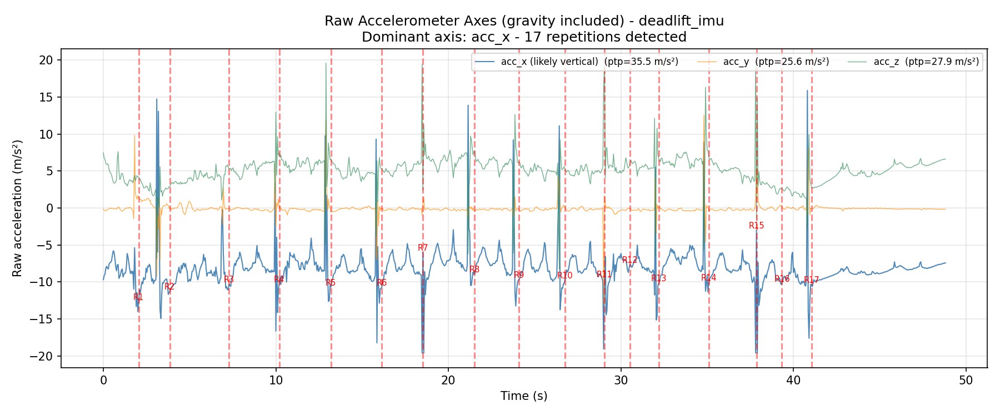
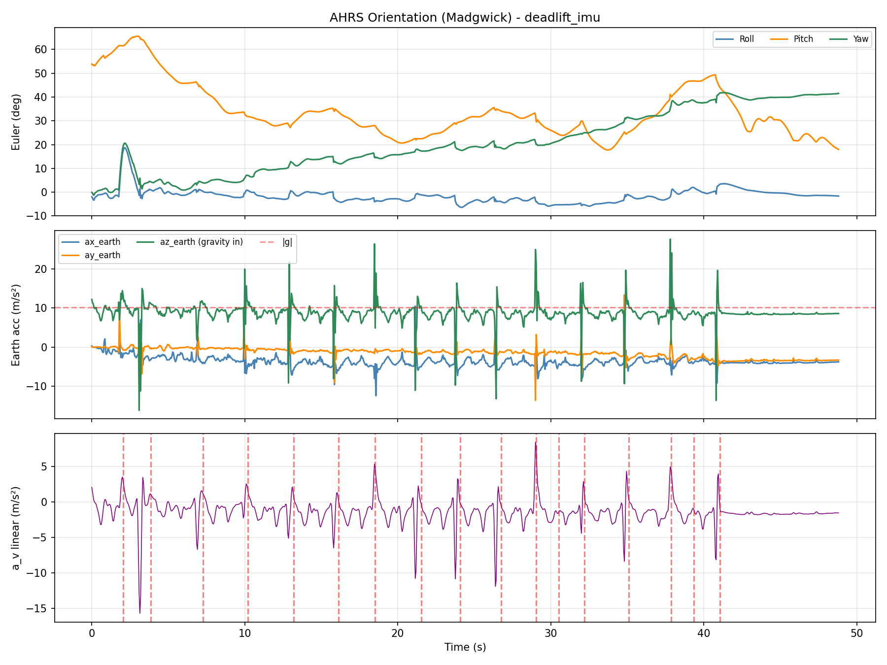
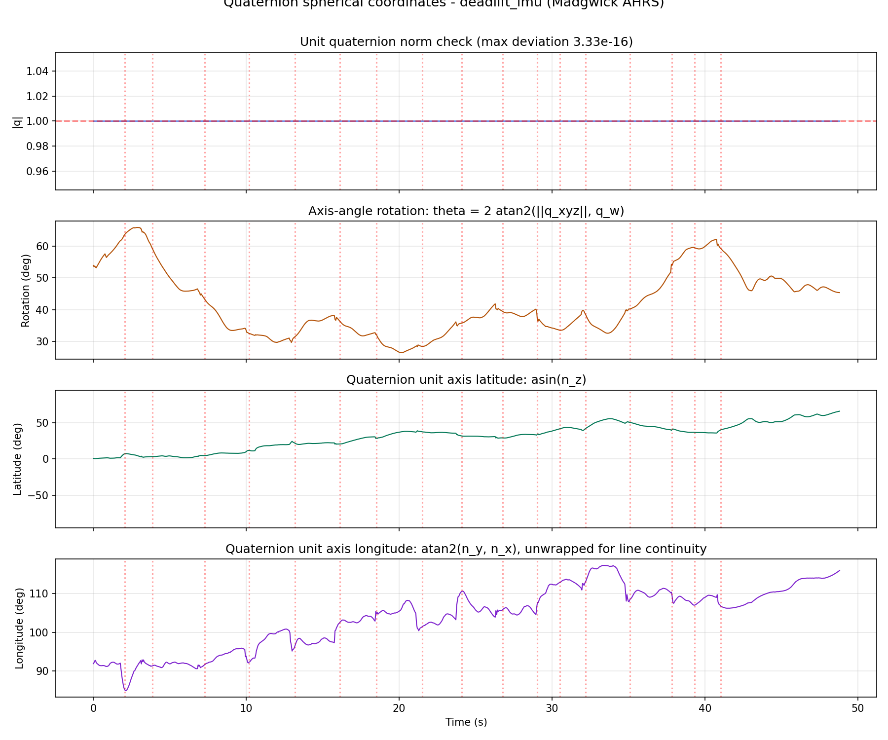
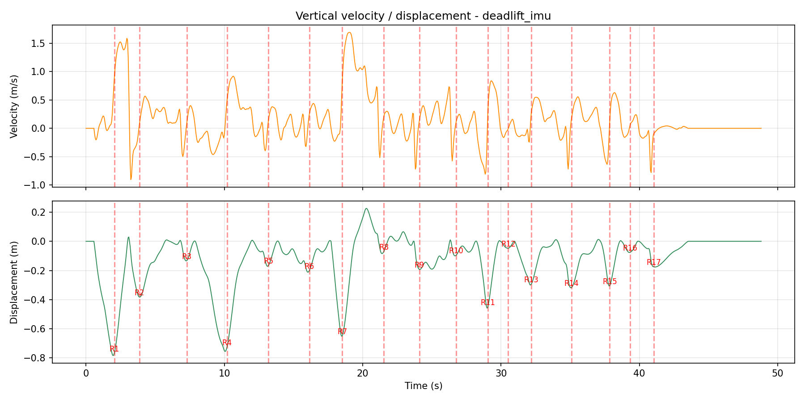
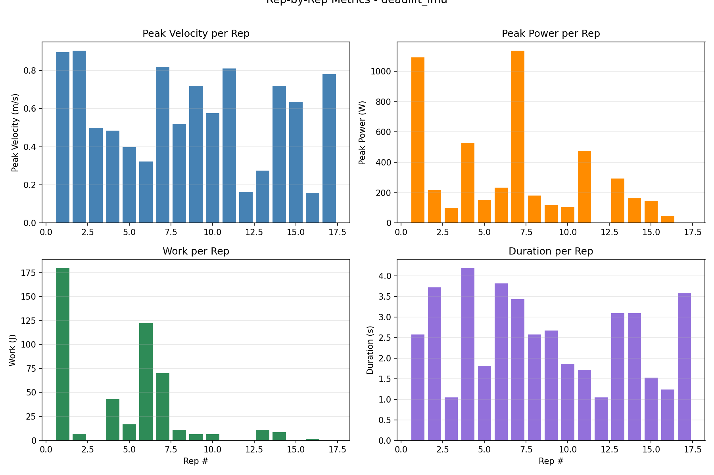
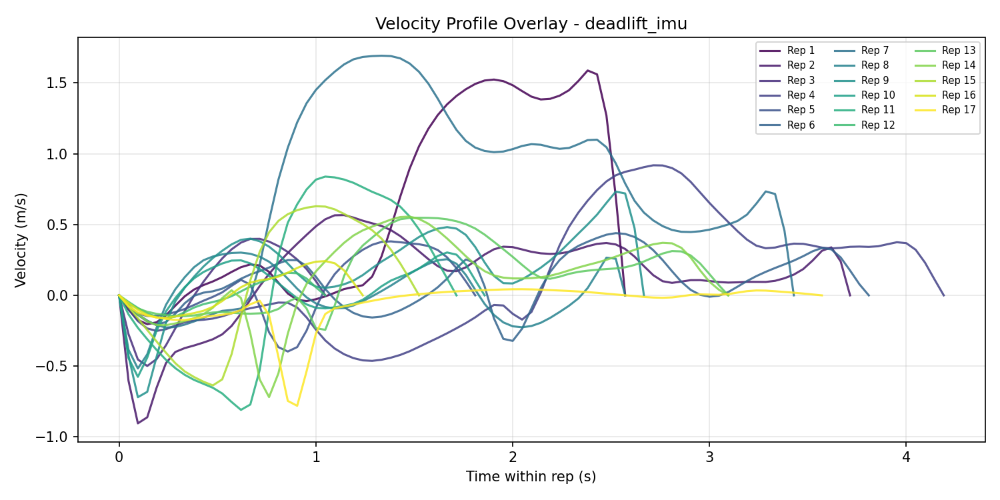

# IMU Deadlift Biomechanical Report (AHRS) - deadlift_imu

- **File:** `deadlift_imu`
- **Date:** 2026-06-09 14:50:58
- **Filter:** Madgwick AHRS  |  **Sample rate:** 21.0 Hz  |  **|g| (sensor):** 10.155 m/s²
- **Barbell weight:** 20.0 kg  |  **Body mass:** 75.0 kg  |  **Body height:** 1.77 m

> **Repetitions detected:** 17  |  **Cadence:** 24.6 reps/min  |  **Mean rep time:** 2.53 ± 1.00 s

## Per-Repetition Metrics

| Rep | Duration (s) | Conc. (s) | Ecc. (s) | Peak Vel (m/s) | Mean Vel (m/s) | Peak Power (W) | Mean Power (W) | Work (J) | ROM (m) | Peak Force (N) | Impulse (N·s) |
|-----|--------------|-----------|----------|---------------|---------------|----------------|----------------|----------|---------|----------------|----------------|
| 1 | 2.57 | 1.48 | 1.10 | 0.895 | 0.204 | 1092.0 | 217.2 | 179.92 | 0.813 | 1265.1 | 1292.14 |
| 2 | 3.71 | 0.71 | 3.00 | 0.904 | 0.065 | 216.8 | 142.0 | 6.76 | 0.392 | 1260.7 | 570.26 |
| 3 | 1.05 | 0.43 | 0.62 | 0.498 | 0.096 | 99.0 | 99.0 | 0.00 | 0.137 | 1080.2 | 352.59 |
| 4 | 4.19 | 2.29 | 1.90 | 0.483 | 0.262 | 527.7 | 295.3 | 43.15 | 0.763 | 1172.1 | 1937.66 |
| 5 | 1.81 | 1.10 | 0.71 | 0.397 | 0.079 | 150.4 | 73.3 | 16.91 | 0.173 | 1130.9 | 890.95 |
| 6 | 3.81 | 2.24 | 1.57 | 0.321 | 0.138 | 231.9 | 112.3 | 122.48 | 0.217 | 1054.7 | 1730.12 |
| 7 | 3.43 | 0.81 | 2.62 | 0.817 | 0.521 | 1135.9 | 724.1 | 69.88 | 0.877 | 1439.6 | 719.46 |
| 8 | 2.57 | 0.38 | 2.19 | 0.516 | 0.124 | 181.4 | 114.9 | 11.07 | 0.150 | 1146.1 | 288.28 |
| 9 | 2.67 | 0.38 | 2.29 | 0.719 | 0.093 | 119.3 | 71.0 | 6.27 | 0.203 | 1240.6 | 281.58 |
| 10 | 1.86 | 0.38 | 1.48 | 0.575 | 0.089 | 106.2 | 71.7 | 6.38 | 0.102 | 1135.6 | 273.94 |
| 11 | 1.71 | 0.81 | 0.90 | 0.809 | 0.284 | 475.2 | 475.2 | 0.00 | 0.463 | 1731.2 | 723.41 |
| 12 | 1.05 | 0.57 | 0.48 | 0.163 | 0.000 | 0.0 | 0.0 | 0.00 | 0.047 | 811.3 | 422.10 |
| 13 | 3.10 | 1.19 | 1.90 | 0.276 | 0.206 | 293.5 | 228.9 | 10.90 | 0.311 | 1205.0 | 952.93 |
| 14 | 3.10 | 1.00 | 2.10 | 0.718 | 0.095 | 162.5 | 92.9 | 8.64 | 0.332 | 1341.2 | 791.70 |
| 15 | 1.52 | 0.67 | 0.86 | 0.636 | 0.106 | 146.4 | 146.4 | 0.00 | 0.310 | 1400.8 | 572.67 |
| 16 | 1.24 | 0.62 | 0.62 | 0.159 | 0.034 | 48.0 | 28.3 | 1.35 | 0.078 | 844.7 | 461.30 |
| 17 | 3.57 | 1.10 | 2.48 | 0.780 | 0.000 | 0.0 | 0.0 | 0.00 | 0.176 | 1306.6 | 830.93 |

## Rep-to-Rep Comparison

| Metric | Max | Min | Range | Mean | Std | CV% | Best Rep | Worst Rep |
|--------|-----|-----|-------|------|-----|-----|----------|-----------|
| Peak Velocity (m/s) | 0.904 | 0.159 | 0.745 | 0.569 | 0.244 | 43.0% | #2 | #16 |
| Mean Velocity (m/s) | 0.521 | 0.000 | 0.521 | 0.141 | 0.127 | 90.3% | #7 | #12 |
| Peak Power (W) | 1135.884 | 0.000 | 1135.884 | 293.306 | 340.257 | 116.0% | #7 | #12 |
| Mean Power (W) | 724.149 | 0.000 | 724.149 | 170.145 | 184.893 | 108.7% | #7 | #12 |
| Work (J) | 179.925 | 0.000 | 179.925 | 28.454 | 50.674 | 178.1% | #1 | #3 |
| ROM (m) | 0.877 | 0.047 | 0.830 | 0.326 | 0.260 | 79.8% | #7 | #12 |
| Duration (s) | 4.190 | 1.048 | 3.143 | 2.527 | 1.033 | 40.9% | #4 | #3 |
| Concentric (s) | 2.286 | 0.381 | 1.905 | 0.950 | 0.586 | 61.7% | #4 | #8 |
| Eccentric (s) | 3.000 | 0.476 | 2.524 | 1.577 | 0.802 | 50.8% | #2 | #12 |
| Peak Force (N) | 1731.232 | 811.305 | 919.926 | 1209.795 | 215.728 | 17.8% | #11 | #12 |
| Impulse (N·s) | 1937.656 | 273.936 | 1663.720 | 770.119 | 487.402 | 63.3% | #4 | #10 |

## Time-series and rep visualizations







[Open 3D quaternion rigid-body animation](deadlift_imu_imu_quaternion_rigidbody_animation_20260609_145057.html)







## Quaternion axis-angle spherical view

The report visualizes the unit quaternion as a rigid-body rotation: `q = [w, x, y, z] = [cos(theta/2), nx sin(theta/2), ny sin(theta/2), nz sin(theta/2)]`, where `n` is the unit rotation axis. Because `|q| = 1`, the axis can be represented on the unit sphere.

- **rotation_deg**: `theta`, the rigid-body rotation angle in degrees.
- **axis_latitude_deg**: `asin(nz)` in degrees.
- **axis_longitude_deg**: `atan2(ny, nx)` in degrees.

The spherical line graph shows these values through time. The embedded HTML animation is the main rigid-body view: real-world Earth axes stay fixed (Xe, Ye, Ze), the cube center translates by AHRS/ZUPT vertical displacement, the sensor cube/body axes (Xb, Yb, Zb) rotate by `q(t)`, and the black vector draws the unit quaternion axis `n(q)`.

Unlike Euler angles, quaternions are singularity-free: no gimbal lock, no axis-order ambiguity, and no discontinuous roll/pitch/yaw interpretation. The code makes `q` sign-continuous for display because `q` and `-q` encode the same physical orientation.

## References & Credits

This report was produced by the **vailá** IMU Deadlift AHRS pipeline (`vaila_deadlift_imu.py`). The orientation tracking is a direct Python port of the open-source x-io Technologies AHRS C reference.

**Method credits:**

- Madgwick, S. O. H. (2010). *An efficient orientation filter for inertial and inertial/magnetic sensor arrays.* Technical report, University of Bristol.
- Mahony, R., Hamel, T., & Pflimlin, J.-M. (2008). *Nonlinear complementary filters on the special orthogonal group.* IEEE Transactions on Automatic Control, 53(5), 1203–1218.
- x-io Technologies — Open-source IMU and AHRS algorithms: <https://x-io.co.uk/open-source-imu-and-ahrs-algorithms/>
- xioTechnologies/Fusion (modern C/C++ reference): <https://github.com/xioTechnologies/Fusion/tree/main>
- Madgwick filter walk-through (cross-check): <https://medium.com/@k66115704/imu-madgwick-filter-explanation-556fbe7f02e3>

## Publication History & Tribute to Prof. René Jean Brenzikofer

Modern biomechanics is grounded in solid physical–mathematical foundations for modeling human movement. I leave here my profound tribute and final farewell to one of the greatest exponents of this scientific rigor in Brazil, Professor **René Jean Brenzikofer** (UNICAMP). It is an honor to have known him and to have shared creative ideas that demonstrated a biomechanics that truly makes a difference. This close collaboration enabled the **first publication of three-dimensional modeling data based on Quaternions** in the book *"Modelos Matemáticos nas Ciências Não-Exatas, vol. 1"* (Editora Blucher, 2007).

**Primary references (BibTeX-ready):**

- Nogueira, E. A., Martins, L. E. B., & Brenzikofer, R. (2007). *Modelos Matemáticos nas Ciências Não-Exatas — vol. 1.* São Paulo: Editora Blucher. ISBN 978-85-212-0419-0. <https://www.blucher.com.br/modelos-matematicos-nas-ciencias-nao-exatas-vol-1_9788521204190>
- Santiago, P. R. P. (2009). *Rotações tridimensionais em biomecânica via quatérnions: aplicações na análise dos movimentos esportivos.* Tese (Doutorado) — Universidade Estadual Paulista (Unesp), Instituto de Biociências de Rio Claro. <http://hdl.handle.net/11449/100404> · [PDF](https://repositorio.unesp.br/server/api/core/bitstreams/41603fa7-545b-4e74-a045-57ce94885e0c/content)

**Tribute & social-media coverage:**

- Instagram post (tribute & publication history): <https://www.instagram.com/p/DZLogIJoFbF/>
- LinkedIn post (publication history & tribute to Prof. Brenzikofer): <https://www.linkedin.com/posts/paulo-roberto-pereira-santiago-132619112_hist%C3%B3rico-de-publica%C3%A7%C3%A3o-e-homenagem-ao-prof-ugcPost-7468670091845472257-3tzD/>

```bibtex
@book{nogueira2007modelos,
  title     = {Modelos matem\'aticos nas ci\^encias n\~ao-exatas - vol. 1},
  author    = {Nogueira, Eduardo Arantes and Martins, Luiz Eduardo Barreto
               and Brenzikofer, Ren\'e},
  year      = {2007},
  publisher = {Editora Blucher},
  isbn      = {9788521204190},
  url       = {https://www.blucher.com.br/modelos-matematicos-nas-ciencias-nao-exatas-vol-1_9788521204190}
}

@phdthesis{santiago2009rotaccoes,
  title    = {Rota\c{c}\~oes tridimensionais em biomec\^anica via quat\'ernions:
              aplica\c{c}\~oes na an\'alise dos movimentos esportivos},
  author   = {Santiago, Paulo Roberto Pereira},
  school   = {Universidade Estadual Paulista (Unesp),
              Instituto de Bioci\^encias de Rio Claro},
  year     = {2009},
  url      = {http://hdl.handle.net/11449/100404}
}
```

— Prof. Paulo R. P. Santiago

---

Generated by **vailá** — Versatile Anarcho Integrated Liberation Ánalysis · `vaila_deadlift_imu.py` v0.3.50 · Author: Prof. Paulo R. P. Santiago · <https://github.com/vaila-multimodaltoolbox/vaila> · AGPL-3.0