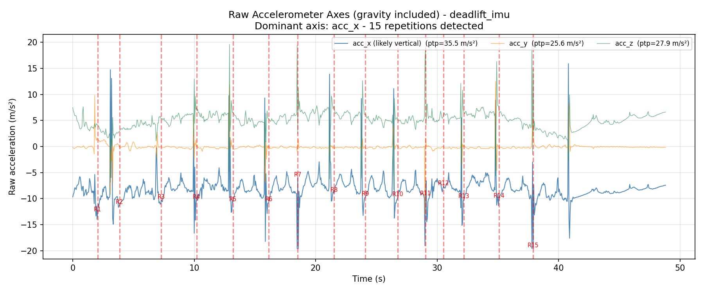
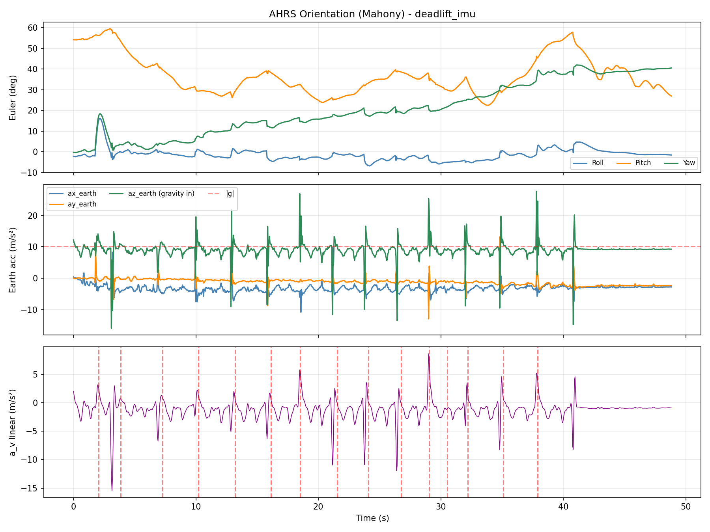
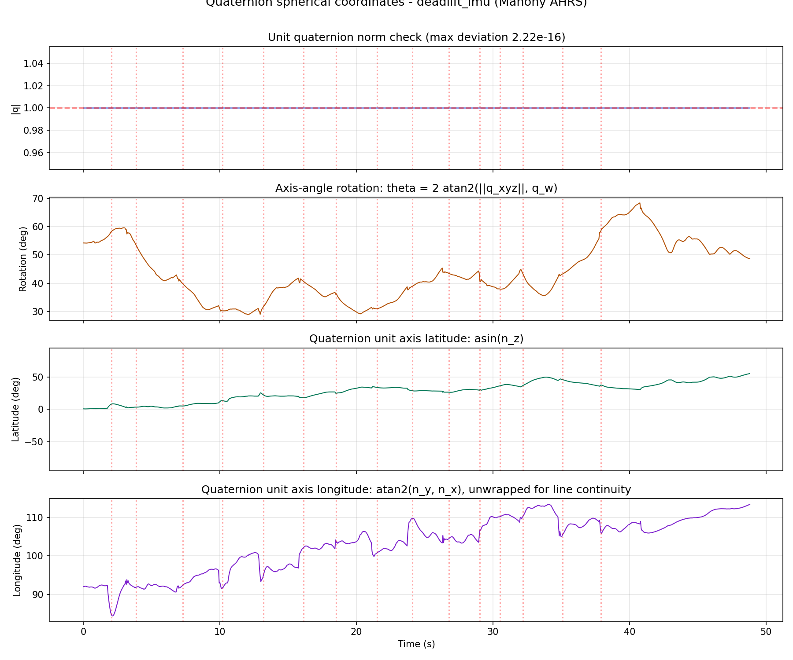
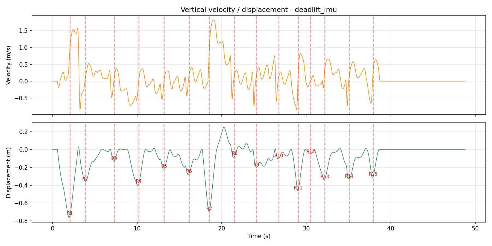
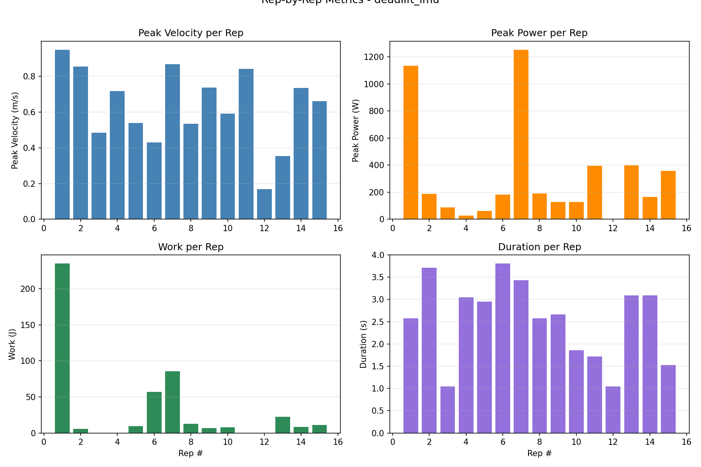
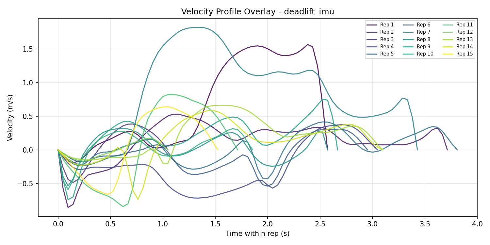

# IMU Deadlift Biomechanical Report (AHRS) - deadlift_imu

- **File:** `deadlift_imu`
- **Date:** 2026-06-09 14:50:59
- **Filter:** Mahony AHRS  |  **Sample rate:** 21.0 Hz  |  **|g| (sensor):** 10.155 m/s²
- **Barbell weight:** 20.0 kg  |  **Body mass:** 75.0 kg  |  **Body height:** 1.77 m

> **Repetitions detected:** 15  |  **Cadence:** 23.4 reps/min  |  **Mean rep time:** 2.54 ± 0.87 s

## Per-Repetition Metrics

| Rep | Duration (s) | Conc. (s) | Ecc. (s) | Peak Vel (m/s) | Mean Vel (m/s) | Peak Power (W) | Mean Power (W) | Work (J) | ROM (m) | Peak Force (N) | Impulse (N·s) |
|-----|--------------|-----------|----------|---------------|---------------|----------------|----------------|----------|---------|----------------|----------------|
| 1 | 2.57 | 1.48 | 1.10 | 0.950 | 0.218 | 1136.3 | 220.9 | 235.27 | 0.794 | 1239.2 | 1279.61 |
| 2 | 3.71 | 0.71 | 3.00 | 0.856 | 0.052 | 187.8 | 120.0 | 5.71 | 0.363 | 1220.9 | 553.36 |
| 3 | 1.05 | 0.43 | 0.62 | 0.486 | 0.088 | 88.4 | 88.4 | 0.00 | 0.133 | 1054.5 | 344.53 |
| 4 | 3.05 | 2.29 | 0.76 | 0.717 | 0.025 | 27.2 | 27.2 | 0.00 | 0.414 | 1148.4 | 1903.52 |
| 5 | 2.95 | 2.24 | 0.71 | 0.540 | 0.043 | 61.5 | 36.3 | 9.56 | 0.237 | 1126.4 | 1781.29 |
| 6 | 3.81 | 2.24 | 1.57 | 0.431 | 0.101 | 181.6 | 86.0 | 56.84 | 0.285 | 1097.0 | 1774.03 |
| 7 | 3.43 | 0.81 | 2.62 | 0.869 | 0.425 | 1254.0 | 608.8 | 85.71 | 0.942 | 1484.9 | 745.84 |
| 8 | 2.57 | 0.38 | 2.19 | 0.535 | 0.126 | 192.3 | 90.6 | 12.64 | 0.160 | 1174.7 | 294.81 |
| 9 | 2.67 | 0.38 | 2.29 | 0.739 | 0.097 | 129.3 | 76.0 | 6.71 | 0.208 | 1271.5 | 289.74 |
| 10 | 1.86 | 0.38 | 1.48 | 0.591 | 0.108 | 129.1 | 85.3 | 7.78 | 0.106 | 1177.5 | 284.94 |
| 11 | 1.71 | 0.81 | 0.90 | 0.843 | 0.234 | 395.7 | 395.7 | 0.00 | 0.470 | 1753.8 | 747.67 |
| 12 | 1.05 | 0.57 | 0.48 | 0.168 | 0.000 | 0.1 | 0.1 | 0.00 | 0.051 | 846.5 | 442.57 |
| 13 | 3.10 | 1.19 | 1.90 | 0.355 | 0.194 | 397.7 | 226.2 | 22.38 | 0.358 | 1268.7 | 1005.28 |
| 14 | 3.10 | 1.00 | 2.10 | 0.735 | 0.090 | 164.9 | 91.7 | 8.33 | 0.344 | 1369.9 | 820.04 |
| 15 | 1.52 | 0.71 | 0.81 | 0.662 | 0.174 | 358.1 | 230.5 | 10.98 | 0.320 | 1430.6 | 659.21 |

## Rep-to-Rep Comparison

| Metric | Max | Min | Range | Mean | Std | CV% | Best Rep | Worst Rep |
|--------|-----|-----|-------|------|-----|-----|----------|-----------|
| Peak Velocity (m/s) | 0.950 | 0.168 | 0.782 | 0.632 | 0.216 | 34.3% | #1 | #12 |
| Mean Velocity (m/s) | 0.425 | 0.000 | 0.425 | 0.132 | 0.106 | 80.8% | #7 | #12 |
| Peak Power (W) | 1253.987 | 0.143 | 1253.844 | 313.612 | 378.864 | 120.8% | #7 | #12 |
| Mean Power (W) | 608.776 | 0.143 | 608.634 | 158.928 | 160.974 | 101.3% | #7 | #12 |
| Work (J) | 235.271 | 0.000 | 235.271 | 30.795 | 61.404 | 199.4% | #1 | #3 |
| ROM (m) | 0.942 | 0.051 | 0.891 | 0.346 | 0.244 | 70.7% | #7 | #12 |
| Duration (s) | 3.810 | 1.048 | 2.762 | 2.543 | 0.905 | 35.6% | #6 | #3 |
| Concentric (s) | 2.286 | 0.381 | 1.905 | 1.041 | 0.700 | 67.2% | #4 | #8 |
| Eccentric (s) | 3.000 | 0.476 | 2.524 | 1.502 | 0.806 | 53.7% | #2 | #12 |
| Peak Force (N) | 1753.824 | 846.538 | 907.286 | 1244.301 | 210.141 | 16.9% | #11 | #12 |
| Impulse (N·s) | 1903.523 | 284.937 | 1618.586 | 861.764 | 569.911 | 66.1% | #4 | #10 |

## Time-series and rep visualizations







[Open 3D quaternion rigid-body animation](deadlift_imu_imu_quaternion_rigidbody_animation_20260609_145058.html)







## Quaternion axis-angle spherical view

The report visualizes the unit quaternion as a rigid-body rotation: `q = [w, x, y, z] = [cos(theta/2), nx sin(theta/2), ny sin(theta/2), nz sin(theta/2)]`, where `n` is the unit rotation axis. Because `|q| = 1`, the axis can be represented on the unit sphere.

- **rotation_deg**: `theta`, the rigid-body rotation angle in degrees.
- **axis_latitude_deg**: `asin(nz)` in degrees.
- **axis_longitude_deg**: `atan2(ny, nx)` in degrees.

The spherical line graph shows these values through time. The embedded HTML animation is the main rigid-body view: real-world Earth axes stay fixed (Xe, Ye, Ze), the cube center translates by AHRS/ZUPT vertical displacement, the sensor cube/body axes (Xb, Yb, Zb) rotate by `q(t)`, and the black vector draws the unit quaternion axis `n(q)`.

Unlike Euler angles, quaternions are singularity-free: no gimbal lock, no axis-order ambiguity, and no discontinuous roll/pitch/yaw interpretation. The code makes `q` sign-continuous for display because `q` and `-q` encode the same physical orientation.

## References & Credits

This report was produced by the **vailá** IMU Deadlift AHRS pipeline (`vaila_deadlift_imu.py`). The orientation tracking is a direct Python port of the open-source x-io Technologies AHRS C reference.

**Method credits:**

- Madgwick, S. O. H. (2010). *An efficient orientation filter for inertial and inertial/magnetic sensor arrays.* Technical report, University of Bristol.
- Mahony, R., Hamel, T., & Pflimlin, J.-M. (2008). *Nonlinear complementary filters on the special orthogonal group.* IEEE Transactions on Automatic Control, 53(5), 1203–1218.
- x-io Technologies — Open-source IMU and AHRS algorithms: <https://x-io.co.uk/open-source-imu-and-ahrs-algorithms/>
- xioTechnologies/Fusion (modern C/C++ reference): <https://github.com/xioTechnologies/Fusion/tree/main>
- Madgwick filter walk-through (cross-check): <https://medium.com/@k66115704/imu-madgwick-filter-explanation-556fbe7f02e3>

## Publication History & Tribute to Prof. René Jean Brenzikofer

Modern biomechanics is grounded in solid physical–mathematical foundations for modeling human movement. I leave here my profound tribute and final farewell to one of the greatest exponents of this scientific rigor in Brazil, Professor **René Jean Brenzikofer** (UNICAMP). It is an honor to have known him and to have shared creative ideas that demonstrated a biomechanics that truly makes a difference. This close collaboration enabled the **first publication of three-dimensional modeling data based on Quaternions** in the book *"Modelos Matemáticos nas Ciências Não-Exatas, vol. 1"* (Editora Blucher, 2007).

**Primary references (BibTeX-ready):**

- Nogueira, E. A., Martins, L. E. B., & Brenzikofer, R. (2007). *Modelos Matemáticos nas Ciências Não-Exatas — vol. 1.* São Paulo: Editora Blucher. ISBN 978-85-212-0419-0. <https://www.blucher.com.br/modelos-matematicos-nas-ciencias-nao-exatas-vol-1_9788521204190>
- Santiago, P. R. P. (2009). *Rotações tridimensionais em biomecânica via quatérnions: aplicações na análise dos movimentos esportivos.* Tese (Doutorado) — Universidade Estadual Paulista (Unesp), Instituto de Biociências de Rio Claro. <http://hdl.handle.net/11449/100404> · [PDF](https://repositorio.unesp.br/server/api/core/bitstreams/41603fa7-545b-4e74-a045-57ce94885e0c/content)

**Tribute & social-media coverage:**

- Instagram post (tribute & publication history): <https://www.instagram.com/p/DZLogIJoFbF/>
- LinkedIn post (publication history & tribute to Prof. Brenzikofer): <https://www.linkedin.com/posts/paulo-roberto-pereira-santiago-132619112_hist%C3%B3rico-de-publica%C3%A7%C3%A3o-e-homenagem-ao-prof-ugcPost-7468670091845472257-3tzD/>

```bibtex
@book{nogueira2007modelos,
  title     = {Modelos matem\'aticos nas ci\^encias n\~ao-exatas - vol. 1},
  author    = {Nogueira, Eduardo Arantes and Martins, Luiz Eduardo Barreto
               and Brenzikofer, Ren\'e},
  year      = {2007},
  publisher = {Editora Blucher},
  isbn      = {9788521204190},
  url       = {https://www.blucher.com.br/modelos-matematicos-nas-ciencias-nao-exatas-vol-1_9788521204190}
}

@phdthesis{santiago2009rotaccoes,
  title    = {Rota\c{c}\~oes tridimensionais em biomec\^anica via quat\'ernions:
              aplica\c{c}\~oes na an\'alise dos movimentos esportivos},
  author   = {Santiago, Paulo Roberto Pereira},
  school   = {Universidade Estadual Paulista (Unesp),
              Instituto de Bioci\^encias de Rio Claro},
  year     = {2009},
  url      = {http://hdl.handle.net/11449/100404}
}
```

— Prof. Paulo R. P. Santiago

---

Generated by **vailá** — Versatile Anarcho Integrated Liberation Ánalysis · `vaila_deadlift_imu.py` v0.3.50 · Author: Prof. Paulo R. P. Santiago · <https://github.com/vaila-multimodaltoolbox/vaila> · AGPL-3.0