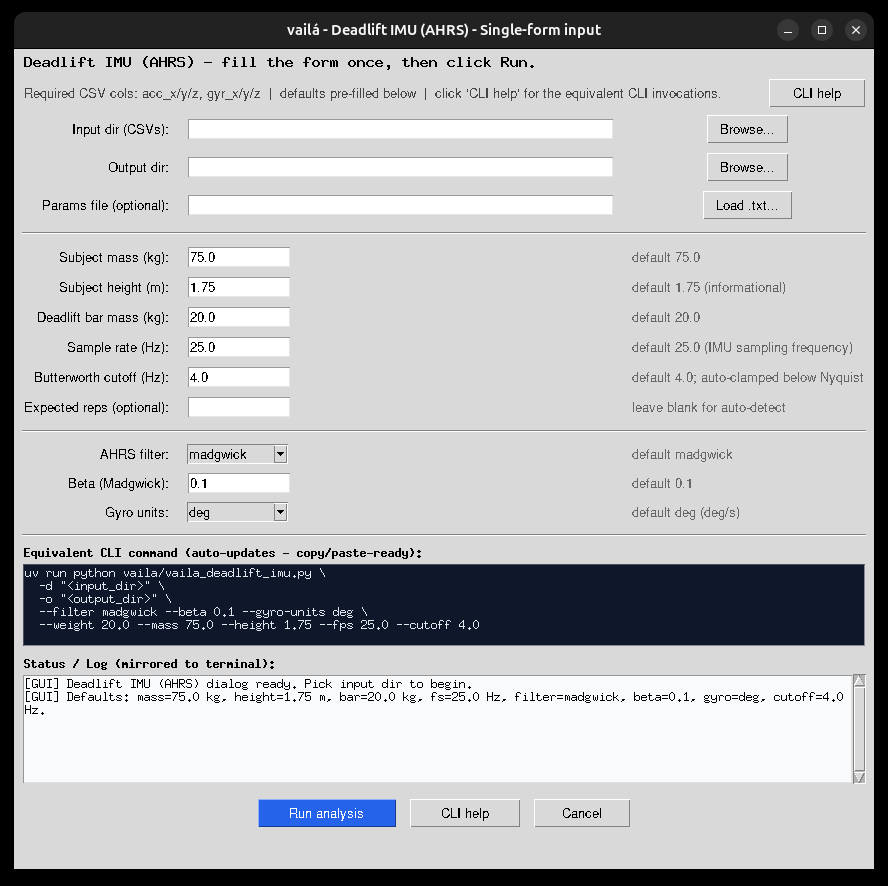

# vaila_deadlift_imu

- **Category:** Analysis
- **File:** `vaila/vaila_deadlift_imu.py`
- **Version:** 0.3.50
- **Updated:** 2026-06-09
- **GUI Interface:** Yes — Frame B → **Deadlift IMU** (B6_r7_c1), or **Deadlift** (B5_r6_c5) → choose *IMU (AHRS)* in the data-source dialog

## Description

Dedicated IMU-only Deadlift / RDL analysis using AHRS sensor fusion. This is
the companion to [`vaila_deadlift`](vaila_deadlift.md), specialised for
barbell-mounted inertial sensors. Unlike the simple "project the raw
accelerometer onto the static gravity axis" approach, this module tracks the
sensor orientation as a quaternion and rotates the accelerometer into the
**Earth frame** before integrating velocity / displacement. The result is
robust to arbitrary barbell rotations during the pull.

Two industry-standard AHRS filters are ported directly from the
[x-io Technologies](https://x-io.co.uk/open-source-imu-and-ahrs-algorithms/)
open-source C reference:

- **Madgwick** AHRS — gradient-descent quaternion update (Madgwick S.O.H.,
  2010). IMU branch (no magnetometer) and full AHRS branch (with
  magnetometer) are both implemented.
- **Mahony** AHRS — complementary-style proportional + integral quaternion
  update (Mahony R., Hamel T., Pflimlin J.-M., 2008). IMU branch.

Reference code lives under
`tests/Deadlift/madgwick_algorithm_c/MadgwickAHRS/` and `MahonyAHRS/`
(C sources from the [xioTechnologies/Fusion](https://github.com/xioTechnologies/Fusion)
repository). A friendly walk-through is also available on the
[Medium Madgwick explanation](https://medium.com/@k66115704/imu-madgwick-filter-explanation-556fbe7f02e3).

## Pipeline

1. Detect a low-motion **static window** at the start of the recording and
   estimate gyroscope bias + the gravity vector in the sensor frame.
2. Initialise the quaternion from gravity using
   `roll = atan2(ay, az)`, `pitch = atan2(-ax, sqrt(ay² + az²))`, `yaw = 0`.
3. Run the AHRS filter sample-by-sample to track orientation as a quaternion
   `q = [w, x, y, z]` (sensor frame relative to Earth frame).
4. Rotate the raw accelerometer to the Earth frame, subtract the measured
   static gravity → **linear acceleration** in Earth coordinates.
5. Lock repetition count and brackets from the **dominant raw accelerometer
   component** (largest peak-to-peak range). The detector low-passes this raw
   axis, follows the gravity-sign peak direction and merges close subpeaks
   caused by a small in-repetition jerk.
6. Use the AHRS vertical linear acceleration for per-rep ZUPT integration,
   velocity, displacement and kinetics inside those locked rep brackets.
7. Per-rep metrics — peak / mean velocity, peak / mean power, work, ROM,
   peak / mean force, impulse — using either the barbell weight or the total
   system mass.
8. PNG plots and a self-contained HTML report.

## Inputs

CSV with at minimum:

```
acc_x, acc_y, acc_z, gyr_x, gyr_y, gyr_z
```

Optional magnetometer columns `mag_x, mag_y, mag_z` enable Madgwick's full
AHRS branch (with heading correction).

| Column            | Units                                         |
|-------------------|-----------------------------------------------|
| `acc_x/y/z`       | m/s² (gravity included)                       |
| `gyr_x/y/z`       | deg/s by default; use `--gyro-units rad` for rad/s |
| `mag_x/y/z` (opt) | any consistent unit (normalised internally)   |

Optional config file `vaila_deadlift_config.toml` beside the input CSV or in
`vaila/`:

```toml
[deadlift_context]
imu_fps = 25.0          # sample rate, Hz
weight_kg = 20.0        # barbell weight
mass_kg = 75.0          # athlete body mass (for total-mass power)
use_total_mass_for_power = true
```

Optional `deadlift_parameters.txt` beside the input CSV (auto-loaded; can also
be pointed to explicitly with `--params-file/-p`).

**Preferred CSV-header format** (one row of values, mass + height + barbell +
sample rate):

```
subject_mass_kg,subject_height_m,deadlift_mass_kg,fs_hz
75.0,1.75,20.0,25.0
```

Tolerated column aliases (case-insensitive): `subject_mass`/`body_mass_kg`
/`mass_kg`/`mass`, `subject_height`/`height_m`/`height`,
`deadlift_mass`/`barbell_kg`/`weight_kg`/`weight`, and
`fs`/`fps`/`imu_fps`/`sample_rate`.

**Legacy key,value format** (still supported, one parameter per line):

```
weight,20
real_repetition_count,10
```

## Usage

**GUI (single unified form):**

```bash
uv run vaila.py
```

Then either click **Deadlift IMU** in Frame B, or click **Deadlift** and choose
*IMU (barbell accelerometer + gyroscope CSV)* in the data-source dialog. A
**single Tkinter window** opens with all inputs in one place: input directory,
output directory, params-file picker (loads numeric fields automatically),
subject mass, subject height, deadlift bar mass, sample rate, Butterworth cutoff,
Madgwick `beta`, gyro units, and optional expected-reps count. The GUI does not
ask the user to choose a filter: it runs **Madgwick and Mahony** and writes both
sets of results.

The current dialog also exposes:

- a **live "Equivalent CLI command" preview** that updates as you fill the
  form — copy/paste-ready so the GUI is also a CLI tutor;
- a **"Status / Log" panel** mirrored to the terminal, plus a blue current-status
  line near the top of the dialog, so picking input/output dirs, auto-detecting
  `deadlift_parameters.txt`, validating numeric fields and starting the run all
  leave a clear `[GUI] ...` trail in **both** the dialog and the shell that
  launched `vaila.py`;
- pre-filled defaults visible next to each numeric field
  (75 kg / 1.75 m / 20 kg / 25 Hz / 4 Hz cutoff / β=0.1 / deg), with both
  AHRS filters processed by default;
- a **"CLI help"** button that opens a popup with the full CLI reference.



**GUI browser / HiDPI fixes:**

- the directory / params browsers open at the already selected path (or the current working directory), so repeated picks start in the right place;
- the GUI shows a **CSV preview** immediately after selecting the input directory, including count and file names;
- the three directory / params Entry widgets are now **70 chars wide** and
  expand with the dialog (`columnconfigure weight=1`), so the full
  `C:\Users\<name>\Documents\<...>\imu_data`-style path fits visually;
- after every "Browse..." pick the Entry is scrolled to the end
  (`xview_moveto(1.0)`), so the meaningful trailing portion of long paths
  is always visible instead of a truncated drive prefix;
- the dialog is opened as a modal `Toplevel` when launched from `vaila.py`,
  avoiding a nested Tk `mainloop`; after **Run analysis** the control returns
  immediately to the batch processor and terminal progress continues;
- on dialog open, every numeric default (`mass=75 kg`, `height=1.75 m`,
  `bar=20 kg`, `fs=25 Hz`, `cutoff=4 Hz`, `beta=0.1`, `gyro=deg`) is
  re-asserted with a 50 ms `root.after` callback, which
  works around an occasional Tk 8.6 + Windows HiDPI race where Entry
  widgets render blank until first focus.

Launching the module always prints a short banner with the defaults and the
canonical CLI invocations to the terminal — useful when the user wants
to reproduce or script the same run later.

**CLI:**

```bash
# Open the unified Tkinter dialog (no args)
uv run python vaila/vaila_deadlift_imu.py

# Single CSV file: runs Madgwick + Mahony by default
uv run python vaila/vaila_deadlift_imu.py -i tests/Deadlift/imu/deadlift_imu.csv

# Batch mode: process every *.csv in a directory (mirrors the GUI, both filters)
uv run python vaila/vaila_deadlift_imu.py -d tests/Deadlift/imu -o /tmp/dlift_out

# Explicit params file (-p / --params-file), same syntax shown by --help
uv run python vaila/vaila_deadlift_imu.py \
  -i tests/Deadlift/imu/deadlift_imu.csv \
  -p tests/Deadlift/imu/deadlift_parameters.txt

# Batch with explicit params file
uv run python vaila/vaila_deadlift_imu.py \
  -d tests/Deadlift/imu \
  -p tests/Deadlift/imu/deadlift_parameters.txt \
  -o /tmp/dlift_out

# Inline overrides (win over params file)
uv run python vaila/vaila_deadlift_imu.py -i data.csv --mass 80 --height 1.80 --weight 60
uv run python vaila/vaila_deadlift_imu.py -i data.csv --filter mahony --beta 0.05  # restrict to one filter
uv run python vaila/vaila_deadlift_imu.py -i data.csv --fps 100 --cutoff 4 --gyro-units rad
uv run python vaila/vaila_deadlift_imu.py -i data.csv --reps 14   # pin a known rep count

# Force the unified GUI dialog
uv run python vaila/vaila_deadlift_imu.py --gui

# Full CLI help (lists every flag with its default + description)
uv run python vaila/vaila_deadlift_imu.py --help
```

Options:

| Flag                 | Default       | Description                                              |
|----------------------|---------------|----------------------------------------------------------|
| `-i / --input`       | —             | Single input IMU CSV (acc_x/y/z, gyr_x/y/z required)     |
| `-d / --input-dir`   | —             | Process every `*.csv` in this directory (batch, GUI-like)|
| `-o / --output`      | input parent  | Destination directory for plots/CSVs/HTML/Markdown       |
| `-p / --params-file` | auto-detect   | Path to `deadlift_parameters.txt` (any supported fmt)    |
| `--filter`           | `both`        | `both`, `madgwick`, or `mahony`; default runs both        |
| `--beta`             | `0.1`         | Madgwick proportional gain                               |
| `--gyro-units`       | `deg`         | `deg` or `rad`                                           |
| `--fps`              | params / 25Hz | Override IMU sample rate (wins over params)              |
| `--cutoff`           | 4 Hz          | Butterworth low-pass cutoff for metrics; clamped below Nyquist |
| `--weight`           | params / 20kg | Override barbell weight in kg                            |
| `--mass`             | params / 75kg | Override athlete body mass in kg                         |
| `--height`           | params        | Override athlete body height in meters (informational)   |
| `--reps`             | auto-detect   | Force the expected repetition count                      |
| `--gui`              | —             | Force the Tkinter single-form dialog                     |

Precedence (highest first): CLI / GUI override → params file → TOML → defaults.

Both `-d` (CLI batch) and the GUI print an identical, copy/paste-ready
**"Equivalent CLI command"** block before processing, so it is trivial to
move a one-off GUI run into a script or scheduled job.

### Repetition detection

Repetitions are counted from the raw accelerometer component with the largest
peak-to-peak range, not separately from each AHRS filter. The selected axis is
low-passed at 2 Hz, the peak direction follows the component's mean gravity
sign, and close subpeaks are merged so a small jerk inside the same repetition
does not become an extra rep. The resulting brackets are then reused by both
Madgwick and Mahony, while AHRS vertical acceleration still supplies velocity,
displacement and kinetics.

Leading/trailing static windows are limited so the barbell-at-rest periods at
the start/end of a set are not counted or used to discard a valid edge rep. The
shared `deadlift_parameters.txt` rep count is **not** used to trim detection by
default (it often describes a different capture); use `--reps N` to pin a known
count. On the bundled `tests/Deadlift/imu/deadlift_imu.csv` example with
`fs_hz=21.0`, the raw `acc_x` negative peaks lock the set to 14 repetitions for
both filters.

## Outputs

Each input CSV produces a sibling folder named
`vaila_deadlift_imu_ahrs_YYYYMMDD_HHMMSS/<input_basename>/` containing a
`*_imu_ahrs_filter_index.html` chooser plus separate `madgwick/` and `mahony/`
subfolders. Each filter subfolder contains:

- `*_imu_ahrs_processed_YYYYMMDD_HHMMSS.csv` — per-sample time series
  (quaternion, Euler angles, quaternion axis-angle spherical columns,
  Earth-frame acceleration, linear acceleration, vertical velocity, displacement,
  `translation_world_x/y/z_m` used by the animation, plus `rep_detection_axis`
  and `rep_detection_direction`)
- `*_imu_ahrs_rep_metrics_YYYYMMDD_HHMMSS.csv` — per-rep summary
  (peak / mean velocity, power, work, ROM, peak / mean force, impulse)
- `*_imu_raw_acc_axes_YYYYMMDD_HHMMSS.png` — raw `acc_x` / `acc_y` / `acc_z`
  (gravity included) with the dominant rep-detection axis highlighted and the
  locked repetition peaks marked
- `*_imu_ahrs_orientation_YYYYMMDD_HHMMSS.png` — roll / pitch / yaw, Earth
  acceleration components, vertical linear acceleration
- `*_imu_quaternion_spherical_YYYYMMDD_HHMMSS.png` — unit quaternion line graph
  with `|q|`, rigid-body `rotation_deg`, axis `latitude_deg`, and axis
  `longitude_deg` (unwrapped for continuous plotting)
- `*_imu_quaternion_rigidbody_animation_YYYYMMDD_HHMMSS.html` — standalone 3D
  canvas animation with fixed real-world Cartesian axes, cube translation from
  AHRS/ZUPT vertical displacement, cube/body orientation from `q(t)`, unit axis
  `n(q)`, latitude, longitude, and rotation angle in degrees
- `*_imu_vel_disp_YYYYMMDD_HHMMSS.png` — vertical velocity and displacement
- `*_imu_rep_bars_YYYYMMDD_HHMMSS.png` — per-rep bar charts
- `*_imu_velocity_overlay_YYYYMMDD_HHMMSS.png` — velocity profile overlay
- `*_imu_ahrs_report.html` — self-contained HTML report (with the didactic
  quaternion section and the BibTeX-ready reference list)
- `*_imu_ahrs_report.md` — Markdown sibling of the HTML report (same tables,
  same figures, same references)

### Quaternion spherical coordinates and rigid-body animation

A unit quaternion
`q = [w, x, y, z] = [cos(theta/2), nx*sin(theta/2), ny*sin(theta/2), nz*sin(theta/2)]`
represents a rigid-body rotation by `theta` around the unit axis `n`. Because
`|q| = 1`, the axis is represented on the unit sphere as latitude and longitude:

- `quat_rotation_deg`: `theta`, the rotation angle in degrees.
- `quat_axis_latitude_deg`: `asin(nz)` in degrees.
- `quat_axis_longitude_deg`: `atan2(ny, nx)` in degrees.

The report includes a line graph for those spherical coordinates and a standalone
HTML animation. In the animation the real-world axes stay fixed (Xe, Ye, Ze),
the cube center translates by the AHRS/ZUPT vertical displacement, and the sensor
cube/body axes (Xb, Yb, Zb) are rotated by `q(t)`. The black vector is the unit
quaternion axis `n(q)`.

## Reference

- Madgwick, S. O. H. (2010). *An efficient orientation filter for inertial
  and inertial/magnetic sensor arrays.*
- Mahony, R., Hamel, T., & Pflimlin, J.-M. (2008). *Nonlinear complementary
  filters on the special orthogonal group.* IEEE Transactions on Automatic
  Control, 53(5), 1203–1218.
- x-io Technologies open-source AHRS reference C code:
  <https://x-io.co.uk/open-source-imu-and-ahrs-algorithms/>
- xioTechnologies/Fusion repository (modern C/C++ port):
  <https://github.com/xioTechnologies/Fusion/tree/main>
- x-IMU3 user manual + downloads:
  <https://x-io.co.uk/x-imu3/#downloads>
- Friendly tutorial on the Madgwick filter:
  <https://medium.com/@k66115704/imu-madgwick-filter-explanation-556fbe7f02e3>

## Publication History & Tribute to Prof. René Jean Brenzikofer

The quaternion-based 3D kinematic modeling used by this module traces back to a
close academic collaboration with Professor **René Jean Brenzikofer** (UNICAMP),
which led to the first publication of quaternion-based three-dimensional modeling
data in the book *"Modelos Matemáticos nas Ciências Não-Exatas, vol. 1"*
(Editora Blucher, 2007). Quaternions solve the *gimbal lock* singularity and are
the exact basis for the AHRS data-fusion algorithms in IMUs used in wearables and
player GPS+IMU trackers. This module is dedicated to his memory.

**Primary references (BibTeX-ready):**

- Nogueira, E. A., Martins, L. E. B., & Brenzikofer, R. (2007). *Modelos
  Matemáticos nas Ciências Não-Exatas — vol. 1.* São Paulo: Editora Blucher.
  ISBN 978-85-212-0419-0.
  <https://www.blucher.com.br/modelos-matematicos-nas-ciencias-nao-exatas-vol-1_9788521204190>
- Santiago, P. R. P. (2009). *Rotações tridimensionais em biomecânica via
  quatérnions: aplicações na análise dos movimentos esportivos.* Tese
  (Doutorado) — Universidade Estadual Paulista (Unesp), Instituto de Biociências
  de Rio Claro. <http://hdl.handle.net/11449/100404> ·
  [PDF](https://repositorio.unesp.br/server/api/core/bitstreams/41603fa7-545b-4e74-a045-57ce94885e0c/content)

**Tribute & social-media coverage:**

- Instagram post (tribute & publication history):
  <https://www.instagram.com/p/DZLogIJoFbF/>
- LinkedIn post (publication history & tribute to Prof. Brenzikofer):
  <https://www.linkedin.com/posts/paulo-roberto-pereira-santiago-132619112_hist%C3%B3rico-de-publica%C3%A7%C3%A3o-e-homenagem-ao-prof-ugcPost-7468670091845472257-3tzD/>

```bibtex
@book{nogueira2007modelos,
  title     = {Modelos matem\'aticos nas ci\^encias n\~ao-exatas - vol. 1},
  author    = {Nogueira, Eduardo Arantes and Martins, Luiz Eduardo Barreto
               and Brenzikofer, Ren\'e},
  year      = {2007},
  publisher = {Editora Blucher},
  isbn      = {9788521204190},
  url       = {https://www.blucher.com.br/modelos-matematicos-nas-ciencias-nao-exatas-vol-1_9788521204190}
}

@phdthesis{santiago2009rotaccoes,
  title    = {Rota\c{c}\~oes tridimensionais em biomec\^anica via quat\'ernions:
              aplica\c{c}\~oes na an\'alise dos movimentos esportivos},
  author   = {Santiago, Paulo Roberto Pereira},
  school   = {Universidade Estadual Paulista (Unesp),
              Instituto de Bioci\^encias de Rio Claro},
  year     = {2009},
  url      = {http://hdl.handle.net/11449/100404}
}
```
